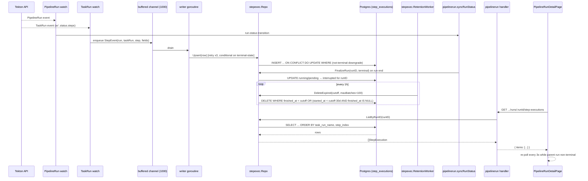

# feat: Per-Step Execution Twin

## Overview

Add a forward-compatible per-step "fact record" layer to zcid so every Tekton step execution is persisted with enough fidelity to later back remote build cache, SLSA provenance, replay, flaky-step detection, cost attribution, and determinism checks — none of which are wired in v1. Ship the capture path, persistence, query API, and a minimal Waterfall UI that demonstrates first-order value (per-run step-duration visualization).

Capture source is the existing watcher package `internal/ws/`, extended to watch the Tekton TaskRun GVR alongside PipelineRun. Mock-mode runs are deliberately excluded from v1. `input_hash` and canonicalization are deferred to v1.1 (see Scope Boundaries) — v1 persists raw inputs so hashes can be computed later from stored rows.

---

## Problem Frame

Today zcid's watcher reads `PipelineRun.status.childReferences` and emits an in-memory `StepStatus` (StepID + Status only — `Name` / `StartedAt` / `FinishedAt` fields exist in `internal/ws/message.go` but are never populated). No per-step data is persisted. `childReferences` entries are lightweight pointers to TaskRun objects — they do not carry per-step image, command, exit code, or result data. That per-step information lives on the referenced TaskRun objects' `.status.steps` arrays.

Once a run ends, the durable artifacts are the aggregate `pipeline_runs` row (status, started_at, finished_at, params, artifacts JSONB) and archived logs in MinIO. Every proposed downstream (cache / SLSA / flaky / cost / replay / waterfall analysis) would otherwise have to build its own K8s watch and persistence layer.

This plan installs one shared persistence substrate and a minimum query surface, per `docs/brainstorms/2026-04-24-execution-twin-requirements.md`.

---

## Requirements Trace

- R1. Persist one row per Tekton step per PipelineRun in a new `step_executions` table.
- R2. Capture the high-inclusivity field set: identity, image + digest, command/args, params, env keys + non-secret values, secret refs, workspace mounts, timing, status, exit code, output artifact digests, Tekton-reported resource limits, result variables, nullable trace_id. (`input_hash` + `hash_version` columns are deferred — see Scope Boundaries and Key Technical Decisions.)
- R3. Capture lives in `internal/ws/` as a single watcher package; the package opens multiple dynamic watches (PipelineRun GVR for run-level + TaskRun GVR for step-level), but all capture code is co-located. No second watcher package or file.
- R4. Real Tekton only; mock-mode runs produce no rows in v1.
- R5. Idempotent upsert on `(pipeline_run_id, task_run_name, step_name)`, guarded against terminal-state regressions (see Key Technical Decisions).
- R6. 90-day default retention, configurable via zcid config.
- R7. Hard-delete rows older than retention in v1; monthly rollup is v2.
- R8. Read API returns all step_executions for a PipelineRun, ordered by `(task_run_name, step_index)`.
- R9. Ship a Waterfall view (per-step horizontal bars proportional to duration, grouped by TaskRun/stage, in-flight steps extend to now).
- R10. Never persist secret values; persist only scoped secret reference names, and never a hash of the secret value.
- R11. Canonicalization of inputs (when `input_hash` lands in v1.1) will exclude resolved secret values — reference identity participates, value does not.
- R12. Do not copy step stdout/stderr into `step_executions`; reference the existing `internal/logarchive/` + MinIO location when linking.

**Origin actors:** A1 (Pipeline viewer), A2 (Platform developer), A3 (Tekton watcher).
**Origin flows:** F1 (Step record capture), F2 (Waterfall view).
**Origin acceptance examples:** AE1 (covers R1, R2, R5), AE2 (covers R9), AE3 (covers R9), AE4 (covers R10, R11 — behavior preserved; formal hash-stability test defers with `input_hash` to v1.1), AE5 (covers R6, R7 v1 half).

---

## Scope Boundaries

- **Mock-mode capture** — excluded by R4.
- **`input_hash` and canonicalization** — deferred to v1.1. v1 persists raw inputs (command, args, params_resolved, env_public, secret_refs, workspace_mounts) as JSONB; hash can be computed later from stored rows. Motivation: no v1 consumer reads the hash, so there is no way to validate canonicalization correctness; premature freezing risks silent corruption of historical rows. Dropping `U3` and the `input_hash` / `hash_version` columns + index until a consumer arrives.
- **Downstream feature wiring** (remote cache, SLSA attestation emission, flaky detection job, cost calculation, replay-from-step-N) — each is a separate brainstorm. Schema hosts fields they will later consume; v1 ships no consumer.
- **Resource usage collection (CPU/memory-seconds)** — the `resources` JSONB column captures Tekton-reported **limits** only; actual usage requires a metrics-server integration that is out of scope.
- **Monthly rollup table and rollup worker** — v2 deliverable; v1 hard-deletes on expiry.
- **Cross-run aggregation endpoints** (trending pass-rate, per-step cost trend) — not in v1 API; ad-hoc SQL remains possible against the raw table.
- **Stable external SDK / plugin consumer API** — v1 exposes an internal read API sufficient for the Waterfall UI only.
- **Backfill** of PipelineRuns completed before deploy — not performed; rows accumulate from deploy forward.
- **Waterfall bar click-through** — v1 bars are non-interactive; per-step log anchors in the Build Output section are v2.
- **Scale regime** — retention worker is built for the v2 scale regime (>100k rows/day). At v1 baseline (~3k/day × 90d ≈ 270k total rows) the worker is near-idle; the batching semantics are documented for the scale transition, not the v1 load.

---

## Context & Research

### Relevant Code and Patterns

- `internal/pipelinerun/service.go` — service-layer constructor pattern, `response.NewBizError` usage, `syncRunStatus` goroutine pattern (3s poller that already watches Tekton for run-level status; the Twin hooks its terminal transition — see U5 FinalizeRun).
- `internal/pipelinerun/repo.go` — `Repository` interface + `Repo` struct with `gorm.DB`; upsert via `Clauses(clause.OnConflict{...})`; use as the template for `StepExecutionRepo`.
- `internal/pipelinerun/handler.go` — Gin handler pattern, `RegisterRoutes(gin.IRoutes)`, swagger annotations, `getProjectID/getPipelineID/getRunID` helpers; reuse the same handler shape for the step-executions endpoint.
- `internal/pipelinerun/model.go` — existing `JSONMap`, `JSONBytes`, `ArtifactSlice` GORM scanners; extend this idiom for new JSONB-typed fields on `StepExecution`. Add a parallel `JSONRaw` scanner wrapping `json.RawMessage` for opaque JSONB fields that must round-trip as JSON through the API without base64 encoding.
- `internal/ws/k8s_watcher.go` — current dynamic-client watch loop scoped to `pipelineRunGVR` (v1). Handler runs inline in the watch-consumer goroutine (NOT in its own goroutine). Extended to watch both PipelineRun and TaskRun GVRs with a new consumer model (see Key Technical Decisions).
- `internal/ws/message.go` — `StepStatus` JSON envelope; fields `Name` / `StartedAt` / `FinishedAt` currently declared but never populated. U5 opportunistically populates them from the new TaskRun watch data.
- `internal/ws/watcher.go` — `PipelineWatcher.Start` depends on `RegisterNamespaceProject`, which has ZERO callers today (verified). U8 adds the missing wiring as a prerequisite.
- `cmd/server/main.go:187-193` — where the watcher is wired when `k8sEnabled`; the retention worker, the writer goroutine, and the namespace-registration discovery register here too.
- `migrations/` — 18 existing up/down pairs. Next number is `000019`. Follow the `CREATE TABLE IF NOT EXISTS` idiom with accompanying indexes; `down.sql` drops the table.
- `pkg/middleware/metrics.go` — Prometheus counter/histogram setup; add write-success/failure counters for the new capture path in follow-up polish (not v1).
- `web/src/pages/projects/pipelines/PipelineRunDetailPage.tsx` — existing detail page using Arco Design + vertical `Card` stack (NO tabs). Contains a mock stage-progress widget at lines 112-135 + `mockStages` declaration that U7 removes (replaced by real Twin-backed Waterfall Card).
- `web/src/services/pipelineRun.ts` — existing service module; add `fetchStepExecutions` alongside.
- `web/src/components/ui/` — `PageHeader`, `Card`, `StatusBadge`, `Metric` primitives used across pipeline pages; reuse for the Waterfall card shell.
- `config/config.go` — flat config struct with explicit `yaml` tags + `applyEnvOverrides` function that enumerates every env var manually. Each new config section requires three edits: struct field, YAML default, env override.

### Institutional Learnings

`docs/solutions/` is empty — verified during brainstorm's Phase 1 learnings-researcher dispatch. No prior institutional knowledge. Consider seeding a `docs/solutions/` entry after v1 ships (the watcher two-GVR design and the default-deny secret classifier are both the kind of decision future contributors will benefit from having documented).

### External References

No external research executed — local patterns (watcher, GORM repo, Gin handler, Arco page) are strong. SLSA / in-toto schema shape is v2+ scope; no forced v1 decisions.

---

## Key Technical Decisions

- **Separate `step_executions` table, not JSONB on `pipeline_runs`.** Step-level rows are N-per-run; normalized table wins on query performance, indexability, and foreign-key hygiene. Preserves 1:N via `pipeline_run_id` FK.
- **Hybrid column strategy.** Indexed/filterable fields (pipeline_run_id, task_run_name, step_name, step_index, status, started_at, finished_at, duration_ms, exit_code, image_ref, image_digest, trace_id) are scalar. Structured fields that will evolve (`command_args`, `env_public`, `secret_refs`, `params_resolved`, `workspace_mounts`, `resources`, `tekton_results`, `output_digests`, `log_ref`) are JSONB. Opaque JSONB fields returned through the API use `JSONRaw` (wrapping `json.RawMessage`) so values round-trip as real JSON rather than base64 `[]byte`.
- **`input_hash` deferred to v1.1.** No consumer reads it in v1; persisting raw inputs instead keeps the schema forward-compatible (adding the column is one migration once a consumer arrives). Avoids silent correctness rot across the 90-day retention window before the first consumer validates canonicalization.
- **Watcher extension: single package, two dynamic watches.** `internal/ws/` is the one watcher package. It opens a `PipelineRun` watch (existing) and a `TaskRun` watch (new). TaskRun events drive the step-execution capture path; PipelineRun events continue to drive run-status updates. CRD version is pinned to `v1` (documented in Dependencies / Assumptions). All capture code lives in the package — honors R3's spirit while enabling access to `.status.steps` data that `PipelineRun.status.childReferences` does not carry.
- **Write path: buffered channel + single writer goroutine.** Watcher event handlers serialize the event and enqueue on a bounded channel (size ~1000) non-blocking. A single dedicated writer goroutine drains the queue, performs the 3-retry exponential-backoff upsert, advances. On queue-full: `slog.Warn` + drop (same semantic as retry-exhaust-drop, better burst behavior). On `hash.Compute` equivalent preprocessing errors (future v1.1): drop entire record, do NOT invoke upsert. Decouples watch-channel drainage from Postgres latency; prevents the 2-second-per-step blocking identified in Phase 5.3 review. Single writer preserves per-namespace upsert ordering (matters for Finding 10's monotonicity guard).
- **Upsert monotonicity guard.** GORM `Clauses(clause.OnConflict{DoUpdates: ..., Where: ...})` conditional: update only when `(excluded.status NOT IN ('running', 'pending')) OR (step_executions.status IN ('pending', 'running'))`. Terminal states (`succeeded`, `failed`, `cancelled`, `interrupted`) never downgrade back to running. Prevents reconnect-driven or HA-deploy event reordering from clobbering correct rows.
- **Orphan row sweep (in retention worker).** `DeleteExpired` adds a secondary criterion: delete rows where `started_at < now - (retention_days + 30d grace) AND finished_at IS NULL`. Prevents unbounded ghost-row accumulation from cancelled/evicted/stuck steps the recorder never closed.
- **Run-terminal coordination — `FinalizeRun`.** The step-recorder package exposes `FinalizeRun(ctx, runID, terminalStatus)` that marks any still-`running` or `pending` step rows for that run as `status=interrupted, finished_at=now`. Called from `internal/pipelinerun/service.go:syncRunStatus` when it transitions to terminal. Keeps state clean in the common case; orphan sweep above remains the safety net for server crashes between parent-run finalize and recorder finalize.
- **Secret classification: default-deny allowlist.** Env-source shapes → `env_public` VALUES (persisted): `valueFrom.configMapKeyRef` (non-secret by convention), literal `env[].value` entries ONLY when the step has no `envFrom.secretRef` in scope. Env-source shapes → `secret_refs` REFERENCES (no value captured): `valueFrom.secretKeyRef`, `envFrom.secretRef` (all keys), `valueFrom.fieldRef`, `resourceFieldRef`, projected volumes. `envFrom.configMapRef` → keys-only into `env_public` with `"source": "configmap"` annotation to signal operator-populated risk. Any new Tekton env-source shape defaults to opaque ref until explicitly allowlisted. Closes the R10 gap around `envFrom.secretRef` / downward-API / projected-volume leakage.
- **Secrets: refs only, never values, never hash-of-value.** R10/R11 preserved. When `input_hash` lands in v1.1, canonicalization hashes the reference identity, not the value — keeps cache-key stable under secret rotation.
- **Retention enforcement semantics.** `DeleteExpired` is **loop-until-exhausted within a single invocation, capped at `maxBatches = 100` per tick** to prevent runaway. Returns `(deleted int, truncated bool)`. Worker ticker logs `deleted` count; warns when `truncated=true` (next tick continues). No pg_cron dependency.
- **Per-field JSONB size bounds.** Truncate oversize fields at configurable caps at capture time: `command_args` 64KB, `tekton_results` 256KB, `env_public` / `params_resolved` 32KB each. Truncated rows carry `"_truncated": true` inside the JSONB so API consumers and downstream queries know. Log via slog.Warn with the PipelineRun + step name on truncation. Raw step logs remain available in MinIO via `log_ref`.
- **Capture lives in `internal/ws/k8s_watcher.go` extension (two GVR watches).** Keeps the capture path single-sourced from one watcher package. Extracting to a standalone `stepexec` service is an implementation refactor, not a product decision — defer to later.
- **API path:** `GET /api/v1/projects/:id/pipelines/:pipelineId/runs/:runId/step-executions`, mirroring existing `/artifacts` and `/cancel` sub-routes. Returns `{ items: [StepExecution] }` via `response.Success`, ordered by `(task_run_name ASC, step_index ASC)`.
- **Domain package path.** `internal/stepexec/` as a sibling of `internal/pipelinerun/` to keep the service-layer seam clean.

---

## Open Questions

### Resolved During Planning

- **Write path (sync vs async vs outbox)?** Resolved: buffered channel + single writer goroutine.
- **Retention enforcement mechanism?** Resolved: goroutine with `time.Ticker`; `DeleteExpired` loops up to 100 batches per tick.
- **API path shape?** Resolved: fits existing `projects/.../runs/:runId/*` pattern.
- **Column layout (JSONB vs normalized split)?** Resolved: hybrid.
- **Hash algorithm + versioning?** Resolved: deferred entirely to v1.1 (raw inputs persisted; hash computed later).
- **Watcher capture architecture?** Resolved: extend `internal/ws/` to watch TaskRun GVR alongside PipelineRun.
- **Secret classifier scope?** Resolved: default-deny allowlist covering `envFrom.secretRef`, `valueFrom.fieldRef`, projected volumes, configMapRef.
- **Upsert monotonicity?** Resolved: conditional `DoUpdates` preventing terminal-state downgrade.
- **Ghost row accumulation?** Resolved: orphan sweep in `DeleteExpired` + `FinalizeRun` coordination with parent-run terminal transition.
- **PipelineWatcher namespace registration?** Resolved: U8 discovers existing project namespaces on server startup and registers them; adds register/deregister hooks to project create/delete service paths.
- **Arco Tabs in PipelineRunDetailPage?** Resolved: no Tabs — new standalone `<Card>` section below existing Artifacts. Existing mock stage widget removed.
- **Waterfall click-through?** Resolved: v1 non-interactive; text footer directs to Build Output.
- **In-flight refresh?** Resolved: 3s poll while parent run is non-terminal; stop on terminal.

### Deferred to Implementation

- Exact GORM tag syntax for JSONB columns on `StepExecution` (follow `internal/pipelinerun/model.go` conventions; minor tuning during U2).
- Exact API chunk boundary where to batch-insert vs upsert-single under burst load (tune during U5 based on real Postgres behavior).
- Exact pool/queue size for the writer channel (tune during U5 based on observed watch burst sizes).
- Exact cutoffs and `title` / `aria-label` text for the Waterfall bars (finalize during U7 review).
- Follow-up: whether the future executor-driver abstraction (ideation #3.4) should move capture up to `internal/pipelinerun/` so future non-Tekton executors automatically produce records. Out of scope for v1.
- Follow-up: future v2 rollup schema. Decided during v2 brainstorm, not v1 planning.

---

## High-Level Technical Design

> *This illustrates the intended approach and is directional guidance for review, not implementation specification. The implementing agent should treat it as context, not code to reproduce.*



Field layout sketch (directional, not final DDL — `input_hash` / `hash_version` deferred to v1.1):

```
step_executions
─ id                 UUID PK
─ pipeline_run_id    UUID FK → pipeline_runs(id)
─ task_run_name      VARCHAR(200)
─ step_name          VARCHAR(200)
─ step_index         INT
─ status             VARCHAR(20)    -- pending/running/succeeded/failed/cancelled/interrupted
─ image_ref          VARCHAR(500)
─ image_digest       VARCHAR(100)   -- nullable
─ trace_id           VARCHAR(64)    -- nullable, OTel placeholder
─ started_at         TIMESTAMPTZ
─ finished_at        TIMESTAMPTZ    -- nullable while in-flight
─ duration_ms        BIGINT         -- nullable while in-flight
─ exit_code          INT            -- nullable
─ command_args       JSONB          -- { command, args }, truncated at 64KB with _truncated flag
─ env_public         JSONB          -- map<string,string>, default-deny allowlist, 32KB cap
─ secret_refs        JSONB          -- [{ scope, name, source }]
─ params_resolved    JSONB          -- map<string,string>, public only, 32KB cap
─ workspace_mounts   JSONB          -- []{ name, path }
─ resources          JSONB          -- Tekton-reported limits
─ tekton_results     JSONB          -- Tekton Task results, 256KB cap
─ output_digests     JSONB          -- []{ type, name, digest, size }
─ log_ref            JSONB          -- { minio_key, bucket } — pointer only
─ created_at         TIMESTAMPTZ
─ updated_at         TIMESTAMPTZ
UNIQUE (pipeline_run_id, task_run_name, step_name)
INDEX (pipeline_run_id)
INDEX (finished_at)            -- for retention + orphan sweep scans
-- INDEX (input_hash) deferred to v1.1
```

---

## Implementation Units

- U1. **Migration: create `step_executions` table**

**Goal:** Persist the v1 schema with primary key, FK to `pipeline_runs(id)`, unique upsert constraint, and retention-scan index.

**Requirements:** R1, R2, R5.

**Dependencies:** None.

**Files:**
- Create: `migrations/000019_create_step_executions.up.sql`
- Create: `migrations/000019_create_step_executions.down.sql`

**Approach:**
- `up.sql`: `CREATE TABLE IF NOT EXISTS step_executions (...)` with columns per the High-Level Technical Design sketch; unique index on `(pipeline_run_id, task_run_name, step_name)`; non-unique indexes on `pipeline_run_id` and `finished_at`. **No `input_hash` or `hash_version` columns; no `input_hash` index** — deferred to v1.1.
- `down.sql`: `DROP TABLE IF EXISTS step_executions;`.
- `ON DELETE CASCADE` on the FK so rows are removed when a PipelineRun is hard-deleted.

**Patterns to follow:**
- `migrations/000013_create_pipeline_runs.up.sql` — `CREATE TABLE IF NOT EXISTS`, UUID default, TIMESTAMPTZ usage, `idx_*` naming.
- `migrations/000015_create_deployments.up.sql` — FK with `REFERENCES` syntax.

**Test scenarios:**
- Happy path: `go run cmd/migrate/main.go up` applies cleanly; `\d step_executions` in psql shows all columns and indexes.
- Edge case: running `up` twice is a no-op (idempotent via `IF NOT EXISTS`).
- Edge case: `down` then `up` restores the table without error.

**Verification:**
- Schema present in DB; the unique index rejects a duplicate insert with the same `(pipeline_run_id, task_run_name, step_name)`.

---

- U2. **`internal/stepexec/` package: model + repo + `JSONRaw` scanner**

**Goal:** Provide the persistence seam — GORM model, repository interface + implementation with `Upsert` (monotonicity-guarded), `ListByPipelineRun`, `DeleteExpired` (includes orphan sweep), `FinalizeRun`.

**Requirements:** R1, R2, R5, R6, R8, R10.

**Dependencies:** U1.

**Files:**
- Create: `internal/stepexec/model.go` (GORM `StepExecution` struct; scanner types including `JSONRaw` for opaque JSON round-trip; field-level truncation helpers)
- Create: `internal/stepexec/repo.go` (`Repository` interface, `Repo` struct, upsert via `ON CONFLICT ... DO UPDATE WHERE` monotonicity guard, `DeleteExpired`, `FinalizeRun`)
- Create: `internal/stepexec/repo_test.go`

**Approach:**
- `StepExecution` struct mirrors table columns. JSONB fields use local types: `JSONMap` / `JSONBytes` from the pattern in `internal/pipelinerun/model.go` for typed maps; new `JSONRaw` type wrapping `json.RawMessage` for opaque fields (`secret_refs`, `tekton_results`, `output_digests`) that must return through the API as real JSON without base64 encoding.
- Field-level truncation helpers: before calling `Upsert`, the caller truncates `command_args` to 64KB, `tekton_results` to 256KB, `env_public` / `params_resolved` to 32KB each; adds `"_truncated": true` JSONB flag on truncated fields.
- `Upsert(ctx, row)` uses GORM's `Clauses(clause.OnConflict{DoUpdates: ..., Where: ...})` with the monotonicity guard: update only when `(excluded.status NOT IN ('running','pending')) OR (step_executions.status IN ('pending','running'))`. Preserve `created_at`; always bump `updated_at`.
- `ListByPipelineRun(ctx, runID)` orders by `task_run_name ASC, step_index ASC`.
- `DeleteExpired(ctx, cutoff time.Time, batchSize int, maxBatches int)` deletes both (a) `finished_at < cutoff` and (b) orphaned rows `started_at < cutoff - 30d AND finished_at IS NULL`, in batches of `batchSize`, looping up to `maxBatches`. Returns `(totalDeleted int, truncated bool)`.
- `FinalizeRun(ctx, runID, terminalStatus)` updates any still-`running`/`pending` rows for the run to `status="interrupted", finished_at=now, updated_at=now`.
- Expose `ErrNotFound` sentinel matching `internal/pipelinerun/repo.go`.

**Patterns to follow:**
- `internal/pipelinerun/repo.go` — `Repository` interface, `Repo` struct, GORM error wrapping.
- `internal/pipelinerun/model.go` — JSONB scanner pattern (`Value()` / `Scan()`).

**Test scenarios:**
- Happy path: `Upsert` of a new row yields one row in DB with JSONB fields round-tripped correctly.
- Happy path: `Upsert` of the same key updates existing row; `updated_at` advances, `created_at` preserved.
- Covers AE1. Upserting two stages × two steps (4 unique keys) produces exactly 4 rows; re-running the same upserts produces no new rows.
- Edge case: Upsert attempting to downgrade `status=succeeded` back to `running` — the row stays `succeeded` (monotonicity guard fires).
- Edge case: Upsert of a row that has `status=pending` upgrading to `running` — succeeds.
- Happy path: `ListByPipelineRun` returns rows ordered by `(task_run_name, step_index)`.
- Edge case: `ListByPipelineRun` for a run with no rows returns an empty slice.
- Edge case: `DeleteExpired` with `finished_at IS NULL` and `started_at > cutoff - 30d` — NOT deleted (still within grace).
- Edge case: `DeleteExpired` with `finished_at IS NULL` and `started_at < cutoff - 30d` — deleted (orphan sweep).
- Happy path: `DeleteExpired` with batchSize=2 across 250 expired rows, maxBatches=100 completes in 125 batches, returns `truncated=false, deleted=250`.
- Edge case: `DeleteExpired` with >200 expired rows, batchSize=2, maxBatches=100 returns `truncated=true`.
- Happy path: `FinalizeRun` on a run with 3 running + 2 succeeded rows transitions only the 3 running rows to `interrupted`.
- Happy path: JSONRaw scanner returns `json.RawMessage` that serializes as object/array JSON (not base64) through a `gin.H` response.
- Edge case: Size truncation flags — a 200KB `command_args` upsert truncates to 64KB with `"_truncated": true` in the payload.
- Integration: JSONB fields survive round-trip for empty map, nil, populated, and truncated values without panicking in `Scan`.

**Verification:**
- Unit tests pass against a real Postgres 16 test container or existing test DB fixture. No mocked `gorm.DB`.

---

- U3. *(deleted — `input_hash` canonicalization deferred to v1.1; no consumer in v1 to validate correctness.)*

---

- U4. **Retention worker**

**Goal:** Background goroutine that periodically deletes rows whose `finished_at` is older than the configured retention window, plus orphaned in-flight rows older than `retention_days + 30d`.

**Requirements:** R6, R7 (v1 half — hard delete only).

**Dependencies:** U2.

**Files:**
- Create: `internal/stepexec/retention.go`
- Create: `internal/stepexec/retention_test.go`

**Approach:**
- `RetentionWorker` struct holds `repo Repository`, `retentionDays int`, `interval time.Duration` (default 1h), `batchSize int` (default 1000), `maxBatches int` (default 100).
- `Run(ctx)` starts a `time.Ticker`; on each tick: `cutoff := time.Now().Add(-retentionDays * 24h)`; call `repo.DeleteExpired(ctx, cutoff, batchSize, maxBatches)`; log deleted count via `slog`; `slog.Warn` when `truncated=true` (next tick continues).
- Respect context cancel: clean shutdown when the server shuts down.
- On deletion errors: slog.Error and continue — do not crash the worker.

**Patterns to follow:**
- `internal/pipelinerun/service.go:syncRunStatus` — ticker-based goroutine, clean-shutdown, `slog` usage.

**Test scenarios:**
- Happy path: Seeded with rows `finished_at=100d ago`, worker with 90d retention deletes them; rows within retention survive.
- Covers AE5. Rows older than 90 days are deleted; v1 produces no rollup rows.
- Edge case: `finished_at IS NULL` within grace (`started_at > cutoff - 30d`) — not deleted.
- Edge case: `finished_at IS NULL` beyond grace (`started_at < cutoff - 30d`) — deleted via orphan sweep.
- Edge case: Empty table — completes without error; logs zero deleted.
- Error path: Repo returns error — worker logs and continues to next tick.
- Happy path: With 20k expired rows, maxBatches=100, batchSize=1000 deletes 100k max; at 20k returns `truncated=false`.
- Happy path: With 150k expired rows, maxBatches=100, batchSize=1000 — deletes 100k, returns `truncated=true`; worker logs warning; next tick continues.
- Integration: Worker respects context cancel within one tick interval.

**Verification:**
- Unit test with injected clock or short interval (50ms) and row-count assertions; context-cancel test completes under 100ms.

---

- U5. **Watcher integration: dual-GVR capture via writer goroutine**

**Goal:** Extend `internal/ws/` to watch PipelineRun + TaskRun GVRs (pinned to `v1`). TaskRun events enqueue step records onto a bounded channel drained by a single writer goroutine that upserts via `stepexec.Recorder`. PipelineRun events unchanged in purpose but extended to opportunistically populate `StepStatus` fields.

**Requirements:** R1, R2, R3, R4, R5, R10, R11, R12.

**Dependencies:** U2.

**Files:**
- Modify: `internal/ws/k8s_watcher.go` (add TaskRun watch + dual-GVR goroutine spawning; extend `extractStatus` populate of `Name` / `StartedAt` / `FinishedAt`)
- Create: `internal/ws/k8s_task_watcher.go` (new file scoped to the TaskRun GVR watch, sibling to existing PipelineRun path, keeps capture package boundary clean)
- Create: `internal/stepexec/recorder.go`
- Create: `internal/stepexec/extract.go` (TaskRun `.status.steps` field extraction + default-deny secret classifier)
- Create: `internal/stepexec/extract_test.go`
- Create: `internal/stepexec/recorder_test.go`
- Modify: `internal/ws/message.go` — no schema change, but document that `Name` / `StartedAt` / `FinishedAt` are now populated from TaskRun watch data.
- Modify: `internal/pipelinerun/service.go` — on terminal state transition in `syncRunStatus`, call `stepexec.Recorder.FinalizeRun(runID, terminalStatus)`.

**Approach:**
- The watcher package exposes a `Recorder` interface with `Record(ctx, event RecordEvent) error` and `FinalizeRun(ctx, runID, terminalStatus)` methods.
- `extract.go` parses TaskRun `.status.steps[]` entries: `name`, `image`, `imageID` (for digest), `container` fields, `started_at` / `running_at` / `terminated.exitCode`, `terminated.finishedAt`, Tekton result bindings; plus the TaskRun-level `.status.taskSpec.steps[]` for `command`, `args`, workspace mounts.
- Secret classification per the **default-deny allowlist** (Key Technical Decisions): walk `taskSpec.steps[].env` and `.envFrom` entries; route `valueFrom.secretKeyRef` / `envFrom.secretRef` / `fieldRef` / `resourceFieldRef` / projected volumes to `secret_refs` (values never captured); route literal `env[].value` to `env_public` only if the surrounding step has no `envFrom.secretRef` in scope; route `envFrom.configMapRef` keys-only into `env_public` with `"source": "configmap"` annotation.
- Before upsert, `extract` truncates oversize JSONB fields per the caps (see Key Technical Decisions) and sets `"_truncated": true`.
- Recorder enqueues events onto a **bounded channel (size 1000)**. A single writer goroutine drains the channel, performs the 3-retry exponential-backoff upsert, advances. Queue-full: `slog.Warn` + drop. Any pre-upsert validation error (secret classifier detects a leak, field layout invalid) drops the entire record, never calls `Upsert`.
- Watcher handler callback signature gains the `StepExecution` emission path separate from the existing `StepStatus` WS emission.
- Watch GVR pinned to `tekton.dev/v1` (documented in Dependencies / Assumptions).
- `extractStatus` in `k8s_watcher.go` additionally populates `StepStatus.Name` / `StepStatus.StartedAt` / `StepStatus.FinishedAt` from the new TaskRun data when available. Existing WS consumers gain data where they had nulls.
- Mock watcher path (when `k8sEnabled=false`) does NOT wire the Recorder — R4.
- On PipelineRun terminal transition observed by `syncRunStatus` in `internal/pipelinerun/service.go`, call `Recorder.FinalizeRun(runID, terminalStatus)` to flip any still-running step rows to `interrupted`.

**Execution note:** Start with a failing `extract.go` unit test against a captured Tekton `TaskRun.status` JSON fixture for each env-source shape (secretKeyRef, envFrom.secretRef, configMapRef, valueFrom.fieldRef, literal value with + without envFrom.secretRef in scope) before modifying the watcher.

**Patterns to follow:**
- `internal/ws/k8s_watcher.go:81-125` (`extractStatus`) — `unstructured.NestedSlice` / `NestedMap` usage, nil-safe type assertions.
- `internal/pipelinerun/service.go:191-240` (`syncRunStatus`) — ticker-driven goroutine lifecycle; pattern for calling `FinalizeRun` at terminal transition.

**Test scenarios:**
- Happy path: Feed recorder a captured 2-stage × 2-step TaskRun fixture; 4 rows upserted with correct identity and image digest when Tekton reported `imageID`.
- Covers AE1. Re-feeding the same fixture (watcher reconnect) produces no duplicates and preserves `created_at`.
- Covers AE4 (behavior-preserved). A step referencing secret `github_token` at project scope persists `secret_refs: [{scope:"project", name:"github_token", source:"secretKeyRef"}]`, does NOT persist the secret value in `env_public`. (Hash-stability assertion deferred to v1.1 with `input_hash`.)
- Happy path: `envFrom.secretRef` bulk-secret step persists `secret_refs: [{name:"gcp-sa-key", source:"envFrom.secretRef"}]` and does NOT persist the secret JSON payload anywhere in the row.
- Happy path: `valueFrom.fieldRef: status.podIP` persists as a `secret_refs` entry (opaque ref), not as `env_public` value.
- Happy path: `envFrom.configMapRef` persists configmap keys-only into `env_public` with `"source": "configmap"` annotation, values stripped.
- Edge case: Step with literal `env[].value` + no `envFrom.secretRef` in scope — value persists to `env_public`.
- Edge case: Step with literal `env[].value` AND `envFrom.secretRef` in scope — value NOT persisted (contaminated scope).
- Error path: Secret classifier detects a literal value that matches a `secret_refs` entry by name — drops the entire record with `slog.Error`; no row written.
- Happy path: `StepStatus.Name` / `StartedAt` / `FinishedAt` populated in WS emission once TaskRun data arrives.
- Happy path: Step in-flight (no `terminated` block) — row persisted with `status=running`, `finished_at=NULL`, `exit_code=NULL`; subsequent terminal-event tick updates these.
- Edge case: Terminal-state downgrade protection — feeding a stale `running` event after `succeeded` leaves row at `succeeded`.
- Happy path: Large `command_args` (200KB) truncates to 64KB with `"_truncated": true` flag; slog.Warn emitted.
- Error path: Writer goroutine sees repo transient error on attempts 1 and 2, success on 3 — row upserted; slog.Warn on each retry.
- Error path: Writer sees error on all 3 attempts — slog.Error, row dropped, writer continues.
- Edge case: Bounded channel full under burst — handler slog.Warn + drop; watch loop does NOT block.
- Integration: Mock watcher path (`k8sEnabled=false`) does not invoke Recorder — `step_executions` stays empty across 10 simulated runs.
- Integration: On parent-run terminal transition, `FinalizeRun` flips any still-running step rows for that run to `status=interrupted`.

**Verification:**
- Unit tests green against `.status.taskSpec` + `.status.steps` fixtures spanning env-source shapes; manual end-to-end run against dev cluster yields rows matching kubectl-observed TaskRun data.

---

- U6. **Read API: step executions endpoint**

**Goal:** Expose a server endpoint returning the persisted step records for a single PipelineRun.

**Requirements:** R8.

**Dependencies:** U2.

**Files:**
- Modify: `internal/pipelinerun/handler.go` (add route + handler method)
- Modify: `internal/pipelinerun/service.go` (add `GetStepExecutions`; service grows a dependency on `stepexec.Repository`)
- Create: `internal/pipelinerun/dto_steps.go` (DTO + mapper from `stepexec.StepExecution` to `StepExecutionResponse` using `JSONRaw` for opaque JSONB fields)
- Modify: `internal/pipelinerun/service_test.go` or create `service_steps_test.go`

**Approach:**
- Route: `GET /api/v1/projects/:id/pipelines/:pipelineId/runs/:runId/step-executions`.
- Handler validates `projectID`, `pipelineID`, `runID`; calls `service.GetStepExecutions(ctx, projectID, runID)`; returns 404 if run does not belong to project (guard via existing `GetByIDAndProject`); returns empty `items: []` when no rows yet.
- DTO maps scalar fields directly; opaque JSONB fields (`secret_refs`, `tekton_results`, `output_digests`, `command_args`, `env_public`, `params_resolved`, `workspace_mounts`, `resources`) use `JSONRaw` so they serialize as real JSON not base64.
- `log_ref` is **not** included in the DTO — log access flows through the existing logarchive endpoint which owns MinIO authz.
- `Service.GetStepExecutions` enforces ownership: verify the run belongs to the project before listing, else `CodeRunNotFound`.
- Swagger annotations mirror existing handlers.

**Patterns to follow:**
- `internal/pipelinerun/handler.go:131-146` (GetRun) — swagger shape, validation.
- `internal/pipelinerun/service.go:269-278` (GetRun) — ownership check + `toResponse`.

**Test scenarios:**
- Happy path: Request returns ordered array matching seeded rows; ordering is `(task_run_name, step_index)`.
- Error path: Run does not belong to the project → 404 with `CodeRunNotFound`.
- Error path: Project or run ID missing in path → 400 with `CodeValidation`.
- Edge case: Run exists with no step rows → 200 with `items: []`.
- Edge case: In-flight step (null `finished_at`) — response includes it with `status="running"` and null timing fields.
- Happy path: Opaque JSONB fields render as JSON in the API response, not base64 byte strings.
- Verification: Response does NOT include `log_ref` field (confirm via response schema test).
- Integration: Handler + real GORM repo against a test DB returns correctly-shaped JSON.

**Verification:**
- Unit tests green. Manual `curl` against a live server returns expected JSON.

---

- U7. **Frontend Waterfall view in PipelineRunDetailPage**

**Goal:** Add a Waterfall Card to the existing PipelineRun detail page that renders per-step horizontal bars proportional to duration, grouped by stage (TaskRun), ordered by DAG. Remove the existing mock stage-progress widget. Bars are non-interactive in v1.

**Requirements:** R9.

**Dependencies:** U6.

**Files:**
- Modify: `web/src/services/pipelineRun.ts` (add `fetchStepExecutions` + `StepExecution` type)
- Create: `web/src/components/pipeline/StepsWaterfall.tsx`
- Create: `web/src/components/pipeline/StepsWaterfall.test.tsx`
- Modify: `web/src/pages/projects/pipelines/PipelineRunDetailPage.tsx` (add Waterfall Card; remove `mockStages` + existing stage-progress widget lines 112-135; add 3s poll for in-flight state)

**Approach:**
- `fetchStepExecutions(projectId, pipelineId, runId): Promise<StepExecution[]>` — mirrors `fetchRunArtifacts`.
- **Remove the existing mock stage-progress widget** from PipelineRunDetailPage (the JSX block at lines 112-135 + the `mockStages` declaration). The Waterfall Card replaces it as the canonical per-step visualization.
- Waterfall Card sits as a new `<Card>` section below the existing Artifacts section; no Arco `Tabs` introduced.
- `StepsWaterfall` receives `items: StepExecution[]` and renders:
  - `role="list"` on the container; each bar as `role="listitem"` with `aria-label="<step_name>, <status>, <duration>"`.
  - Grouping: rows grouped under TaskRun stage headers (stage name from `task_run_name` or mapped config-snapshot display name).
  - Bar width: `duration_ms / max_duration * chart_width` via CSS calc with a 4px minimum floor so 1-second-in-10-minute steps remain visible.
  - In-flight steps (`finished_at === null`): render `(now - started_at)` width, CSS pulse animation (respects `prefers-reduced-motion`).
  - Bar color: driven by status via existing `StatusBadge` tone map.
  - **Non-interactive in v1**: no `cursor: pointer`, no `onClick`. A one-line text footer below the Waterfall Card reads: "Per-step logs are available in the Build Output section below."
  - Empty state: "Step timing will appear here once the run starts reporting task status."
  - Mobile / narrow viewport: container is `overflow-x: auto` at narrow widths; bar duration additionally rendered as inline text ("180s") adjacent to each bar so information survives visual compression.
  - Full identity on hover: `title` attribute only (no custom tooltip); at narrow widths the text is visible inline via the duration label.
- PipelineRunDetailPage adds a **3s poll** for `fetchStepExecutions` while the parent run is non-terminal (status ∈ {pending, queued, running}); stops polling on transition to terminal state. Reuses existing `PipelineRun.status` signal from `loadData` to decide lifecycle.

**Patterns to follow:**
- `web/src/pages/projects/pipelines/PipelineRunDetailPage.tsx` — `Promise.all` data fetch, `Card`/`PageHeader` shell, loadData callback pattern.
- `web/src/components/ui/StatusBadge` — status-to-tone mapping.
- `web/src/components/ui/` primitives + zinc CSS variables for consistent look.

**Test scenarios:**
- Covers AE2. Seeded with 4 step rows of durations 10s, 180s, 5s, 30s, the chart renders 4 bars whose widths are in 10:180:5:30 ratio (floor 4px); order is `task_run_name` then `step_index`.
- Covers AE3. Row with `finished_at=null` and `started_at=42s ago` renders an in-flight bar that pulses; after the next 3s poll delivers `finished_at=...`, the bar freezes at the observed value.
- Happy path: Empty response renders the empty-state message.
- Edge case: Single-step run renders one full-width bar.
- Error path: `fetchStepExecutions` rejects — component renders an error row and does not break the containing page.
- Accessibility: Container has `role="list"`; each bar is `role="listitem"` with `aria-label` readable by screen readers.
- Accessibility: `prefers-reduced-motion` removes the pulse animation.
- Responsive: At 640px viewport, bars remain visible with inline duration label; container scrolls horizontally inside the Card rather than compressing bars to invisibility.
- Polling: In-flight run triggers 3s refetch; terminal run does not refetch.
- Integration: Removing the mockStages widget does not break page layout (verified via a render-stability snapshot test).

**Verification:**
- Vitest passes. Manual browser verification on `npm run dev` for a real Tekton run shows the Waterfall Card populated; the old mock stage widget is gone.

---

- U8. **Wire-up: config, server bootstrap, watcher namespace wiring, smoke test**

**Goal:** Wire the Recorder, writer goroutine, and RetentionWorker into `cmd/server/main.go`. Fix the pre-existing `RegisterNamespaceProject` wiring gap so the watcher actually observes pipelines. Surface retention config.

**Requirements:** R3, R4, R6.

**Dependencies:** U2, U4, U5, U6.

**Files:**
- Modify: `cmd/server/main.go` (construct `stepexec.Repo`, construct `Recorder` + writer goroutine, inject into watcher; fix `RegisterNamespaceProject` wiring; start `stepexec.RetentionWorker` under the existing goroutine-manager pattern)
- Modify: `config/config.go` (add `StepExecutionsConfig` struct with `RetentionDays int`; add env override in `applyEnvOverrides` for `ZCID_STEP_EXECUTIONS_RETENTION_DAYS`)
- Modify: `config/config.yaml.example` (add `step_executions.retention_days: 90`)
- Modify: `config/config.yaml` (add `step_executions.retention_days: 90` to the real default-loaded file)
- Modify: `internal/project/service.go` (add register/deregister hooks on project create/delete paths that call `PipelineWatcher.RegisterNamespaceProject` / deregister equivalents)
- Create: `tests/smoke/stepexec_smoke_test.go` (optional — include if a smoke-test harness exists)

**Approach:**
- Only wire Recorder when `k8sEnabled && coreClient != nil` — same guard as `NewRealK8sWatcher`. Skip when mock (R4).
- **Fix `PipelineWatcher` wiring**: on server startup (regardless of whether Twin is active), enumerate existing projects via `internal/project.Service`, extract each project's namespace, call `pipelineWatcher.RegisterNamespaceProject(namespace, projectID)` for each. Add hooks to `internal/project/service.go` Create/Delete paths so new/removed projects update the watcher's namespace map in real time. This fix unblocks watcher activity generally — not Twin-specific.
- Default `retention_days` to 90 if config missing; log the effective value on startup.
- Start `RetentionWorker.Run(ctx)` as a goroutine with the server's lifecycle context; wait on shutdown for clean exit.
- Smoke test (if harness available): spin up Postgres via existing test infra, seed a pipeline_run + 4 step_executions rows, call the API route, assert shape and ordering.

**Patterns to follow:**
- `cmd/server/main.go:187-193` — k8sEnabled branching.
- `internal/pipelinerun/service.go:TriggerRun:186` — `go s.syncRunStatus(...)` pattern for long-running goroutines.

**Test scenarios:**
- Happy path: Config loaded with `retention_days: 30` → `RetentionWorker` sees 30.
- Happy path: `ZCID_STEP_EXECUTIONS_RETENTION_DAYS=45` env override takes precedence over config YAML.
- Happy path: `k8sEnabled=false` — no Recorder wired; server starts cleanly; retention worker still runs.
- Edge case: Config missing `step_executions` section → defaults to 90 days; logged.
- Happy path: Server startup registers existing project namespaces with the watcher; a new project created afterward also registers.
- Integration (smoke, optional): Full path — migration applied, recorder wired with mock Tekton events, API returns rows.

**Verification:**
- Server starts with and without `ZCID_K8S_ENABLED=true`; `make dev` succeeds; logs confirm the retention worker's tick cadence, the effective retention, and that namespace registration happened on startup.

---

## System-Wide Impact

- **Interaction graph:** `internal/ws/` gains a second watch (TaskRun GVR) alongside the existing PipelineRun watch. TaskRun events flow into a bounded channel consumed by a dedicated writer goroutine. `cmd/server/main.go` gets two new goroutines (writer + RetentionWorker) plus the pre-existing `PipelineWatcher` that now actually receives namespaces. `internal/pipelinerun/service.go:syncRunStatus` gains a `FinalizeRun` call at terminal transition to cleanly close any still-running step rows. `internal/project/service.go` gains register/deregister hooks.
- **Error propagation:** Writer-goroutine upsert failures are logged, retried, and dropped on exhaustion — never block the watcher loop. Secret-classification failures drop the entire record (no partial write). RetentionWorker errors logged and retried next tick. API failures flow through the existing `response.HandleError` path.
- **State lifecycle risks:** Writer-queue saturation under sustained Postgres outage drops step records (slog.Warn). RetentionWorker protects against ghost-row accumulation via the orphan sweep + `FinalizeRun` coordination. Terminal-state monotonicity guard prevents stale reconnect events from downgrading correct rows.
- **API surface parity:** The new endpoint does not alter existing run/artifact endpoints. `internal/ws/message.go` `StepStatus` envelope is structurally unchanged — but `Name` / `StartedAt` / `FinishedAt` fields (previously declared-but-always-null) transition to populated. Consumers should treat this as additive, not breaking.
- **Integration coverage:** Two-GVR watch + writer + hash-less recorder + repo integration has to work end-to-end against real Tekton events. Unit tests use captured fixtures for each env-source shape; manual verification completes a real pipeline against a dev cluster during U5 / U8.
- **Unchanged invariants:** `pipeline_runs` table schema is unchanged. WebSocket envelope schema is unchanged (only field-population behavior changes, additively). `internal/logarchive/` + MinIO log paths are referenced but not duplicated (R12). Mock-mode behavior is unchanged (R4). The existing 3s `syncRunStatus` poller is unchanged in mechanism — it gains one additional call site (`FinalizeRun`).

---

## Risks & Dependencies

| Risk | Mitigation |
|------|------------|
| Tekton `.status.steps` / TaskRun CRD schema drift across v0.56-v0.62 | Extraction is defensive (nil-check every `NestedSlice` / `NestedMap`); captured fixtures span both versions if available. CRD version pinned to `v1` (see Dependencies / Assumptions). |
| New Tekton env-source shape leaks secret values | Default-deny allowlist: any env-source shape not explicitly allowlisted becomes an opaque `secret_refs` entry. Adding a shape requires both code + tests + package doc update. |
| Writer-queue saturation during Postgres outage drops step records | Bounded channel (size 1000) drops with slog.Warn; watcher loop stays responsive; no upstream back-pressure. Same semantic as today's pipeline_runs-level tolerance. |
| HA deploy with two watcher instances causes racing upserts | Monotonicity guard on `DoUpdates` prevents terminal-state downgrade; unique key prevents duplicate rows. Ghost rows from racing reorder handled by orphan sweep + `FinalizeRun`. |
| High row volume at large scale (500k/day+ tenants) | v1 retention + `finished_at` index keep table bounded at stated scale; scale-out beyond that triggers v2 rollup design. Retention worker's `maxBatches=100` safety cap prevents runaway tick. |
| JSONB column size blowup from inline shell scripts or large Tekton results | Per-field truncation caps (64KB / 256KB / 32KB); truncated rows carry `"_truncated": true` so consumers know. Raw logs remain in MinIO via `log_ref`. |
| `RegisterNamespaceProject` wiring gap blocks Twin verification | U8 fixes the pre-existing gap by enumerating projects on server startup + hooking create/delete on `internal/project/service.go`. Separately from Twin, this fixes a silent watcher no-op that has existed for as long as the wiring gap has. |

---

## Dependencies / Assumptions

- Existing Tekton watcher (`internal/ws/k8s_watcher.go`) is the sole K8s watch-client package; the Twin extends it to watch TaskRun alongside PipelineRun. Verified against repo.
- `internal/logarchive/` already handles per-run log archival to MinIO — Twin references these locations rather than duplicating.
- Postgres 16 + golang-migrate workflow (18 existing migration up/down pairs) is the standard for schema additions. Verified.
- `pipeline_runs.id` is UUID suitable as a foreign key for 1:N relationships from `step_executions.pipeline_run_id`. Verified (`migrations/000013_create_pipeline_runs.up.sql`).
- Secret storage is AES-256-GCM encrypted via `ZCID_ENCRYPTION_KEY`; only secret references (scoped names + source shape) are ever persisted outside that boundary.
- **Tekton CRD version: `v1` pinned.** Cluster must serve `tekton.dev/v1` for PipelineRun + TaskRun (Tekton v0.56+ default). Clusters serving exclusively `v1beta1` CRDs require a future Twin release. Rationale: simpler than runtime discovery; Tekton v1 is GA as of v0.56 which is zcid's minimum supported version.
- Tekton `childReferences` lists TaskRuns under a PipelineRun (used only for cross-reference; the Twin reads TaskRun objects directly from its own watch, not from this field).
- TaskRun `.status.steps[]` and `.status.taskSpec.steps[]` reliably expose per-step image / imageID / command / args / timing / exit code / results across Tekton v0.56-v0.62 — standard Tekton API.

---

## Sources & References

- **Origin document:** `docs/brainstorms/2026-04-24-execution-twin-requirements.md`
- **Origin ideation:** `docs/ideation/2026-04-24-zcid-feature-gaps-ideation.md`
- Related code: `internal/ws/k8s_watcher.go`, `internal/ws/watcher.go`, `internal/ws/message.go`, `internal/pipelinerun/service.go`, `internal/pipelinerun/repo.go`, `internal/pipelinerun/handler.go`, `internal/pipelinerun/model.go`, `internal/project/service.go`, `migrations/000013_create_pipeline_runs.up.sql`, `web/src/pages/projects/pipelines/PipelineRunDetailPage.tsx`, `cmd/server/main.go`
- Related Tekton docs: Tekton Pipelines TaskRun `.status.steps` field reference; Tekton v1 vs v1beta1 CRD version notes.

---

## Document Review Trail

This plan was reviewed by ce-doc-review (2026-04-24) across 7 persona reviewers (coherence, feasibility, product-lens, design-lens, security-lens, scope-guardian, adversarial). 20 actionable findings surfaced. 4 safe_auto fixes applied silently (R8 terminology, U8 dependency completeness, U5 naming drift ×2). 19 walk-through decisions Applied; 1 cascaded skip (canonicalization spec mooted by deferring `input_hash` to v1.1). All changes folded into this rewrite.
