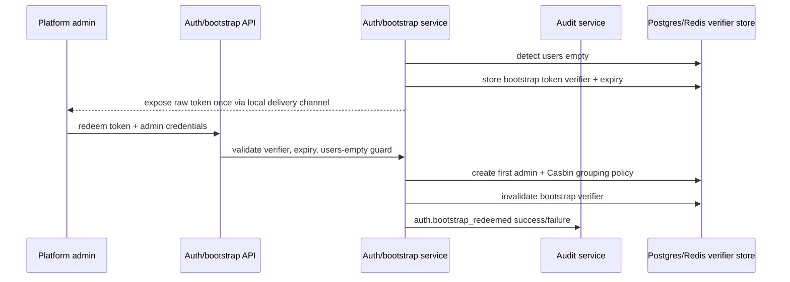
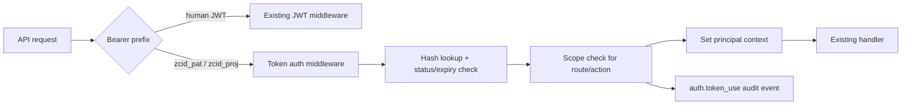

# feat: Identity & Access Foundations

## Overview

Replace zcid's static first-admin credential with a one-time bootstrap flow, expand audit logging to cover authentication and access-control events, and add scoped expiring personal/project access tokens for automation. This is the first identity/access foundations release: it hardens what exists before layering on SSO, SCIM, JIT access, policy-as-code, or per-run workload identity.

---

## Problem Frame

The current repo has local username/password auth, JWT access/refresh tokens, Casbin-backed role checks, and an audit table. That is enough for a development CI/CD platform, but the identity/access substrate has three foundational weaknesses (see origin: `docs/brainstorms/2026-04-25-identity-access-foundations-requirements.md`):

- `migrations/000004_seed_admin_user.up.sql` creates a known `admin/admin123` account for every install.
- `internal/audit/middleware.go` only records successful mutation requests, so login failures, token use, logout, refresh, bootstrap, and role-change details are not first-class forensic records.
- There is no programmatic token model; API callers only have the human JWT path in `internal/auth/service.go` and `pkg/middleware/auth.go`.

The plan keeps existing password login and Casbin routing intact while adding safe bootstrap, typed auth/security audit events, and scoped API tokens.

---

## Requirements Trace

- R1. Remove the static seeded `admin/admin123` credential from the default bootstrap path.
- R2. Support a one-time bootstrap-token redemption flow when the `users` table is empty.
- R3. Bootstrap tokens expire quickly, are single-use, and are stored server-side as a verifier/hash rather than plaintext.
- R4. Documentation replaces default admin login with the new bootstrap flow.
- R5. Record typed auth/security audit events for bootstrap, login, refresh, logout, user/role/password changes, and token lifecycle/use.
- R6. Record both successful and failed auth/security events without retaining secret material.
- R7. Use structured audit detail to distinguish event type, principal/token type, target, result, and reason category.
- R8. Preserve existing mutation audit behavior; do not replace it with a full event bus or hash chain in this release.
- R9. Let administrators identify auth/security events through audit API/UI.
- R10. Add personal access tokens and project access tokens with explicit scopes and mandatory expiry.
- R11. Display tokens once, store one-way hashes, support revocation, and use distinguishable prefixes.
- R12. Enforce token status, expiry, owner/project status, and requested scope before allowing access.
- R13. Track token metadata: name, type, scopes, expiry, created actor, revoked status, and last-used timestamp.
- R14. Integrate token lifecycle and token use with auth/security audit events.

**Origin actors:** A1 (Platform administrator), A2 (Security/compliance reviewer), A3 (Automation maintainer), A4 (Existing local user).
**Origin flows:** F1 (First admin bootstrap), F2 (Authentication event capture), F3 (Scoped API token issue and use).
**Origin acceptance examples:** AE1 (bootstrap success), AE2 (bootstrap expiry), AE3 (failed login audit), AE4 (role-change audit), AE5 (PAT use), AE6 (wrong-scope token rejection).

---

## Scope Boundaries

- No SSO/OIDC/MFA/passkeys in this release.
- No SCIM/team/group model in this release.
- No full tamper-evident hash chain, Merkle witness, or SIEM streaming in this release.
- No policy-as-code or ReBAC migration; token scopes should be compatible with future policy work but should not replace Casbin.
- No per-pipeline-run OIDC workload identity.
- No broad account lockout/password reset/password policy bundle unless a tiny supporting validation is needed for bootstrap safety.

### Deferred to Follow-Up Work

- Teams + IdP-group role mappings and SCIM provisioning from `docs/ideation/2026-04-25-zcid-identity-access-ideation.md`.
- Policy-as-code + decision logger, after the auth/security audit vocabulary exists.
- JIT access requests, after audit events and team/approver concepts exist.
- Per-pipeline-run OIDC workload identity, after token/audit foundations and deployment trust boundaries are clearer.

---

## Context & Research

### Relevant Code and Patterns

- `internal/auth/service.go` contains login, refresh, logout, user CRUD/role service logic; follow its `Repository` interface + `response.NewBizError` style.
- `internal/auth/repo.go` stores refresh tokens in Redis and mutates Casbin grouping policy; follow its DB/Redis repository split but avoid storing new token plaintext.
- `internal/auth/handler.go` registers `/auth/login`, `/auth/refresh`, `/auth/logout`, and `/admin/users` routes; add bootstrap and token handlers consistently.
- `pkg/middleware/auth.go` is the current human JWT middleware; token auth should compose without breaking `JWTAuth`, `RequireCasbinRBAC`, or `RequireAdminRBAC` semantics.
- `internal/audit/service.go`, `internal/audit/repo.go`, `internal/audit/middleware.go`, and `internal/audit/model.go` are the existing audit path. Extend with typed helpers rather than duplicating write logic.
- `migrations/000001_init_schema.up.sql`, `000004_seed_admin_user.up.sql`, `000005_seed_admin_rbac.up.sql`, and `000017_create_audit_logs.up.sql` are the identity/audit migration baseline.
- `cmd/server/main.go` wires auth, admin routes, audit middleware, and Casbin enforcer. Bootstrap initialization and token-auth middleware registration will meet here.
- `web/src/pages/admin-users/AdminUsersPage.tsx` and `web/src/pages/admin-users/UserFormModal.tsx` are the existing admin access UI patterns.
- `web/src/services/http.ts` is the API client foundation; add token/audit service functions near existing service conventions.

### Institutional Learnings

- `docs/brainstorms/2026-04-24-execution-twin-requirements.md` and `docs/plans/2026-04-24-001-feat-execution-twin-plan.md` establish the repo's durable brainstorm → plan document style.
- No `docs/solutions/` learnings were found during related prior planning; this plan does not rely on institutional solution docs.

### External References

- GitHub Enterprise PAT policy supports maximum lifetime enforcement, with fine-grained token default maximum lifetime around 366 days.
- GitHub Enterprise audit log streaming emphasizes retaining and exporting access, membership, and settings events; zcid should first make these events complete locally.
- GitLab token docs show personal/group/project tokens with scopes and expiries, plus CI job tokens that are short-lived and job-scoped.
- Kubernetes TokenRequest supports short-lived, audience-bound service-account tokens; this validates the later workload-identity direction but is not v1 scope.

---

## Key Technical Decisions

- **Use a persistent bootstrap verifier, not a seeded admin user.** zcid needs to survive restarts during first setup without exposing a universal password. Store a hashed/verifier form in Postgres or Redis with expiry; print/write the raw token only through bootstrap delivery channels.
- **Resolve the legacy seed before relying on users-empty bootstrap.** `000004_seed_admin_user.up.sql` currently makes a fresh database non-empty before the server can generate a bootstrap token. The implementation must choose one explicit compatibility strategy: edit the unsafe seed for greenfield installs, add a neutralizing migration, mark `admin-bootstrap-001` unusable until redemption, or otherwise guarantee the static seed cannot satisfy first-admin setup.
- **Add a typed audit helper over the existing audit service.** `internal/audit.Service.LogAction` already centralizes writes; a typed auth/security helper can standardize event names and JSON detail without creating a full event bus.
- **Token values are opaque random secrets, not JWTs.** Store one-way hashes and route by prefix. This keeps revocation/last-used checks server-side and avoids accidentally accepting PATs through the human JWT parser.
- **Start with explicit v1 scopes.** Use a small scope vocabulary mapped to current API use cases (`pipelines:trigger`, `runs:read`, `deployments:create`, `variables:read`, plus admin-only token-management scopes if needed). Avoid a full permission DSL.
- **Token auth augments, not replaces, existing middleware.** Human JWT flows remain unchanged. Token middleware should authenticate to a principal shape that downstream handlers can inspect while preserving project-scope enforcement. Project tokens need a first-class project-principal path because `pkg/middleware/project_scope.go` currently only authorizes system admins or human `ContextKeyUserID` project members.
- **UI should be useful but not overbuilt.** Admins need list/create/revoke/last-used for tokens and auth-event visibility in audit logs. Full self-service account settings can be a follow-up if implementation cost grows.

---

## Open Questions

### Resolved During Planning

- **Should this release include SSO/SCIM/MFA?** No. The foundation gaps are more urgent and lower-risk.
- **Should audit hash-chaining ship now?** No. Event completeness comes first; tamper evidence is a later hardening layer.
- **Should project access tokens depend on teams?** No. Project-bound tokens are useful before teams exist; team-owned tokens can be added later.

### Deferred to Implementation

- **Exact bootstrap storage backend:** Redis TTL is simple, but Postgres is easier to inspect and migrate. Choose based on existing startup wiring and testability.
- **Exact static-seed neutralization:** Decide whether to modify `000004_seed_admin_user.up.sql` for greenfield safety or add a later compatibility migration/guard. Do not leave this implicit; otherwise F1 cannot trigger on fresh migrations.
- **Exact token hash format:** Decide between bcrypt/argon-like slow hashing and HMAC/SHA-256 lookup-index patterns during implementation; requirement is no plaintext storage and practical lookup.
- **Exact scope-to-route map:** Start from routes used by external automation and expand only when tests expose missing scopes.
- **Exact project-principal middleware shape:** Decide whether to extend `RequireProjectScope`, add a sibling token-aware project-scope middleware, or route project-token endpoints through a narrower custom guard.
- **Exact UI placement:** Token pages may land under admin access control or user settings depending on existing route/component fit.

---

## Output Structure

```text
internal/bootstrap/        # optional if bootstrap is kept separate from auth
internal/token/            # optional if token domain is split from auth
internal/audit/            # typed auth/security event helpers added here
web/src/pages/access-tokens/
web/src/services/
migrations/
docs/
```

The tree is directional. If implementation shows the bootstrap/token code fits more cleanly under `internal/auth/`, keep it there rather than creating artificial packages.

---

## High-Level Technical Design

> *This illustrates the intended approach and is directional guidance for review, not implementation specification. The implementing agent should treat it as context, not code to reproduce.*





---

## Implementation Units

- U1. **Bootstrap verifier data model and startup generation**

**Goal:** Remove reliance on a seeded known admin password by adding a unique, expiring first-admin bootstrap token mechanism.

**Requirements:** R1, R2, R3, R14; F1; AE1, AE2

**Dependencies:** None

**Files:**
- Create: `migrations/000020_create_bootstrap_tokens.up.sql`
- Create: `migrations/000020_create_bootstrap_tokens.down.sql`
- Create or modify: `internal/auth/bootstrap*.go` or `internal/bootstrap/*.go`
- Modify: `cmd/server/main.go`
- Modify: `migrations/000004_seed_admin_user.up.sql` or add a follow-up neutralizing migration if direct migration edits are unsafe for existing DBs
- Modify: `migrations/000005_seed_admin_rbac.up.sql` or add compatibility handling for first admin Casbin policy
- Test: `internal/auth/bootstrap_test.go` or `internal/bootstrap/bootstrap_test.go`

**Approach:**
- Add storage for bootstrap token verifier, expiry, used timestamp, and creation metadata, or use Redis with a clear persistence tradeoff documented in tests.
- Generate a bootstrap token only when no users exist and no valid unused bootstrap token already exists.
- Expose plaintext once through a local delivery channel appropriate for current runtime: server log/stderr and optionally a configured file path. Do not persist plaintext.
- Ensure first-admin creation also inserts/updates the admin Casbin grouping policy currently seeded by `000005_seed_admin_rbac.up.sql`.
- Neutralize the old static admin path for new installs before depending on `users`-empty detection. If editing historical migrations is inappropriate, add a new migration/config guard that disables or quarantines `admin-bootstrap-001` until bootstrap redemption.
- Treat `admin-bootstrap-001` specially during compatibility only long enough to remove the known shared credential. Do not introduce a permanent hidden admin state that future SSO/SCIM work must carry.

**Execution note:** Start with tests for users-empty bootstrap generation and one-time redemption before modifying startup wiring.

**Patterns to follow:**
- `internal/auth/repo.go` repository style for DB/Redis operations.
- `internal/auth/service.go` `response.NewBizError` error handling.
- `cmd/server/main.go` startup dependency wiring.

**Test scenarios:**
- Happy path: empty users table + no active bootstrap token -> startup creates one verifier and exposes one raw token through the delivery abstraction.
- Happy path: fresh migrations that include the historical admin seed -> the known `admin/admin123` credential is not usable, and bootstrap redemption is still available. Covers AE1.
- Happy path: redeem valid token with username/password -> admin user is created, Casbin `g` policy points user to `admin`, verifier is marked used, and bootstrap success audit is emitted. Covers AE1.
- Edge case: users table already has at least one user -> startup does not create a bootstrap token.
- Edge case: unexpired unused bootstrap verifier already exists -> startup does not rotate it unexpectedly.
- Error path: expired token redemption -> no user is created and failure audit reason is `expired`. Covers AE2.
- Error path: reused token redemption -> no second admin is created and failure audit reason is `used` or equivalent.
- Error path: invalid/unknown token -> no user is created and secret material is not logged or audited.

**Verification:**
- A fresh install has no usable default `admin/admin123` login path.
- Bootstrap can create exactly one first admin and cannot be replayed.

---

- U2. **Typed auth/security audit event layer**

**Goal:** Standardize auth/security audit events and record success/failure details safely.

**Requirements:** R5, R6, R7, R8, R14; F2; AE3, AE4

**Dependencies:** U1 for bootstrap event call sites, but the helper can be implemented first.

**Files:**
- Modify: `internal/audit/service.go`
- Modify: `internal/audit/model.go`
- Modify: `internal/audit/repo.go`
- Modify: `internal/audit/handler.go`
- Modify: `migrations/000017_create_audit_logs.up.sql` or create `migrations/000021_extend_audit_logs_for_auth_events.up.sql`
- Create: `migrations/000021_extend_audit_logs_for_auth_events.down.sql` if a new migration is used
- Test: `internal/audit/service_test.go`
- Test: `internal/audit/handler_test.go`

**Approach:**
- Keep `audit_logs` as the durable table but make `detail` consistently JSON for auth/security events.
- Add typed event names such as `auth.login`, `auth.login_failed`, `auth.refresh`, `auth.logout`, `auth.bootstrap_redeemed`, `auth.role_changed`, `auth.token_created`, `auth.token_used`, `auth.token_revoked`.
- Preserve existing middleware-generated mutation rows; do not require every existing module to migrate immediately.
- Extend list/filter support enough for UI/API consumers to distinguish auth/security events from generic mutations.
- Ensure failure events are written even when request handlers return 4xx, since `internal/audit/middleware.go` currently skips status >= 400.

**Patterns to follow:**
- Existing async `Service.LogAction` behavior in `internal/audit/service.go`.
- Existing list pagination/filter style in `internal/audit/handler.go`.

**Test scenarios:**
- Happy path: typed auth event helper writes action, result, resource type/id, IP, and JSON detail with expected fields.
- Happy path: role change event captures actor, target user, old role, new role, and success result. Covers AE4.
- Error path: failed login event captures reason category without password/token material. Covers AE3.
- Edge case: nil user/principal for failed login before user lookup still records username/IP safely if supplied.
- Integration: audit list endpoint can filter or identify auth/security events without breaking existing audit log listing.

**Verification:**
- Auth/security event callers can use one helper instead of hand-building inconsistent audit rows.
- Existing mutation audit tests still pass with unchanged behavior.

---

- U3. **Auth service and handler event instrumentation**

**Goal:** Emit audit events from login, refresh, logout, bootstrap redemption, user updates, disablement, password changes, and role assignments.

**Requirements:** R5, R6, R7, R14; F1, F2; AE1-AE4

**Dependencies:** U1, U2

**Files:**
- Modify: `internal/auth/service.go`
- Modify: `internal/auth/handler.go`
- Modify: `internal/auth/repo.go`
- Modify: `cmd/server/main.go`
- Test: `internal/auth/service_test.go`
- Test: `internal/auth/handler_test.go`

**Approach:**
- Inject an audit event recorder into auth service/handler without making tests brittle.
- Capture IP/request metadata at handler boundaries where available; keep service tests focused on emitted event payloads using a mock recorder.
- Emit failure events for invalid credentials, disabled account, expired/invalid refresh token, and bootstrap failures.
- Emit success events for login, refresh, logout, first-admin bootstrap redemption, user create/update/disable, password update, and role assignment.
- Avoid duplicate audit rows when generic mutation middleware also records admin user mutations: either mark typed auth/security events as the canonical row for those operations or allow both only when they serve distinct purposes and are clearly typed.

**Patterns to follow:**
- Existing `NewService(repo, jwtSecret)` constructor style; if constructor changes, use optional dependencies or a new constructor carefully to avoid broad test churn.
- Existing auth handler request binding and response flow.

**Test scenarios:**
- Happy path: successful login emits `auth.login` success with user id, username, role, and no token values.
- Error path: wrong password emits `auth.login_failed` with reason `invalid_credentials`. Covers AE3.
- Error path: disabled user emits failure with reason `account_disabled`.
- Happy path: refresh emits `auth.refresh` success without storing refresh token value.
- Error path: expired refresh emits failure reason `expired`.
- Happy path: logout emits `auth.logout` success.
- Happy path: role assignment emits old/new role detail. Covers AE4.
- Integration: admin user update route still returns the same response shape while emitting typed audit event.

**Verification:**
- All auth/security events in R5 that exist before token work are emitted once with safe detail.

---

- U4. **Programmatic token persistence and domain service**

**Goal:** Add personal and project access token storage, issuance, hashing, revocation, expiry, and last-used tracking.

**Requirements:** R10, R11, R13, R14; F3; AE5, AE6

**Dependencies:** U2

**Files:**
- Create: `migrations/000022_create_access_tokens.up.sql`
- Create: `migrations/000022_create_access_tokens.down.sql`
- Create or modify: `internal/auth/token*.go` or `internal/token/*.go`
- Modify: `internal/auth/model.go` if token models live in auth
- Test: `internal/auth/token_service_test.go` or `internal/token/service_test.go`
- Test: `internal/auth/token_repo_test.go` or `internal/token/repo_test.go`

**Approach:**
- Model personal and project access tokens with type, principal/user/project relation, name, scopes, hash, prefix/id, expiry, revoked metadata, creator, and last-used timestamp.
- Generate random opaque token values with prefixes such as `zcid_pat_` and `zcid_proj_`.
- Show the raw token only in the create response; never return it from list/detail endpoints.
- Use mandatory expiry with a maximum default aligned with external norms (for example ≤366 days), configurable later only if needed.
- Store token hash in a lookup-friendly and secure format; do not store plaintext.
- Emit audit events for create/revoke and later token use from middleware.

**Patterns to follow:**
- `internal/pipelinerun/repo.go` and `internal/auth/repo.go` for repository interfaces and GORM patterns.
- Existing migration naming and index conventions in `migrations/`.

**Test scenarios:**
- Happy path: create PAT with name/scopes/expiry -> response includes raw token once, DB stores hash and metadata only.
- Happy path: create project token with project id -> metadata links to project and creator.
- Edge case: expiry omitted -> rejected or defaulted according to chosen rule, but never infinite.
- Edge case: expiry beyond maximum -> validation error.
- Error path: invalid scope -> validation error.
- Happy path: revoke token -> revoked timestamp/actor set and future validation fails.
- Error path: listing tokens never returns token hash or raw token.

**Verification:**
- Token records are sufficient to support validation, rotation UX, and audit without exposing token secrets.

---

- U5. **Token authentication middleware and scope enforcement**

**Goal:** Allow API requests authenticated by PAT/project tokens while enforcing expiry, revocation, ownership/project status, and scopes.

**Requirements:** R12, R14; F3; AE5, AE6

**Dependencies:** U2, U4

**Files:**
- Modify: `pkg/middleware/auth.go`
- Modify: `pkg/middleware/project_scope.go`
- Modify: `cmd/server/main.go`
- Modify: selected route registration files in `cmd/server/main.go` where token access is supported
- Create or modify: `internal/auth/token_scope.go` or `internal/token/scope.go`
- Test: `pkg/middleware/auth_test.go`
- Test: `internal/auth/token_scope_test.go` or `internal/token/scope_test.go`
- Test: relevant handler integration tests for pipeline trigger/read endpoints

**Approach:**
- Add token parsing by prefix before JWT parsing only where token auth is explicitly allowed. Do not accidentally allow PATs on admin-only human routes.
- Map token validation to a principal context: principal type (`user` or `project_token`), user id when applicable, project id when applicable, token id, scopes.
- Extend project-scope enforcement so project tokens authorize only the token's own project without requiring `ContextKeyUserID` membership lookup. Preserve the existing human path in `RequireProjectScope`.
- Define v1 endpoint-to-scope checks for the most useful automation paths. Start narrow: pipeline trigger, run read, deployment create/read, and variable read only if existing APIs can support it safely.
- Preserve existing project-scope middleware invariants; project tokens should not escape their project.
- Update `last_used_at` and emit success/failure token-use audit events.

**Technical design:** *(directional)*

```text
human JWT -> existing ContextKeyUserID/Username/Role
PAT       -> ContextKeyPrincipalType=user_token + userID + tokenID + scopes
project   -> ContextKeyPrincipalType=project_token + projectID + tokenID + scopes
```

**Patterns to follow:**
- `pkg/middleware/auth.go` token parsing and context setting.
- `pkg/middleware/project_scope.go` project membership/scope expectations.

**Test scenarios:**
- Happy path: valid PAT with `pipelines:trigger` can call the selected pipeline trigger endpoint. Covers AE5.
- Happy path: valid project token can access only its project-scoped allowed endpoint.
- Error path: revoked token is rejected and audited.
- Error path: expired token is rejected and audited.
- Error path: valid token with missing scope is rejected and audited. Covers AE6.
- Error path: project token for project A cannot access project B even with matching scope.
- Error path: project token with correct scope but no human `ContextKeyUserID` succeeds for its own project through the project-principal path instead of being rejected by membership middleware.
- Integration: existing JWT-authenticated requests continue to work for the same routes.
- Integration: admin-only routes still require admin human authorization unless explicitly opened to token scopes.

**Verification:**
- Token authentication is opt-in per route/scope and cannot bypass existing project/admin boundaries.

---

- U6. **Token management API and admin/user UI**

**Goal:** Provide usable create/list/revoke flows for PATs and project tokens, plus audit visibility for auth/security events.

**Requirements:** R9, R10, R11, R13, R14; F3; AE5, AE6

**Dependencies:** U2, U4, U5

**Files:**
- Modify: `internal/auth/handler.go` or create `internal/token/handler.go`
- Modify: `cmd/server/main.go`
- Create: `web/src/pages/access-tokens/AccessTokensPage.tsx`
- Create: `web/src/pages/access-tokens/TokenFormModal.tsx`
- Modify: `web/src/pages/admin-users/AdminUsersPage.tsx` if token entry points are colocated
- Modify: `web/src/services/http.ts` or create `web/src/services/accessToken.ts`
- Modify: route/sidebar files under `web/src/` as appropriate
- Test: `internal/auth/handler_test.go` or `internal/token/handler_test.go`
- Test: relevant frontend tests if the repo has page-level test conventions

**Approach:**
- Backend endpoints should support list/create/revoke for current user's PATs and admin/project token management for project tokens.
- Creation response must show raw token once with clear copy/store warning.
- List views show name, type, scopes, expiry, revoked status, created time, last-used time, and safe token id/prefix, never hash/raw token.
- Add audit-log filtering/labeling for auth/security events, either in existing audit page or by enriching API filters used by UI.
- Use existing UI primitives (`PageHeader`, `Card`, `Btn`, `StatusBadge`, `Avatar`) and Arco messaging style.

**Patterns to follow:**
- `web/src/pages/admin-users/AdminUsersPage.tsx` table/actions/modal pattern.
- Existing backend handler swagger/binding/response patterns in `internal/auth/handler.go`.

**Test scenarios:**
- Happy path: create PAT through API -> response contains raw token once and list endpoint returns metadata without raw/hash.
- Happy path: revoke token through API -> subsequent list shows revoked state.
- Error path: non-admin cannot create project token unless explicitly allowed by project role rules.
- Error path: invalid scopes/expiry return validation errors surfaced in UI.
- UI: token creation modal displays one-time-token warning and copyable token result.
- UI: auth/security audit events are visually distinguishable from generic mutation rows. Covers R9.

**Verification:**
- An administrator can create/revoke project tokens and inspect auth/security events without direct DB access.
- A user/admin can create PATs without token secret leakage after initial creation.

---

- U7. **Documentation and bootstrap migration compatibility**

**Goal:** Update docs and operational guidance so new installs and existing dev environments understand the new identity/access flow.

**Requirements:** R1, R4, Success Criteria

**Dependencies:** U1-U6

**Files:**
- Modify: `README.md`
- Modify: `AGENTS.md`
- Modify: `config/config.yaml.example` if bootstrap config is added
- Modify: `deploy/helm/zcid/values.yaml` if Helm bootstrap options are added
- Modify: `deploy/README.md` or Helm chart docs if present
- Test expectation: none -- documentation/config guidance only, unless Helm values schema tests exist.

**Approach:**
- Replace references to `admin/admin123` as a default login with bootstrap-token instructions.
- Document token prefixes, expiry expectations, and safe storage guidance for PAT/project tokens.
- Document the compatibility story for existing local databases that already contain `admin-bootstrap-001`.
- If Helm/admin-secret support ships, document exact value names and security expectations.

**Patterns to follow:**
- Existing README Quick Start and Deployment sections.
- Existing AGENTS.md operational notes.

**Test scenarios:**
- Test expectation: none -- docs-only, but reviewers should manually verify every removed default-login reference.

**Verification:**
- Searching docs for `admin123` finds no instruction that recommends using it for a fresh install.
- New install instructions lead to a unique first-admin setup path.

---

## System-Wide Impact

- **Interaction graph:** Auth handlers/services, audit service, route middleware, admin UI, project/pipeline route registration, and deployment docs are affected. Pipeline/deployment business logic should remain unchanged except for token-authenticated access.
- **Error propagation:** Auth/token validation failures should use existing `response.BizError` codes and must still emit safe audit failures when required.
- **State lifecycle risks:** Bootstrap token generation/redeem is race-sensitive on first startup; token create/revoke/use has partial-write risk between metadata update and audit emission.
- **API surface parity:** Human JWT auth remains the default. Token auth is added only to selected API surfaces; WebSocket token parsing is not expanded unless explicitly required.
- **Integration coverage:** Middleware + handler tests are needed because unit tests alone will not prove token scope enforcement and audit emission happen in the same request path.
- **Unchanged invariants:** Existing username/password login, refresh/logout endpoints, Casbin admin/project checks, and project-scope membership behavior must continue for human users.

---

## Risks & Dependencies

| Risk | Mitigation |
|------|------------|
| Fresh migrations never trigger bootstrap because `000004_seed_admin_user.up.sql` already inserted a user | Make static-seed neutralization an explicit U1 deliverable and test fresh-migration behavior. |
| Locking users out of dev installs by removing static admin too abruptly | Provide explicit bootstrap instructions and a compatibility path for existing DBs. |
| Bootstrap race creates two first admins | Enforce users-empty and token-use checks transactionally. |
| Token middleware accidentally bypasses admin/project RBAC | Make token auth opt-in by route/scope and test forbidden cross-project/admin access. |
| Project tokens are unusable because current project scope only understands human users | Add a token-aware project-principal branch or sibling middleware and test own-project/cross-project behavior. |
| Audit events leak secrets in `detail` | Use typed helpers with safe categorical fields; tests assert secret/token/password absence. |
| Token hash lookup becomes slow or insecure | Use a lookup prefix/id plus secure verifier pattern; avoid scanning all token hashes. |
| Duplicate audit rows confuse administrators | Define which typed auth/security events supplement or supersede generic mutation rows. |

---

## Documentation / Operational Notes

- Update `README.md` and `AGENTS.md` because both currently mention `admin/admin123` as a default login.
- If Helm supports non-interactive first admin setup, document how to provide the secret without writing it into git.
- Add security notes for token creation: copy once, store in a secret manager, rotate before expiry, revoke unused tokens.
- Consider adding a post-implementation `docs/solutions/` learning for the bootstrap/token verifier pattern because it will influence future SSO/SCIM/JIT work.

---

## Sources & References

- **Origin document:** `docs/brainstorms/2026-04-25-identity-access-foundations-requirements.md`
- **Ideation input:** `docs/ideation/2026-04-25-zcid-identity-access-ideation.md`
- Related code: `internal/auth/service.go`, `internal/auth/repo.go`, `internal/auth/handler.go`, `pkg/middleware/auth.go`, `internal/audit/middleware.go`, `internal/audit/model.go`, `cmd/server/main.go`
- Related migrations: `migrations/000001_init_schema.up.sql`, `migrations/000004_seed_admin_user.up.sql`, `migrations/000005_seed_admin_rbac.up.sql`, `migrations/000017_create_audit_logs.up.sql`
- Related UI: `web/src/pages/admin-users/AdminUsersPage.tsx`
- External docs: GitHub Enterprise PAT policies, GitHub audit log streaming, GitLab token overview/job token docs, Kubernetes TokenRequest API
