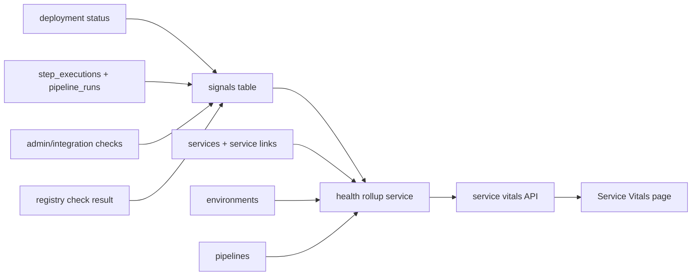

# feat: Add Service Vitals and Signal Matrix

## Overview

Add a service-centered health surface to zcid by introducing a bounded signal matrix, service-to-delivery associations, backend rollups, and a Service Vitals UI. The goal is to move services from passive repo rows to operational entities backed by delivery evidence.

---

## Problem Frame

Today, `services` are shallow records, environment health is derived in the frontend from names, and admin integration health still contains TODO/mock-style checks. zcid has rich delivery evidence in `pipeline_runs`, `deployments`, and `step_executions`, but the user has to inspect separate pages to understand a service's current health. This plan implements the first cohesive slice defined in `docs/brainstorms/2026-04-26-service-vitals-signal-matrix-requirements.md`.

---

## Requirements Trace

- R1. Show a service-level vitals page.
- R2. Aggregate existing pipeline, deployment, environment, and step-execution facts first.
- R3. Replace name-derived environment health with signal-backed health.
- R4. Store signals with source, target entity, status/severity, reason, freshness, and timestamps.
- R5. Link services to pipelines and deployments enough for service-level delivery health.
- R6. Keep v1 bounded to zcid delivery-platform signals.
- R7. Degrade gracefully for missing/stale/insufficient data.
- R8. Preserve existing APIs unless explicitly extended.

**Origin actors:** A1 service developer, A2 platform engineer, A3 project admin
**Origin flows:** F1 view service vitals, F2 inspect warning, F3 refresh environment/integration health, F4 handle missing data
**Origin acceptance examples:** AE1 service summary, AE2 stale/unknown environment health, AE3 step warning links to run detail, AE4 no-data empty state, AE5 failed integration signal affects rollup

---

## Scope Boundaries

- Implement project-scoped service vitals, not org-level catalog.
- Implement zcid-owned health signals only; no generic metrics/traces ingestion.
- Add enough service-to-pipeline/deployment linking for v1, but do not build full service dependency graphs.
- Replace frontend environment health heuristics with backend-provided health fields.
- Defer preview environments, deployment picker, progressive delivery queues, Backstage compatibility, and external signal ingestion APIs.

---

## Context & Research

### Relevant Code and Patterns

- `internal/svcdef` follows the standard handler → service → repo layering and maps to the `services` table.
- `internal/environment` has a similarly simple CRUD module and currently stores no health fields.
- `internal/deployment` already persists `status`, `sync_status`, `health_status`, and `error_message` for deployments.
- `internal/stepexec` persists per-step status, duration, exit code, image refs/digests, resolved params, and trace ID.
- `web/src/pages/projects/services/ServiceListPage.tsx` is the current service UI entry point.
- `web/src/pages/projects/environments/EnvironmentListPage.tsx` currently computes health in React and should stop doing so.
- `cmd/server/main.go` registers project-scoped routes by module; new routes should fit the existing project route group.

### Institutional Learnings

- No `docs/solutions/` directory exists in this repo, so there are no prior institutional solution notes to honor.

### External References

- Backstage software catalog and scorecard patterns support making service ownership and health a primary platform surface.
- GitLab release evidence and environments support connecting deployments, environment state, and audit evidence.
- Buildkite/CircleCI analytics support using historical delivery data to highlight trends and warnings rather than isolated run records.

---

## Key Technical Decisions

- **Create a bounded `signals` module rather than embedding health directly into each domain table.** This keeps signal freshness and provenance visible while letting services, environments, and integrations share the same rollup semantics.
- **Use service-level rollups as a read model, not the source of truth.** Signals and existing delivery tables remain authoritative; vitals responses aggregate them.
- **Start with explicit or inferred associations instead of a full dependency graph.** Use project ID and repo URL/pipeline config where reliable; add explicit linking fields when inference is not enough.
- **Represent unknown/stale explicitly.** Missing signals never mean healthy.
- **Keep frontend charts simple in v1.** The first UX should prioritize evidence, warnings, and links over complex visualization.

---

## Open Questions

### Resolved During Planning

- Should v1 be project-scoped or org-scoped? Project-scoped, because org/team multi-tenancy is deferred and current routes are project-based.
- Should v1 require external observability? No. Use existing zcid statuses and internal probes first.
- Should health be stored directly on `services`/`environments`? No. Store source signals and compute rollups so evidence remains inspectable.

### Deferred to Implementation

- Exact pipeline-to-service inference rules: implementation should inspect existing pipeline config shape and choose the least surprising repo URL matching rule, with explicit fallback.
- Whether service vitals rollups need caching: start without caching unless query performance is poor on realistic data.
- Exact charting component choice: reuse existing UI primitives first; add a chart library only if already present or clearly needed.

---

## High-Level Technical Design

> *This illustrates the intended approach and is directional guidance for review, not implementation specification. The implementing agent should treat it as context, not code to reproduce.*

---

## Implementation Units

- U1. **Add signal matrix persistence and domain model**

**Goal:** Create the bounded storage model for zcid-owned health/status signals.

**Requirements:** R3, R4, R6, R7

**Dependencies:** None

**Files:**
- Create: `migrations/000023_create_health_signals.up.sql`
- Create: `migrations/000023_create_health_signals.down.sql`
- Create: `internal/signal/model.go`
- Create: `internal/signal/dto.go`
- Create: `internal/signal/repo.go`
- Create: `internal/signal/service.go`
- Test: `internal/signal/service_test.go`

**Approach:**
- Add a `health_signals` table with fields for project ID, target type, target ID, source, status, severity, reason/message, observed value payload, observed_at, stale_after, and created_at.
- Keep target types bounded for v1: `service`, `environment`, `pipeline`, `deployment`, `integration`.
- Keep statuses bounded: `healthy`, `warning`, `degraded`, `unknown`; compute `stale` as a rollup state when `stale_after` has passed.
- Add repo/service functions for upserting or appending latest source signals and listing latest signals by target.

**Execution note:** Implement model/service tests first because signal semantics are the core invariant for the rest of the feature.

**Patterns to follow:**
- `internal/stepexec/model.go` for JSON raw payload conventions and table naming.
- `internal/environment/repo.go` and `internal/svcdef/repo.go` for repo layering.

**Test scenarios:**
- Happy path: recording a healthy signal for an environment stores source, target, message, and freshness fields.
- Happy path: listing latest signals for a target returns newest signal per source in descending observation order.
- Edge case: a signal with expired `stale_after` is reported as stale by the service rollup helper.
- Error path: invalid target type or invalid status is rejected before persistence.
- Integration: inserting multiple signals for different targets in the same project does not leak signals across projects.

**Verification:**
- Signal records can be created, queried by target, and evaluated for stale state without touching existing service/environment APIs.

---

- U2. **Extend service metadata and association model**

**Goal:** Make services rich enough to act as the primary vitals object and associate them with delivery evidence.

**Requirements:** R1, R2, R5, R8

**Dependencies:** None

**Files:**
- Create: `migrations/000024_extend_services_for_vitals.up.sql`
- Create: `migrations/000024_extend_services_for_vitals.down.sql`
- Modify: `internal/svcdef/model.go`
- Modify: `internal/svcdef/dto.go`
- Modify: `internal/svcdef/service.go`
- Modify: `internal/svcdef/repo.go`
- Modify: `internal/svcdef/handler.go`
- Test: `internal/svcdef/service_test.go`

**Approach:**
- Add low-carrying-cost metadata fields such as service type, language/framework, owner label or owner user ID, tags, and optional explicit pipeline IDs/environment IDs when inference is insufficient.
- Preserve existing create/list/update behavior by making new fields optional with defaults.
- Add service response fields that the frontend can render without requiring a separate org/team model.

**Patterns to follow:**
- Existing optional update handling in `internal/environment/service.go` and `internal/svcdef/service.go`.
- Existing JSON/array conventions in other models where available.

**Test scenarios:**
- Happy path: creating a service without new metadata still succeeds with existing defaults.
- Happy path: updating owner/type/tags persists and appears in service response.
- Edge case: blank owner/type values are normalized consistently rather than producing invalid metadata.
- Error path: invalid service type, if a bounded enum is used, returns a validation error.
- Integration: existing service list API remains compatible for frontend callers that only expect old fields.

**Verification:**
- Existing services continue to list correctly, and richer metadata is available for the vitals response.

---

- U3. **Create service vitals backend rollup API**

**Goal:** Add a backend endpoint that aggregates service metadata, linked pipelines, recent runs, deployments, environment health, and active signals.

**Requirements:** R1, R2, R5, R7, AE1, AE3, AE4

**Dependencies:** U1, U2

**Files:**
- Create: `internal/svcdef/vitals.go`
- Modify: `internal/svcdef/handler.go`
- Modify: `internal/svcdef/service.go`
- Modify: `internal/svcdef/repo.go`
- Modify: `cmd/server/main.go`
- Test: `internal/svcdef/service_test.go`

**Approach:**
- Add a project-scoped endpoint such as `GET /api/v1/projects/:id/services/:serviceId/vitals` under the existing service route group.
- Roll up recent pipeline runs and step warnings using existing `pipeline_runs` and `step_executions` data.
- Roll up latest deployments by environment using `deployments`.
- Include active health signals for service/environment/integration targets.
- Return explicit empty states and freshness timestamps for missing data.

**Patterns to follow:**
- `internal/deployment/handler.go` for project-scoped list/detail handlers.
- `internal/pipelinerun/service.go` for run/detail DTO shaping.

**Test scenarios:**
- Happy path: service with runs, deployments, and signals returns populated vitals summary.
- Covers AE3. Error/warning path: failed step execution appears as a warning with a run-detail reference.
- Covers AE4. Edge case: service with no runs or deployments returns no-data sections, not healthy defaults.
- Error path: requesting vitals for a service outside the project returns not found/forbidden consistent with existing patterns.
- Integration: vitals aggregation does not include runs/deployments from another project.

**Verification:**
- The endpoint gives one coherent service health payload without breaking existing service CRUD endpoints.

---

- U4. **Feed initial signals from existing zcid subsystems**

**Goal:** Ensure the Signal Matrix has at least three useful v1 signal sources.

**Requirements:** R2, R3, R4, AE2, AE5

**Dependencies:** U1

**Files:**
- Modify: `internal/deployment/service.go`
- Modify: `internal/admin/handler.go`
- Modify: `internal/registry/service.go`
- Modify: `internal/pipelinerun/service.go`
- Test: `internal/deployment/service_test.go`
- Test: `internal/registry/service_test.go`
- Test: `internal/pipelinerun/service_test.go`

**Approach:**
- Record deployment health/sync changes as environment and deployment signals.
- Convert admin integration checks for DB/Redis/K8s/Tekton/ArgoCD/MinIO where available into integration signals.
- Replace mock-only registry connection test with a real lightweight HTTP/API reachability probe where credentials permit, recording the result as a registry/integration signal.
- Summarize pipeline run failures and failed step executions into pipeline/service candidate signals where service association is known.

**Patterns to follow:**
- Existing deployment status update flow in `internal/deployment/service.go`.
- Existing registry service validation and test structure in `internal/registry/service.go`.

**Test scenarios:**
- Covers AE2. Edge case: environment with old signal is marked stale in rollup.
- Covers AE5. Error path: failed integration probe records degraded signal with reason.
- Happy path: successful deployment status records healthy signal for deployment/environment.
- Error path: signal write failure does not make the primary deployment or registry operation fail unless the primary operation itself failed.
- Integration: project scoping is preserved when subsystem signals are written.

**Verification:**
- At least deployment, integration/admin health, and pipeline/step-derived signals can populate the signal matrix.

---

- U5. **Build Service Vitals frontend page**

**Goal:** Add the user-facing service health chart and evidence view.

**Requirements:** R1, R2, R7, AE1, AE3, AE4

**Dependencies:** U3

**Files:**
- Create: `web/src/pages/projects/services/ServiceVitalsPage.tsx`
- Modify: `web/src/pages/projects/services/ServiceListPage.tsx`
- Modify: `web/src/services/project.ts`
- Modify: `web/src/pages/projects/ProjectLayout.tsx` or the relevant project router file
- Test: `web/src/pages/projects/services/ServiceVitalsPage.test.tsx`

**Approach:**
- Link each service row to a vitals detail page.
- Render service metadata, owner/type/tags, linked pipelines, latest deployments by environment, active warning cards, health freshness, and recent run summary.
- Include empty states that point users toward creating/linking pipelines or deployments when data is absent.
- Keep visuals consistent with existing `Card`, `Metric`, `Badge`, `StatusBadge`, and table patterns.

**Patterns to follow:**
- `web/src/pages/projects/deployments/DeploymentDetailPage.tsx` for detail-page action/header patterns.
- `web/src/pages/projects/pipelines/PipelineRunDetailPage.tsx` for evidence links back to run detail.

**Test scenarios:**
- Covers AE1. Happy path: populated vitals response renders summary, warnings, deployments, and linked pipelines.
- Covers AE3. Happy path: warning with run link renders clickable navigation target.
- Covers AE4. Empty state: no delivery data renders explanatory no-data state.
- Edge case: stale/unknown health renders distinct label and timestamp instead of green healthy badge.
- Error path: API failure displays a recoverable error state without crashing the page.

**Verification:**
- Users can navigate from service list to service vitals and understand health evidence without visiting pipeline/deployment pages first.

---

- U6. **Replace environment health heuristic with backend signal-backed health**

**Goal:** Stop deriving environment health from the environment name in React and use the backend rollup instead.

**Requirements:** R3, R7, AE2, R8

**Dependencies:** U1, U4

**Files:**
- Modify: `internal/environment/dto.go`
- Modify: `internal/environment/service.go`
- Modify: `internal/environment/handler.go`
- Modify: `web/src/pages/projects/environments/EnvironmentListPage.tsx`
- Modify: `web/src/services/project.ts`
- Test: `internal/environment/service_test.go`
- Test: `web/src/pages/projects/environments/EnvironmentListPage.test.tsx`

**Approach:**
- Add optional health rollup fields to environment responses: status, reason, last signal time, stale flag.
- Remove `deriveHealth` from the frontend and render backend-provided status.
- For environments with no signals, return `unknown` and a clear reason.

**Patterns to follow:**
- Existing environment response DTO mapping.
- Existing status badge rendering patterns in deployment and pipeline pages.

**Test scenarios:**
- Covers AE2. Environment with no signal returns/renders unknown instead of healthy.
- Happy path: fresh healthy signal returns/renders healthy.
- Edge case: stale signal returns/renders stale with last observed timestamp.
- Error path: signal lookup failure degrades environment health to unknown without failing the environment list.
- Integration: existing create/list/delete environment behavior is unchanged aside from additional response fields.

**Verification:**
- The environment page no longer contains name-based health logic, and health labels match backend rollups.

---

## System-Wide Impact

- **Interaction graph:** New signal writes will be called from deployment, registry/admin health, and possibly pipeline run flows; failures must not cascade into primary user operations unless explicitly intended.
- **Error propagation:** Signal write errors should be logged and surfaced as degraded signal freshness, not usually block deployments or health page loads.
- **State lifecycle risks:** Stale signals must be handled consistently; old signals should not make a service look healthy forever.
- **API surface parity:** Existing service/environment list responses gain optional fields but should remain backward-compatible.
- **Integration coverage:** Cross-layer tests should cover service vitals response composition and frontend rendering of no-data/stale/warning states.
- **Unchanged invariants:** Existing project scoping and RBAC behavior remain unchanged; this plan does not introduce org/team permissions.

---

## Risks & Dependencies

| Risk | Mitigation |
|------|------------|
| Health model becomes too generic | Bound v1 target types, statuses, and sources to zcid delivery signals only |
| Slow vitals page queries | Start with indexed signal table and bounded recent windows; add caching only if needed |
| Incorrect service-to-pipeline inference | Support explicit links/fallback empty states; do not pretend weak inference is authoritative |
| Signal write failure breaks core operations | Treat most signal writes as best-effort with logs, unless the originating operation failed independently |
| UI overclaims health confidence | Show freshness, unknown, stale, and reason fields prominently |

---

## Documentation / Operational Notes

- Update `README.md` feature list after implementation to describe Service Vitals and signal-backed environment health.
- Document signal statuses and freshness semantics in a short operator note under `docs/` if the feature becomes configurable.
- Mention that v1 is internal-signal-only; external observability ingestion is deferred.

---

## Sources & References

- **Origin document:** `docs/brainstorms/2026-04-26-service-vitals-signal-matrix-requirements.md`
- **Ideation source:** `docs/ideation/2026-04-26-zcid-service-vitals-signal-matrix-ideation.md`
- Related code: `internal/svcdef/model.go`
- Related code: `internal/environment/model.go`
- Related code: `internal/deployment/model.go`
- Related code: `internal/stepexec/model.go`
- Related UI: `web/src/pages/projects/services/ServiceListPage.tsx`
- Related UI: `web/src/pages/projects/environments/EnvironmentListPage.tsx`
