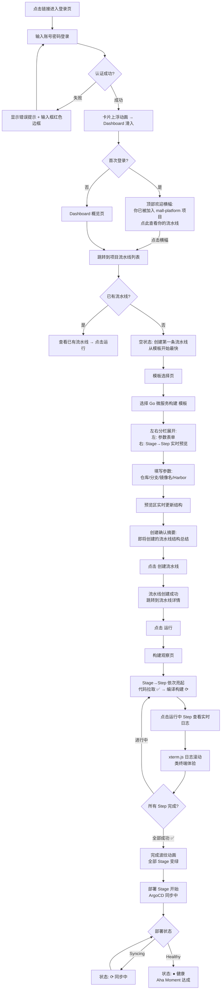
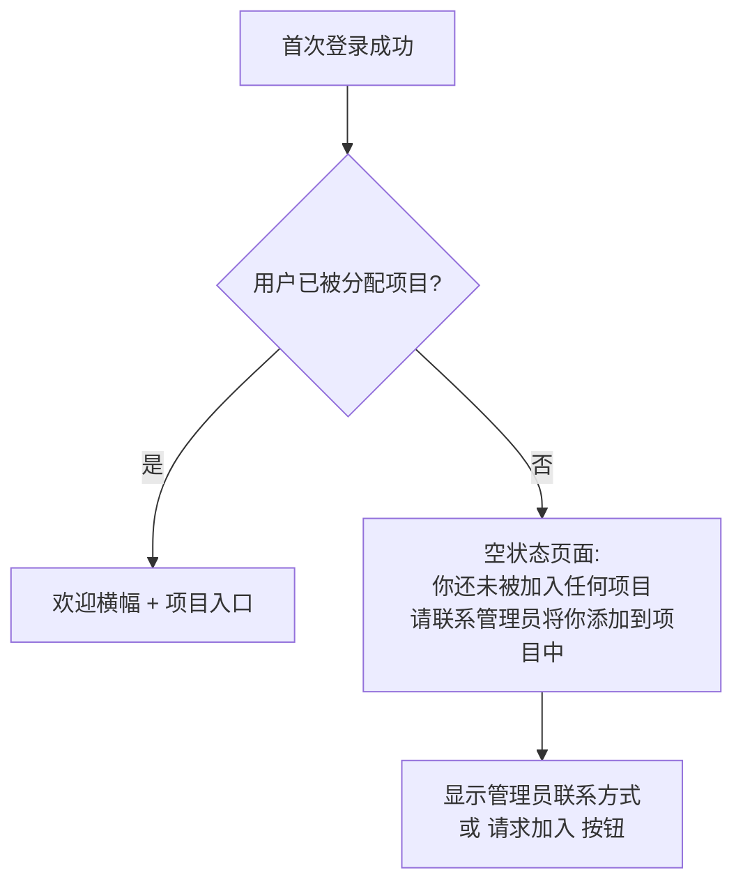
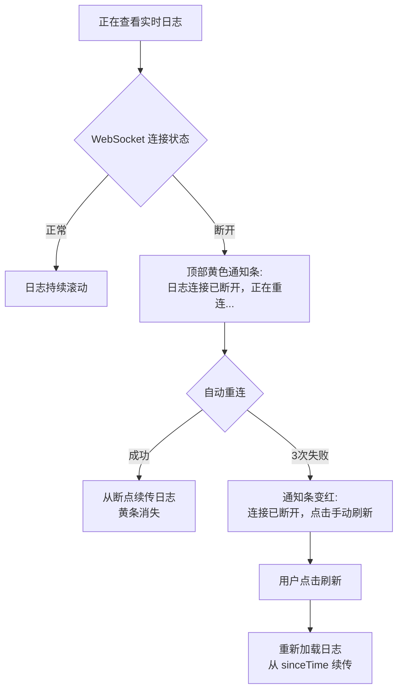
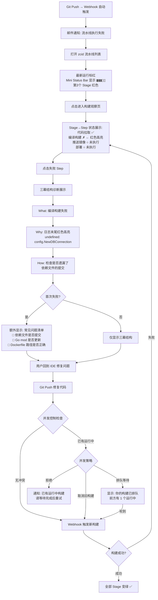
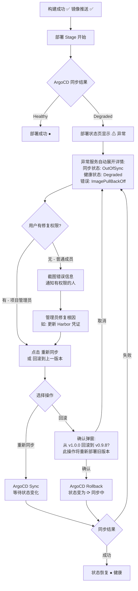
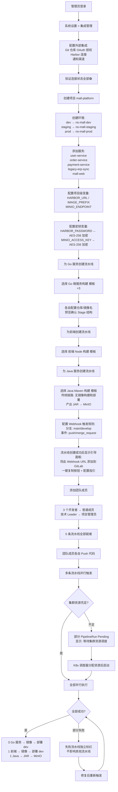
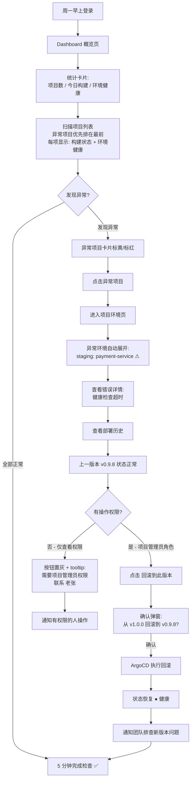
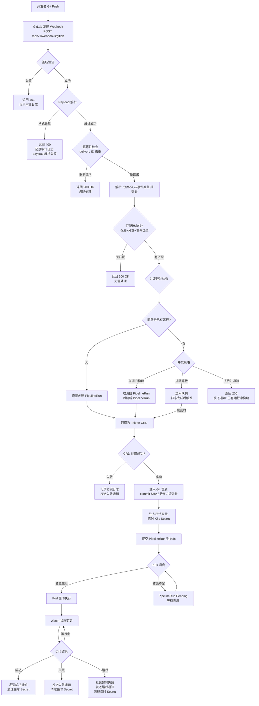
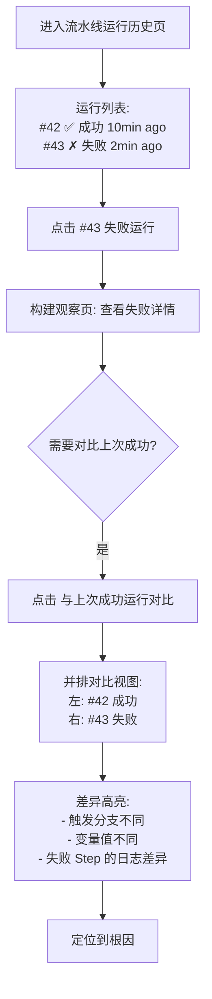

# UX Design Specification zcid

**Author:** xjy
**Date:** 2026-03-01

---

<!-- UX design content will be appended sequentially through collaborative workflow steps -->

## Executive Summary

### Project Vision

zcid 是基于 Tekton + ArgoCD 的一站式云原生 CI/CD 平台，核心 UX 定位是「小白都好用」。平台作为 Tekton/ArgoCD 之上的智能翻译层和状态看板，将复杂的 Kubernetes 资源编排封装在直观的可视化操作界面之后。

UX 设计的核心使命：让三类用户（后端开发者、DevOps 工程师、技术管理者）都能在自己的技能水平上高效完成 CI/CD 操作。通过三层体验设计（模板→可视化→YAML），同一个入口服务新手到高级用户的全谱系需求。

视觉语言采用 Apple 风格蓝白色调，使用 Arco Design 组件库，追求现代简洁的设计感，与同类产品（Zadig、Jenkins）形成明显的视觉差异化。

**核心 UX 原则：** 目标用户不是真正的技术小白，而是「被工具门槛阻挡的有经验开发者」。因此 UX 策略是**降低操作复杂度而非概念复杂度**——用户知道什么是构建、镜像、部署，只是不想写 YAML。

### Target Users

**主要用户：**

| 用户 | 代表 | 核心场景 | 技术水平 | 使用频率 |
|------|------|---------|---------|---------|
| 后端开发者 | 小李，25 岁，3 年经验 | 提交代码→查看构建→确认部署 | K8s 基础了解，不写 YAML | 每日多次 |
| DevOps 工程师 | 老张，30 岁，5 年经验 | 配置流水线→管理环境→赋能开发者 | K8s/Helm/CI/CD 精通 | 每日 |
| 技术管理者 | 王总，35 岁 | Dashboard 概览→交付质量决策 | 关注效率指标而非技术细节 | 每日/每周 |

**次要用户：** 系统管理员（通常由 DevOps 兼任），负责集群连接、镜像仓库、权限、全局变量等系统级配置。

**关键用户旅程：**

- 开发者 Aha 时刻：第一次全程不写 YAML 完成从提交到部署的闭环
- DevOps Aha 时刻：开发者第一次自己完成了流水线配置和部署
- 上手目标：新用户登录到第一次成功跑通流水线 < 30 分钟

### Key Design Challenges

1. **流水线可视化编排器** — MVP 核心差异化功能。需在「足够强大支撑真实 CI/CD 场景」和「小白看得懂用得了」之间平衡。Stage→Step 模型的执行语义（Stage 并行、Step 串行）需要通过视觉语言直观传达。使用 @xyflow/react v12 实现，需设计自定义节点类型（StageNode、StepNode、AddStageButton、AddStepButton）、连线规则、Step 参数配置面板（Drawer/Modal），不同 Step 类型参数结构不同——这是一个**领域特定的可视化编辑器**，而非简单拖拽画布。
2. **三层体验的认知负荷递进** — 模板→可视化→YAML 不应是三个独立模式的切换，而是**同一条学习路径上的自然进阶**。用户应在使用模板的过程中自然发现可视化编排的入口（「模板背后到底做了什么」）。采用**单向升级模型**：模板→可视化→YAML 可逐级升级，但 YAML 模式包含不支持的高级 Tekton 特性时锁定在 YAML 模式，避免双向同步的复杂性。同时需要**只读可视化视图**——即使流水线是 YAML 模式，普通成员也能看到简化的 Stage/Step 结构展示。
3. **实时日志与错误态体验** — 构建失败是高频场景（占比可达 30-50%），错误定位效率直接决定用户满意度。需设计：Step 级状态色彩编码、失败 Step 自动展开日志、错误行高亮、WebSocket 断连状态指示与自动重连反馈。技术约束：大型构建可能产出数万行日志，必须使用**虚拟滚动**（virtualized scrolling），同时需支持 ANSI 颜色码解析（构建工具普遍使用彩色输出）。默认只展开当前运行/失败的 Step 日志，其余折叠，控制 WebSocket 连接数。
4. **RBAC 驱动的界面适配** — 三级角色 + 项目级权限组合出复杂的可见性矩阵（13 项操作 × 3 角色）。Casbin 4-tuple 模型意味着同一用户在不同项目里看到的界面可能完全不同。需要处理**跨项目上下文切换时的角色感知变化**，而非仅单个页面的权限控制。密钥变量对普通成员完全隐藏（非灰态禁用）。
5. **空状态与首次引导** — 每个空状态页面都需要设计行动引导路径。新用户登录看到空白 Dashboard 会直接流失。空项目列表引导「创建第一个项目」，空流水线列表引导「从模板创建」，空环境列表引导「配置第一个环境」。
6. **搜索与筛选效率** — 当项目规模增长后（100+ 项目、1000+ 流水线），列表的搜索和筛选效率是留存用户的关键（FR56）。需为主要列表页设计统一的筛选交互模式。

### Design Opportunities

1. **模板系统的极致首次体验** — 4 个高质量预置模板让新用户在 5 分钟内跑通第一条流水线。模板选择页设计为引导式体验（选语言→选仓库→填参数→运行），而非冰冷的列表。模板参数表单采用**动态表单系统**（模板定义 JSON Schema，前端根据 Schema 自动渲染），配合分组、说明文字、推荐值（placeholder 提示常用配置），兼顾灵活性和美观度。
2. **Apple 风格 Dashboard** — 卡片式布局展示项目状态、最近构建、环境健康度。针对三类角色智能排列信息优先级：开发者看自己的项目和最近构建，DevOps 看全项目状态，管理者看跨项目健康汇总。配合蓝白色调和 Arco Design 组件库，打造国内 DevOps 工具中少见的「高级感」。
3. **构建过程的沉浸式可视化** — 流水线运行时每个 Step 实时状态动画（等待→运行→成功/失败），配合 WebSocket 日志流，打造类似「观看代码被构建」的沉浸体验。成功/失败的视觉反馈要即刻、醒目、有成就感。
4. **只读可视化视图** — 即使 DevOps 用 YAML 模式创建的复杂流水线，普通开发者也能通过简化的可视化视图理解流水线结构和运行状态，降低团队协作的认知门槛。

## Core User Experience

### Defining Experience

**核心交互循环：**

zcid 的核心体验围绕一个持续循环：**配置（一次）→ 触发（每次）→ 观察（实时）→ 行动（按需）**

1. **配置阶段（低频，DevOps 主导）：** 创建项目→配置环境→创建流水线（模板/可视化/YAML）→配置触发规则
2. **触发阶段（高频，开发者主导）：** 代码推送自动触发 / 手动点击触发 — 这一步必须是**零思考**的
3. **观察阶段（最高频，所有用户）：** 实时查看流水线运行状态 + 每个 Step 的日志流 — 这是用户停留时间最长的界面
4. **行动阶段（按需）：** 构建成功→确认部署状态；构建失败→定位错误→修复代码→重新触发

**最频繁操作 Top 3：**

| 排名 | 操作 | 频率 | 核心要求 |
|------|------|------|---------|
| 1 | 查看构建状态和日志 | 每日多次 | 实时、直观、失败时快速定位 |
| 2 | 触发流水线运行 | 每日数次 | 一键触发或自动触发，零配置 |
| 3 | 查看部署状态 | 每日数次 | 环境健康度一目了然 |

**核心交互 — 「构建观察」体验：**

用户触发构建后进入「构建观察」页面，这是 zcid 最核心的体验界面：

- 顶部：流水线名称 + 触发信息（Git commit SHA、分支、触发者、时间）
- 中部：Stage→Step 可视化进度条，每个 Step 实时状态色彩编码（灰色等待→蓝色运行→绿色成功→红色失败）
- 下部：当前运行 Step 的实时日志流，支持 ANSI 颜色、虚拟滚动、错误行高亮
- 失败时：失败 Step 自动展开并滚动到错误位置，醒目的红色视觉标识
- 日志搜索：`Ctrl+F` 快捷键触发日志内搜索，搜索结果在滚动条上标记位置（类似 VS Code 搜索热力条），支持上下跳转

**并发构建 — 「项目运行面板」：**

当项目有多条流水线并行运行时（FR27），项目页面需要提供运行面板：

- 列出当前项目所有正在运行的流水线，按开始时间排序
- 每条显示：流水线名称 + 当前 Stage/Step + 进度指示 + 触发者
- 点击任意一条进入详细的构建观察页面
- 排队中的构建显示队列位置（FR26 并发控制策略可视化）

**流水线创建的多种路径：**

| 创建方式 | 适用场景 | 用户 |
|---------|---------|------|
| 从模板创建 | 新项目首次配置 | 所有用户 |
| 复制已有流水线（FR29） | 项目有 10+ 流水线时，基于已有配置微调 | 项目管理员 |
| 可视化编排新建 | 需要自定义 Stage/Step 组合 | 项目管理员 |
| YAML 直接编写 | 需要 Tekton 高级特性 | DevOps |

**运行时参数覆盖（FR30）：**

手动触发对话框采用渐进式设计：
- 默认态：显示流水线名称 + 分支（从配置读取）+ 大大的「运行」按钮
- 展开态：点击「高级选项」展开参数覆盖表单（分支、环境变量等）
- 记住上次展开状态（DevOps 用户一旦开始用高级选项，后续大概率每次都用）

**操作历史就近查看：**

审计日志（FR52）不只是独立的管理页面，更重要的是在流水线详情页和项目设置页面提供**操作历史**入口，让项目管理员就近回答「谁在什么时候改了这个配置」。

### Platform Strategy

**平台定位：** Web 应用（SPA），桌面浏览器优先。

| 维度 | 决策 | 依据 |
|------|------|------|
| 平台 | Web SPA（React 19 + Vite 6） | CI/CD 是工作场景工具，桌面浏览器是主要使用环境 |
| 输入方式 | 鼠标 + 键盘为主 | 流水线编排需要精确操作，触屏不适合 |
| 响应式 | 最小宽度 1280px，不做移动端适配 | 目标用户在工位使用，移动端查看场景极少 |
| 离线功能 | 不需要 | 平台依赖实时 K8s/Tekton 交互，离线无意义 |
| 浏览器支持 | Chrome/Edge 最新两个大版本，Firefox ESR | 开发者群体浏览器更新及时，不需要兼容 IE/Safari |
| 实时能力 | WebSocket（日志推送、状态变更） | 构建日志实时性是核心体验 |
| 键盘快捷键 | 提供高频操作快捷键（触发构建、切换 Tab、搜索、日志内搜索） | DevOps 用户偏好键盘操作效率 |

**技术约束对 UX 的影响：**

- @xyflow/react v12 驱动流水线可视化编排器，需自定义节点/边类型
- Arco Design v2.66 提供基础组件，蓝白主题通过 Design Token 定制
- WebSocket 统一消息协议（type/payload/timestamp/seq），支持断点续传
- 前端状态 5 层架构（TanStack Query 服务端数据 + Zustand UI 状态 + WebSocket 实时 + React Router URL + 组件表单）

### Effortless Interactions

**必须零思考的操作：**

1. **代码推送后自动触发构建** — Webhook 配置一次后，开发者 `git push` 即自动触发对应流水线，无需打开平台手动操作。构建开始后自动推送通知。Webhook 收到但尚未开始执行时显示「待启动」过渡状态，避免用户误判为触发失败而重复操作。
2. **从模板创建流水线** — 选择模板→选择仓库→填写最少参数→点击运行。每个模板**必填项最多 3 个**（仓库地址、分支、镜像名称），其余全部有合理默认值。全程不超过 5 个步骤，不出现任何 YAML。模板选择后播放短暂「展开」动画（0.5s），展示模板展开为 Stage→Step 结构，让用户理解模板本质并自然发现可视化编排器的存在。
3. **查看构建结果** — 打开平台即看到最近构建状态列表，点击任意一条即进入详情。成功绿色、失败红色、运行中蓝色，色彩即信息。
4. **日志断线自动重连** — WebSocket 断开后静默重连，基于 seq 参数从断点续传日志。用户可能完全感知不到断线发生。

**应当自动化的流程：**

- 构建产物信息（镜像地址+Tag / 产物存储路径）自动关联到运行记录，无需用户手动查找
- 流水线运行时自动注入 Git 信息（commit SHA、分支、提交者），无需用户手动填写
- 密钥变量运行时自动注入临时 K8s Secret，运行后自动清理，用户完全无感
- 日志自动归档到 MinIO，历史日志查看无缝切换，不因 Pod 被清理而丢失
- PipelineRun CRD 自动 TTL 清理，不需要用户关心 K8s 资源膨胀
- 构建历史耗时参考（P1）：每个 Step 旁显示上次运行耗时，让等待变得可预期

**竞品痛点消除：**

| 竞品痛点 | zcid 解决方案 |
|---------|-------------|
| Tekton 原生：必须写 YAML 才能创建流水线 | 模板一键创建 + 可视化编排，YAML 仅作为高级逃生舱 |
| Jenkins：配置分散在多个界面 | 统一管理面：项目→环境→服务→流水线一个入口 |
| Zadig：模板灵活度不足 | 三层体验递进，高级用户可完全自定义 |
| 通用问题：构建失败后排错困难 | 失败 Step 自动展开 + 错误行高亮 + 日志搜索 |

### Critical Success Moments

**Make-or-Break 时刻：**

1. **首次构建成功（Aha Moment）** — 新用户从模板创建流水线到第一次看到绿色成功状态。如果这个过程 < 30 分钟且不需要求助，用户留存率将大幅提升。视觉反馈要有「成就感」——不仅仅是一个绿色图标，可以考虑轻微的成功动画或状态变化。模板「展开」动画是这个旅程中的关键引导触点。

2. **首次构建失败的排错体验** — 这可能比首次成功更关键。如果用户第一次遇到失败就能快速找到错误原因（失败 Step 自动定位 + 错误日志高亮 + 日志内 `Ctrl+F` 搜索），他们会信任这个平台。如果需要到处翻找才能看到错误信息，信任立即崩塌。构建卡死场景同样重要——Step 运行超时需要明确的超时指示和**醒目的取消按钮**（不能藏在三级菜单里）。

3. **Webhook 自动触发的闭环验证** — 开发者配置好 Webhook 后第一次推送代码，看到平台自动触发构建。「我只是 push 了代码，构建就自己跑起来了」——这是从手动操作到自动化的认知跃迁。触发延迟期间显示「待启动」过渡状态消除焦虑。

4. **DevOps 赋能时刻** — 老张创建好模板和项目后，小李第一次自己完成了完整的 CI/CD 流程。这是 DevOps 用户的核心价值验证——自己不再是瓶颈。

5. **管理者一览全局** — 王总打开 Dashboard 就能看到所有项目的构建趋势和环境健康度，不需要找人问。这个时刻的关键是**信息密度**——足够多的信息，足够少的噪音。

**体验失败的致命点：**

- 模板创建后运行失败且错误信息不可理解 → 「这个平台不靠谱」
- 构建日志延迟或丢失 → 「还不如直接看 kubectl logs」
- 权限报错信息不明确 → 「我为什么点不了这个按钮？」
- 页面加载超过 3 秒 → 「比 Jenkins 还慢」
- 构建卡死无超时提示且取消按钮难找 → 「只能干等」

### Experience Principles

基于以上分析，zcid 的 UX 设计遵循以下核心原则：

**原则 1：状态即界面（Status as Interface）**
> 用户打开任何页面，第一眼看到的就是当前状态。构建是成功还是失败、环境是健康还是异常、流水线是运行中还是空闲——色彩和图标承载核心信息，文字只是补充。

**原则 2：渐进式复杂度（Progressive Complexity）**
> 简单场景用简单工具。模板→可视化→YAML 是一条自然的学习路径，用户在当前层级满足需求时不会被更高复杂度干扰。每一层都能独立完成工作，升级是可选的。触发对话框「默认折叠 + 可展开高级选项」是这一原则的典型应用。

**原则 3：失败优先设计（Failure-First Design）**
> 构建失败的体验比成功更重要。错误状态的可见性、错误信息的可理解性、从错误到修复的路径清晰度——这些决定了用户是否信任平台。每个可能失败的操作都必须有明确的错误反馈和下一步建议。构建卡死要有超时指示，取消操作要醒目易达。

**原则 4：零配置默认（Zero-Config Defaults）**
> 每个配置项都有合理的默认值。用户从模板创建流水线时，应该能直接运行而无需修改任何配置。高级配置项存在但不强制，「开箱即用」是底线。每个模板必填项最多 3 个。

**原则 5：操作可逆（Reversible Actions）**
> 破坏性操作（删除项目、删除流水线）需要二次确认。部署支持回滚。用户不应该因为一次误操作而陷入不可恢复的状态。降低操作焦虑，鼓励探索。

**原则 6：权限可感知（Permission Awareness）**
> 权限限制不应让用户困惑。采用分层策略：密钥变量对无权用户完全隐藏（安全需要）；操作权限不足时按钮灰掉 + tooltip 说明原因和获取权限的方式（如「需要项目管理员权限，请联系 @老张」）。跨项目切换时角色变化通过 UI 线索自然体现。

## Desired Emotional Response

### Primary Emotional Goals

**核心情感：掌控感（In Control）**

zcid 要创造的首要情感是**掌控感**——用户在任何时刻都清楚地知道「发生了什么、正在发生什么、接下来会发生什么」。这是对 Tekton/ArgoCD 原生体验（YAML 黑箱、状态不透明）的直接情感反转。

| 情感目标 | 描述 | 对标竞品的情感差距 |
|---------|------|------------------|
| **掌控感** | 我清楚地知道每一步在做什么 | Tekton 原生：「我提交了 YAML 但不知道它在干嘛」 |
| **效率感** | 我用最少的操作完成了目标 | Jenkins：「我点了 20 个页面才配好一个 Job」 |
| **信任感** | 我相信平台能正确执行我的意图 | 通用痛点：「构建失败了但我不知道为什么」 |
| **成就感** | 我自己完成了以前需要找人帮忙的事 | 开发者痛点：「每次改流水线都要找 DevOps」 |

**次要情感：**

- **好奇心** — 模板展开动画和可视化编排激发「我想试试更高级的功能」
- **安心感** — 密钥加密、权限控制、操作可逆让用户放心探索
- **专业感** — Apple 风格蓝白色调、现代化 UI 让用户觉得「这是一个专业的工具」

### Emotional Journey Mapping

**开发者（小李）的情感旅程：**

| 阶段 | 触发场景 | 期望情感 | 需要避免的情感 | 设计支撑 |
|------|---------|---------|-------------|---------|
| **发现** | 被 DevOps 邀请加入项目 | 好奇、期待 | 抗拒、负担感 | 简洁的邀请通知，不暴露技术复杂度 |
| **首次登录** | 看到 Dashboard | 清晰、被引导 | 茫然、不知所措 | 空状态引导（邀请式文案：「你的 CI/CD 旅程从这里开始」） |
| **首次创建** | 从模板创建流水线 | 惊喜、这么简单？ | 困惑、参数太多 | 模板引导流程，必填项 ≤ 3 个 |
| **首次构建** | 观看构建过程 | 兴奋、掌控感 | 焦虑、不确定 | Step 实时状态 + 呼吸灯动画 + 日志流 |
| **等待构建** | 切换到其他窗口工作 | 安心、被通知 | 反复切窗口检查 | 浏览器标签页标题变化 + Notification API |
| **首次成功** | 看到绿色成功状态 | 成就感、自豪 | 无感、平淡 | 完成波纹动画 + 构建产物信息即刻展示 |
| **首次失败** | 构建失败 | 冷静、能找到原因 | 恐慌、无助 | 三幕结构（发生了什么→为什么→怎么办）+ AI 诊断预留位 |
| **日常使用** | 推送代码→自动构建 | 流畅、无感知 | 等待、不确定是否触发 | Webhook 自动触发 + 待启动过渡态 |
| **进阶** | 尝试可视化编排 | 好奇、我能行 | 畏惧、太复杂了 | 渐进式界面，从模板查看编排结构入手 |

**DevOps（老张）的情感旅程：**

| 阶段 | 触发场景 | 期望情感 | 需要避免的情感 | 设计支撑 |
|------|---------|---------|-------------|---------|
| **评估** | 对比 zcid 与 Jenkins/Tekton 原生 | 专业认可、这个靠谱 | 怀疑、又一个半成品 | 系统设置流程清晰，集成状态可视化 |
| **配置** | 对接 Git/Harbor/集群 | 高效、一步到位 | 烦躁、配置项太多 | 集成配置向导 + 连接测试即时反馈 |
| **赋能** | 创建模板供团队使用 | 掌控感、架构师感 | 不确定团队能否用起来 | 模板预览 + 团队使用统计 |
| **解放** | 开发者自助完成 CI/CD | 自豪、终于不是瓶颈 | 不放心、他们会搞砸吗 | 审计日志 + 权限控制给予安全感 |
| **数据验证** | 查看项目统计 | 赋能成就感 | 缺少反馈 | 「本月自助部署 47 次」— 赋能效果可量化 |
| **高级使用** | YAML 模式微调 | 自由、不受限 | 被平台限制了能力 | YAML 逃生舱无缝切换 |

**管理者（王总）的情感旅程：**

| 阶段 | 触发场景 | 期望情感 | 需要避免的情感 | 设计支撑 |
|------|---------|---------|-------------|---------|
| **打开 Dashboard** | 查看全局状态 | 清晰、一目了然 | 信息过载、看不懂 | 卡片布局 + 比较性文案（「本周构建 23 次，比上周多 15%」） |
| **发现问题** | 某环境异常 | 掌控、知道该找谁 | 焦虑、不知道严重程度 | 异常状态醒目 + 负责人信息 |
| **做决策** | 评估团队交付效率 | 有据可依、自信 | 数据不够、靠猜 | 趋势数据 + 活跃感文案（「最近部署：2h 前 by 小李」） |

### Micro-Emotions

**关键微情感对及设计策略：**

**自信 vs 困惑：**
- 自信：每个操作都有即时反馈（按钮点击后立即有加载状态，不是「什么都没发生」）
- 消除困惑：操作结果明确（成功提示用绿色 Toast，失败提示用红色 Toast + 错误描述）
- 导航永远可预测（侧边栏高亮当前位置，面包屑显示层级路径）

**信任 vs 怀疑：**
- 建立信任：系统状态透明（健康检查端点可视化，集成连接状态实时展示）
- 消除怀疑：操作可追溯（审计日志就近查看）、操作可逆（部署回滚、二次确认删除）
- 密钥安全可感知：密钥变量显示为 `••••••••`，不是空白，让用户知道「值存在且受保护」

**成就感 vs 挫败感：**
- 创造成就感：首次构建成功的完成波纹动画、模板创建后的进度指示（「还差 2 步就能运行」）
- 缓解挫败感：构建失败时不只显示错误，用三幕结构提供完整诊断（发生了什么→为什么→怎么办 + 直达链接）
- P1 升级为 AI 智慧导师：AI 分析错误日志，生成个性化修复建议，从「冷冰冰的错误码」变成「有经验的前辈指导」
- 空状态不是死胡同而是起点（邀请式文案：「你的 CI/CD 旅程从这里开始」）

**效率感 vs 等待焦虑：**
- 提升效率感：常用操作 ≤ 3 次点击完成、键盘快捷键、最近项目/流水线快捷入口
- 缓解等待焦虑：构建过程有节奏感的动画（Step 接力过渡 + 运行中呼吸灯），传递「流水线在流动」
- 多窗口工作支持：浏览器标签页标题动态变化（「✅ 构建成功」/「❌ 构建失败」）+ favicon 色彩变化 + Notification API（需授权）
- 切回来时自动恢复上下文：日志自动滚动到最新位置
- 页面切换无白屏（骨架屏 Skeleton + 路由预加载）

**安心感 vs 操作焦虑：**
- 营造安心感：破坏性操作二次确认（对话框明确告知影响范围）、权限不足时友好提示（灰掉 + tooltip）
- 降低操作焦虑：配置变更可 diff 对比、部署支持回滚到任意历史版本

### Design Implications

**情感→设计的映射关系：**

| 目标情感 | 设计手段 | 具体实现 |
|---------|---------|---------|
| 掌控感 | 状态可视化 | Step 实时色彩编码、环境健康徽章、构建进度条 |
| 掌控感 | 信息层次 | 重要信息前置（状态→触发者→时间），详情按需展开 |
| 效率感 | 操作快捷 | 模板一键创建、Webhook 自动触发、键盘快捷键 |
| 效率感 | 减少跳转 | 构建观察页聚合所有相关信息（触发信息+进度+日志+产物） |
| 信任感 | 透明度 | 每个操作有即时反馈、错误信息三幕结构、审计日志可追溯 |
| 信任感 | 安全感知 | 密钥脱敏显示 `••••••••`、权限边界清晰、连接状态实时监测 |
| 成就感 | 正向反馈 | 成功完成波纹动画、进度指示（「还差 N 步」）、空状态邀请式引导 |
| 好奇心 | 渐进揭示 | 模板展开动画、高级选项折叠、YAML 预览入口 |
| 专业感 | 视觉品质 | Apple 风格蓝白色调、一致的组件风格、合理的留白和排版 |
| 安心感 | 操作保护 | 二次确认、可逆操作、diff 对比、权限 tooltip 引导 |
| 节奏感 | 微交互动画 | Step 接力过渡（0.3s）、运行中呼吸灯、完成波纹扩散（0.5s） |

**构建状态的多渠道感知（等待场景优化）：**

| 渠道 | 实现方式 | 需要授权 | 优先级 |
|------|---------|---------|--------|
| 页面内状态 | Step 色彩编码 + 动画 | 否 | P0 |
| 标签页标题 | `✅ 构建成功 - zcid` / `❌ 构建失败 - zcid` | 否 | P0 |
| Favicon | 成功绿色 / 失败红色 / 运行中蓝色 | 否 | P0 |
| 浏览器通知 | Notification API | 是（一次性） | P0 |

**动画性能约束：**
- 只对视口内可见的 Step 执行 CSS animation（Intersection Observer API）
- 20+ Step 的复杂流水线中，视口外 Step 用静态状态渲染
- 所有动画 60fps，使用 CSS transform/opacity 避免 layout thrashing

**AI 诊断 UI 预留（MVP→P1 无缝升级）：**
- MVP 阶段：构建失败的 Step 日志下方显示静态三幕结构（发生了什么→为什么→怎么办）
- P1 阶段：同一位置升级为 AI 动态生成的诊断内容，无需改动 UI 布局
- AI 诊断定位为「智慧导师」角色——对话式语气、个性化建议，而非冷冰冰的错误码

**需要刻意避免的负面设计模式：**

- 空白加载页面（用骨架屏替代）
- 无反馈的按钮点击（所有按钮必须有 loading 状态）
- 含糊的错误消息（「操作失败」→ 应改为三幕结构的完整诊断）
- 突然消失的 UI 元素（权限变化导致按钮消失应有过渡，而非刷新后突然不见）
- 过度的确认弹窗（只在真正破坏性操作时弹出，日常操作不打断流程）
- 否定式空状态文案（「你还没有任何项目」→「你的 CI/CD 旅程从这里开始」）
- 过度装饰性动画（每个动画必须回答一个用户问题，否则就是噪音）

### Emotional Design Principles

**原则 1：即时反馈（Instant Feedback）**
> 每个用户操作在 200ms 内必须有视觉反馈。按钮点击有 loading 态，请求发送有进度指示，操作完成有结果 Toast。消除「我点了但不知道有没有效果」的焦虑。

**原则 2：失败是学习而非惩罚（Failure as Learning）**
> 构建失败时提供三幕结构：「发生了什么 + 为什么 + 怎么修」。不使用警告性、责备性的语言（不说「你的配置有误」，而说「构建在镜像推送步骤失败，Harbor 返回认证错误。建议检查镜像仓库凭证配置」）。P1 升级为 AI 智慧导师，提供个性化诊断。

**原则 3：渐进揭示而非信息轰炸（Progressive Disclosure）**
> 默认展示用户当前需要的信息层级。日志默认折叠只展示运行中/失败的 Step，高级选项默认收起，YAML 视图作为可选切换。信息量随用户操作逐步增加，而非一次性全部呈现。

**原则 4：一致性创造信任（Consistency Builds Trust）**
> 相同的操作在任何页面有相同的交互模式。删除始终用红色按钮 + 二次确认，成功始终用绿色 Toast，列表始终用相同的筛选/搜索模式。一致性降低认知负荷，让用户的经验可迁移。

**原则 5：品质感传递专业性（Quality Signals Professionalism）**
> UI 的视觉品质直接影响用户对平台可靠性的判断。Apple 风格不只是「好看」，更是传递「这是一个精心打造的专业工具」的信号。动画流畅（60fps）、排版精致（合理留白、对齐）、色彩一致（蓝白主调、语义化色彩系统）。

**原则 6：节奏感传递活力（Rhythm Conveys Vitality）**
> 流水线执行是一段有节奏的旋律。Step 之间的接力过渡（0.3s）传递「流程在流动」，运行中的呼吸灯传递「步骤在活动」，完成后的波纹扩散传递「任务已收束」。动画是信息传递的手段，不是装饰——每个动画必须回答一个用户问题。

**原则 7：上下文感知（Context Awareness）**
> 同一个数据对不同角色有不同的情感意义。Dashboard 使用比较性文案（「本周构建 23 次，比上周多 15%」）和活跃感文案（「最近部署：2h 前 by 小李」），将数据转化为故事。用户切回浏览器时自动恢复上下文，标签页标题即时反映构建结果。

## UX Pattern Analysis & Inspiration

### Inspiring Products Analysis

**1. GitHub Actions — CI/CD 工作流的交互标杆**

- **核心优势：** 工作流运行视图将 Job 和 Step 以树状结构清晰展示，每个 Step 可展开查看实时日志，成功/失败状态一目了然
- **日志体验：** 按 Step 分组折叠，失败 Step 自动展开，日志行可链接分享（`#L42`），支持搜索。CI/CD 日志交互的行业最佳实践
- **触发信息：** 每次运行显示触发方式（push/PR/manual）、commit SHA、分支、触发者头像，上下文完整
- **不足：** 没有可视化编排器，没有模板系统，没有部署状态统一展示

**zcid 可借鉴：** 日志分组折叠、Step 状态树形展示、触发信息完整度、日志行可链接（hover 行号出现链接图标，支持团队协作分享错误位置）
**zcid 要超越：** 可视化编排器、模板一键创建、部署状态统一管理

**2. Vercel — 部署体验的极致简约**

- **核心优势：** 推送代码即部署，零配置。部署状态页面极简——三阶段（Building → Deploying → Ready）进度条展示
- **错误体验：** 构建失败时直接展示错误日志关键片段，不需要展开完整日志即可了解问题
- **Dashboard：** 项目卡片展示最近部署状态和域名，信息密度恰到好处
- **不足：** 只适合前端/Serverless 场景，不支持复杂流水线编排，不支持私有部署

**zcid 可借鉴：** 部署三阶段极简展示、错误关键片段提取、Dashboard 卡片布局
**zcid 要超越：** 多 Stage 复杂流水线、后端/容器化场景、私有部署

**3. Linear — 项目管理的交互美学**

- **核心优势：** 极致的键盘快捷键体系（`C` 创建、`/` 搜索），操作效率极高
- **视觉设计：** 克制的配色、大量留白、精致排版，传递「专业工具」而非「企业软件」
- **列表交互：** 筛选/排序/分组一气呵成，全局搜索 `Cmd+K` 覆盖所有内容类型
- **状态系统：** 状态用色彩+图标双重传达（色盲友好）
- **动画：** 微交互克制但精致，60fps 无卡顿

**zcid 可借鉴：** 键盘快捷键体系、`Cmd/Ctrl+K` 全局搜索、状态双编码、克制的动画风格
**zcid 要适配：** 蓝白色调替代 Linear 紫色调，CI/CD 领域快捷键语义

**4. Grafana — 实时监控 Dashboard 的信息架构**

- **核心优势：** 卡片/面板灵活布局，信息密度高但不混乱。每个面板是独立信息单元
- **实时数据：** 数据自动刷新，变化用动画过渡（数字渐变而非跳变）
- **异常标识：** 告警状态醒目但不遮挡正常信息
- **不足：** 学习曲线陡峭，配置复杂

**zcid 可借鉴：** 卡片面板信息单元、实时数据动画过渡、异常不遮挡正常信息
**zcid 要避免：** 配置复杂度，Dashboard 应开箱即用。王总视角更适合 Vercel 极简风格而非 Grafana 信息密集风格

**5. ArgoCD Web UI — 直接竞品参考**

- **核心优势：** Application 资源树展示，同步状态+健康状态双维度标识
- **不足：** UI 原始，交互生硬，对非 K8s 专家不友好，无项目/流水线概念

**zcid 可借鉴：** 同步状态+健康状态双维度标识
**zcid 要超越：** 友好展示部署状态，不暴露 K8s 资源层级细节

**6. VS Code — 面板布局与开发者心智模型**

- **核心优势：** 编辑器+侧边栏+终端+面板的多区域布局，面板可拖拽调整大小，记忆用户偏好
- **终端面板 Split：** 可并排显示多个终端，启发并行 Stage 日志并排展示（P1）
- **开发者熟悉度：** 小李每天使用 VS Code，面板布局的肌肉记忆可零成本迁移

**zcid 可借鉴：** 构建观察页面板可拖拽调整（进度区/日志区比例可调，用 `react-resizable-panels` 实现），面板比例存 localStorage 记忆用户偏好

**7. Zadig — 直接竞品的教训**

- **做对的：** 项目→工作流→环境三层模型、内置构建模板、Webhook+手动触发
- **做错的：** UI 设计语言过时（像 2018 年的企业后台）、工作流编辑器用表单堆砌（非可视化画布）、日志体验差（无 Step 折叠、无错误高亮）、环境状态需要点很多层

**zcid 的差异化空间：** 现代化 Apple 风格 UI、可视化编排画布、日志分组折叠+错误高亮+搜索、环境状态一级展示

**8. GitLab CI/CD — Pipeline 可视化参考**

- **核心优势：** 节点+箭头展示 Stage 关系，运行时每个节点有状态色彩，简单直观
- **参考价值：** 流水线运行态的简化可视化展示（zcid 编排器功能更强大，但运行态展示可参考其简洁性）

### Transferable UX Patterns

**导航模式：**

| 模式 | 来源 | 在 zcid 的应用 |
|------|------|---------------|
| 侧边栏 + 面包屑双导航 | Linear | 项目→环境→服务→流水线层级导航 |
| 顶部可见搜索框 + `Ctrl+K` 快捷键 | Linear + 飞书 | 搜索框 placeholder：「搜索项目、流水线、构建...（Ctrl+K）」，同时教会用户快捷键 |
| 标签页切换 | GitHub Actions | 流水线详情页：概览/配置/运行历史/变量 |

**交互模式：**

| 模式 | 来源 | 在 zcid 的应用 |
|------|------|---------------|
| Step 分组折叠日志 | GitHub Actions | 构建观察页日志按 Step 折叠，失败自动展开 |
| 日志行可链接分享 | GitHub Actions | hover 行号出现链接图标，支持团队协作排错 |
| 三阶段进度展示 | Vercel | 适配为 Stage 级进度 + Step 级详情展开 |
| 键盘快捷键 | Linear | `R` 运行、`C` 取消、`L` 日志、`/` 搜索（仅无输入框聚焦时生效） |
| 状态色彩+图标双编码 | Linear | 绿✓/红✗/蓝⟳/灰○，色盲友好 |
| 错误关键片段提取 | Vercel | 失败 Step 标题旁直接显示一行错误摘要 |
| 面板可拖拽调整 | VS Code | 构建观察页进度区/日志区比例可调，记忆用户偏好 |

**视觉模式：**

| 模式 | 来源 | 在 zcid 的应用 |
|------|------|---------------|
| Dashboard 卡片布局（极简风格） | Vercel | 每个卡片 2-3 个核心数据点，详情点进去看。偏 Vercel 极简而非 Grafana 密集 |
| 克制的微交互动画 | Linear | 状态变化、页面过渡精致但不花哨，统一 ease-out 0.2-0.5s |
| 大量留白+精致排版 | Linear | Apple 风格蓝白色调，留白传递专业感 |
| 实时数据动画过渡 | Grafana | 构建状态变化用渐变而非跳变 |
| 同步+健康双维度标识 | ArgoCD | 部署页面：同步状态+健康状态双标识，简化为 Service 层级 |
| Pipeline 节点可视化 | GitLab CI/CD | 流水线运行态用节点+箭头展示 Stage 关系 |

### Anti-Patterns to Avoid

| 反模式 | 常见于 | zcid 替代方案 |
|--------|--------|-------------|
| **YAML-first 交互** | Tekton/ArgoCD 原生 | 模板→可视化→YAML 三层体验 |
| **表单堆砌式编辑器** | Zadig | 可视化画布编排器（@xyflow/react） |
| **UI 设计语言过时** | Zadig/Jenkins | Apple 风格蓝白色调 + Arco Design |
| **配置向导过长** | 企业级 CI/CD | 最多 5 步，大量合理默认值 |
| **全局加载遮罩** | 早期 SPA | 局部加载（骨架屏+局部 spinner） |
| **日志纯文本无格式** | 传统 CI 工具 | ANSI 颜色+错误高亮+搜索+关键片段 |
| **权限报错无引导** | 多数 B2B 产品 | 灰掉+tooltip+引导联系管理员 |
| **Dashboard 信息过载** | Grafana（未优化时） | 固定布局，极简风格，角色差异化 |
| **操作后无反馈** | 低质量 SPA | 200ms 内即时反馈 |
| **隐藏搜索入口** | Linear（纯快捷键） | 可见搜索框 + 快捷键加速器 |
| **隐藏高级功能** | 过度简化的产品 | 渐进揭示：默认简化+高级可展开 |

### Design Inspiration Strategy

**直接采用（Adopt）：**

| 模式 | 来源 | 理由 |
|------|------|------|
| Step 分组折叠日志 + 失败自动展开 | GitHub Actions | CI/CD 日志交互行业最佳实践 |
| 日志行可链接分享 | GitHub Actions | 团队协作排错的关键触点 |
| 顶部可见搜索框 + `Ctrl+K` | Linear + 飞书 | placeholder 同时教会快捷键，降低学习门槛 |
| 状态色彩+图标双编码 | Linear | 色盲友好，信息传达更可靠 |
| Dashboard 极简卡片 | Vercel | 项目状态概览最佳展示形式 |
| 触发信息完整上下文 | GitHub Actions | 构建运行的必备信息 |

**适配采用（Adapt）：**

| 模式 | 来源 | 适配方式 |
|------|------|---------|
| 三阶段进度展示 | Vercel | 适配为 Stage 级进度 + Step 级详情展开 |
| 键盘快捷键体系 | Linear | 适配 CI/CD 语义，单字母仅在无输入框聚焦时生效 |
| 面板可拖拽调整 | VS Code | 构建观察页进度区/日志区可调，localStorage 记忆偏好 |
| 实时数据动画过渡 | Grafana | 适配到构建状态和部署健康度更新 |
| 资源树可视化 | ArgoCD | 简化为 Service→部署状态两层，隐藏 K8s 细节 |
| Pipeline 节点可视化 | GitLab CI/CD | 运行态 Stage 关系展示，编排态用更完整的画布 |
| 克制的微交互 | Linear | 适配蓝白 Apple 风格，统一 ease-out 0.2-0.5s |

**明确避免（Avoid）：**

| 反模式 | 理由 |
|--------|------|
| YAML-first 配置 | 与「小白都好用」核心理念矛盾 |
| 表单堆砌式工作流编辑 | Zadig 的教训，可视化画布是差异化 |
| 全局加载遮罩 | 打断用户流程，产生焦虑 |
| 长步骤配置向导 | 模板系统的核心价值是「快」 |
| 日志纯文本无格式 | 构建失败排错效率的最大杀手 |
| Dashboard 可自定义面板 | 增加复杂度，固定最佳布局即可 |
| 纯快捷键搜索入口 | 小白用户不知道快捷键，需可见入口 |

**技术实现约束：**

| 模式 | 约束 | 解决方案 |
|------|------|---------|
| 全局搜索 | MVP 无后端聚合接口 | MVP 客户端搜索（TanStack Query 缓存），P1 加 `/api/v1/search` |
| 面板拖拽 | 需要第三方库 | `react-resizable-panels`，与 @xyflow/react 不冲突 |
| 日志行链接 | 实时日志和归档日志行号需一致 | 架构已确保 Pod 完成后整体归档到 MinIO |
| `Ctrl+K` 快捷键 | Chrome 默认是地址栏聚焦 | JS 可拦截覆盖，已验证可行 |
| `Ctrl+F` 日志搜索 | 覆盖浏览器默认搜索 | 仅在日志面板聚焦时覆盖 |

## Design System Foundation

### 1.1 Design System Choice

**选型：Arco Design v2.66 + 定制 Design Token 主题层 + 领域专用组件库**

属于「Themeable System」路线——以成熟组件库为基础，通过 Design Token 体系实现品牌差异化，同时为 CI/CD 领域构建专用组件层。

**设计系统三层架构：**

| 层级 | 内容 | 来源 |
|------|------|------|
| **基础层** | Arco Design v2.66 组件库 | 直接使用，Design Token 定制主题 |
| **扩展层** | 通用业务组件（StatusBadge、EmptyState、ConfirmDialog、FilterBar） | 基于 Arco 封装 |
| **领域层** | CI/CD 专用组件（PipelineEditor、LogViewer、StepNode、BuildProgress） | 自主开发 |

### Rationale for Selection

**为什么是 Arco Design 而非其他选项：**

| 考虑因素 | Arco Design | Ant Design | MUI | Tailwind UI |
|---------|-------------|------------|-----|------------|
| 蓝白 Apple 风格适配 | ✅ 设计语言天然偏简洁现代 | ⚠️ 偏企业风格，需大量覆写 | ⚠️ Material 风格差异大 | ⚠️ 需从零搭建组件 |
| Design Token 定制 | ✅ CSS 变量 + Less 变量双体系 | ✅ 支持但体系较重 | ✅ Theme Provider | ❌ 非组件库 |
| React 19 兼容 | ✅ 官方支持 | ⚠️ 部分组件存在兼容问题 | ✅ 支持 | ✅ |
| 国内使用生态 | ✅ 字节系产品验证 | ✅ 蚂蚁系广泛使用 | ⚠️ 国内文档偏弱 | ✅ |
| 组件丰富度 | ✅ 80+ 组件覆盖 B 端场景 | ✅ 最全面 | ✅ | ⚠️ 需自建 |
| 包体积 | ✅ 支持 Tree-shaking | ⚠️ 偏大 | ⚠️ 偏大 | ✅ 最小 |
| 与 zcid 视觉差异化 | ✅ 不像 Ant Design 那样「撞脸」 | ❌ 太多产品使用，辨识度低 | ✅ 差异化 | ✅ |

**核心理由：**

1. **设计语言契合** — Arco Design 的视觉语言偏现代简洁，与 Apple 风格蓝白色调的定制成本最低
2. **避免撞脸** — 国内 B 端产品大量使用 Ant Design，选 Arco 在同类 DevOps 产品中形成视觉差异化
3. **定制能力强** — CSS 变量 + Less 变量双体系，Design Token 覆盖度高，可深度定制而不 fork 源码
4. **字节验证** — 字节跳动内部大量 B 端产品使用，稳定性和性能经过大规模验证
5. **技术栈一致** — 官方 React 版本维护活跃，与 React 19 + TypeScript 技术栈无缝集成

### Implementation Approach

**Design Token 体系（zcid 主题层）：**

```
zcid-theme/
├── tokens/
│   ├── colors.ts          # 语义化色彩 Token（构建时生成 CSS 变量 + Less 变量）
│   ├── typography.ts      # 字体系统
│   ├── spacing.ts         # 间距系统
│   ├── shadows.ts         # 阴影系统
│   ├── radius.ts          # 圆角系统
│   ├── animation.ts       # 动画 Token
│   └── density.ts         # 信息密度 Token
├── components/            # Arco 组件样式覆写
│   ├── button.less
│   ├── table.less
│   └── ...
└── index.ts               # 主题入口
```

**Token 定义用 TypeScript，构建时双轨生成：**

Token 在 TypeScript 中定义（提供 IntelliSense 和类型安全），构建脚本同时生成 CSS 变量文件和 Less 变量文件：

```
tokens/colors.ts → 构建 → colors.css（CSS 变量，自建组件消费）
                        → colors.less（Less 变量，Arco 组件覆写消费）
                 → 直接 import（JS/TS 组件引用，有类型提示）
```

**Token 双轨消费策略：**

| 消费方 | 方式 | 优势 |
|--------|------|------|
| Arco 组件定制 | `ConfigProvider` + Less 变量（编译时注入） | 享受 Tree-shaking 优化 |
| 自建领域组件 | CSS 变量（运行时注入） | 支持动态主题、暗色模式预留 |
| JS/TS 逻辑引用 | 直接 import Token TS 文件 | IntelliSense + 类型安全 |

**色彩系统（Apple 风格蓝白色调）：**

| Token | 值 | 用途 |
|-------|-----|------|
| `--zcid-primary` | `#1677FF` | 主色（品牌蓝） |
| `--zcid-primary-hover` | `#4096FF` | 主色 hover 态 |
| `--zcid-primary-active` | `#0958D9` | 主色 active 态 |
| `--zcid-primary-disabled` | `rgba(22,119,255,0.4)` | 主色 disabled 态 |
| `--zcid-primary-light` | `#E6F4FF` | 主色浅色背景 |
| `--zcid-success` | `#52C41A` | 成功状态（构建成功、部署健康） |
| `--zcid-error` | `#FF4D4F` | 错误状态（构建失败、部署异常） |
| `--zcid-warning` | `#FAAD14` | 警告状态（超时、队列等待） |
| `--zcid-running` | `#1677FF` | 运行中状态（呼吸灯动画） |
| `--zcid-pending` | `#D9D9D9` | 等待状态 |
| `--zcid-bg-page` | `#F7F8FA` | 页面背景（浅灰白） |
| `--zcid-bg-card` | `#FFFFFF` | 卡片背景（纯白） |
| `--zcid-text-primary` | `#1D2129` | 主文本 |
| `--zcid-text-secondary` | `#86909C` | 次要文本 |

**暗色模式预留规范：** 所有 Token 使用语义化命名（`--zcid-bg-page` 而非 `--zcid-bg-light-gray`），团队规范**明确禁止**在组件代码里直接写颜色值。未来切暗色模式只需替换 Token 值，无需改组件代码。

**日志暗色岛（LogViewer 专用 Token 组）：**

构建日志是用户停留时间最长的界面，日志区域采用深色背景（开发者心智模型：终端/编辑器），形成局部暗色岛：

| Token | 值 | 用途 |
|-------|-----|------|
| `--zcid-log-bg` | `#1E1E1E` | 日志背景（VS Code 深色） |
| `--zcid-log-text` | `#D4D4D4` | 日志默认文本 |
| `--zcid-log-error` | `#F48771` | 错误日志高亮 |
| `--zcid-log-warning` | `#CCA700` | 警告日志 |
| `--zcid-log-success` | `#89D185` | 成功信息 |
| `--zcid-log-line-number` | `#858585` | 行号 |
| `--zcid-log-highlight` | `rgba(255,215,0,0.15)` | 搜索匹配行高亮 |
| `--zcid-log-selection` | `rgba(38,79,120,0.5)` | 选中行 |

**状态色彩编码（贯穿全平台，色彩+图标双编码，色盲友好）：**

| 状态 | 颜色 | 图标 | 应用场景 |
|------|------|------|---------|
| 成功 | `#52C41A` 绿色 | ✓ | 构建成功、部署健康、连接正常 |
| 失败 | `#FF4D4F` 红色 | ✗ | 构建失败、部署异常、连接断开 |
| 运行中 | `#1677FF` 蓝色 | ⟳ | 构建中、部署同步中、Step 执行中 |
| 等待 | `#D9D9D9` 灰色 | ○ | 队列中、未运行的 Step |
| 警告 | `#FAAD14` 黄色 | ⚠ | 超时、资源不足、外部修改告警 |

**排版系统：**

| Token | 值 | 用途 |
|-------|-----|------|
| 字体族 | `-apple-system, BlinkMacSystemFont, 'Segoe UI', Roboto, 'PingFang SC', 'Hiragino Sans GB', sans-serif` | 系统字体栈（中英文优化） |
| 代码字体 | `'JetBrains Mono', 'Fira Code', 'SF Mono', Menlo, monospace` | 日志、YAML 编辑器、代码片段 |
| 页面标题 | `20px / 600` | 页面级标题 |
| 卡片标题 | `16px / 600` | 卡片、模块标题 |
| 正文 | `14px / 400` | 主要内容文本 |
| 辅助文本 | `12px / 400` | 时间、标签、说明文字 |
| 日志文本 | `13px / 400 monospace` | 构建日志（行高 1.6 优化阅读） |

**间距系统（8px 基准网格）：**

`4px / 8px / 12px / 16px / 20px / 24px / 32px / 40px / 48px / 64px`

**信息密度 Token（三档密度系统）：**

| Token | 值 | 适用场景 | 用户 |
|-------|-----|---------|------|
| `--zcid-density-comfortable` | `24px` | Dashboard、空状态页、管理者概览 | 小李/王总 |
| `--zcid-density-compact` | `16px` | 列表页、流水线详情、表格 | 老张 |
| `--zcid-density-dense` | `8px` | 日志区域、编排器工具栏 | 所有 |

组件通过 `data-density` attribute 切换间距系统，同一套 Token 在不同页面按角色和场景选择密度档位。

**圆角系统：**

| Token | 值 | 用途 |
|-------|-----|------|
| `--zcid-radius-sm` | `4px` | 按钮、输入框、小标签 |
| `--zcid-radius-md` | `8px` | 卡片、弹窗、下拉菜单 |
| `--zcid-radius-lg` | `12px` | Dashboard 卡片、大面板 |
| `--zcid-radius-round` | `50%` | 头像、状态圆点 |

**动画系统：**

| Token | 值 | 用途 |
|-------|-----|------|
| `--zcid-duration-fast` | `0.15s` | 按钮 hover、tooltip 出现 |
| `--zcid-duration-normal` | `0.3s` | 页面过渡、Step 状态变化、面板展开 |
| `--zcid-duration-slow` | `0.5s` | 模板展开动画、完成波纹扩散 |
| `--zcid-easing` | `cubic-bezier(0.34, 0.69, 0.1, 1)` | 统一缓动曲线（Apple 风格 ease-out） |
| 呼吸灯 | `opacity 0.4↔1.0, 1.5s infinite` | 运行中 Step 状态指示 |

**Apple 风格三要素（设计系统执行准则）：**

1. **单焦点原则** — 每个页面只有一个视觉焦点。Dashboard 焦点是状态卡片，构建观察页焦点是当前运行 Step，编排器焦点是画布。其他元素在视觉层级上让位。
2. **语义留白** — 留白传递「这里没有更多需要关注的了」。卡片间距 24px、卡片内 padding 16px，间距即信息单元边界。
3. **动效即答案** — 每个动效必须回答一个用户问题（呼吸灯→「还在跑吗？」、波纹→「完成了吗？」），不回答问题的动效一律删除。

### Customization Strategy

**领域专用组件清单（需自主开发）：**

| 组件 | 依赖 | 复杂度 | 优先级 | 备注 |
|------|------|--------|--------|------|
| `PipelineEditor` | @xyflow/react v12 | 高 | P0 | 在 resizable panel 内需手动触发 `fitView()` |
| `StageNode` | @xyflow/react 自定义节点 | 中 | P0 | 节点内使用 Arco 组件 |
| `StepNode` | @xyflow/react 自定义节点 | 中 | P0 | 节点内使用 Arco 组件 |
| `LogViewer` | xterm.js + xterm-addon-search + xterm-addon-fit | 高 | P0 | canvas 渲染，自建行号映射层支持 #L42 链接 |
| `BuildProgress` | CSS Animation | 中 | P0 | |
| `StatusBadge` | Arco Tag 扩展 | 低 | P0 | |
| `EmptyStateGuide` | Arco Empty 扩展 | 低 | P0 | |
| `StepConfigDrawer` | Arco Drawer + DynamicForm | 中 | P0 | |
| `DynamicForm` | @rjsf/core + Arco 渲染层适配 | 高 | P0 | JSON Schema→表单，支持条件展示/数组嵌套 |
| `YAMLEditor` | Monaco Editor（路由级懒加载） | 中 | P0 | `React.lazy` 按需加载，只加载 YAML 语言 worker |
| `FilterBar` | Arco Select/Input 组合 | 低 | P0 | |
| `ConfirmDialog` | Arco Modal 扩展 | 低 | P0 | |
| `ResizablePanel` | react-resizable-panels | 低 | P0 | `onResize` 回调联动 reactFlow `fitView()` |
| `SearchCommand` | Arco Modal + 自定义 | 中 | P0（Ctrl+K） | |

**日志渲染方案决策 — xterm.js：**

选择 xterm.js 而非 `@tanstack/react-virtual` + 自建 ANSI parser，理由：

1. 自带 ANSI 颜色码完整解析（256色+TrueColor），构建工具彩色输出完美还原
2. canvas 渲染器，万行级日志性能优于 DOM 渲染
3. `xterm-addon-search` 开箱即用，支持日志内搜索（`Ctrl+F`）
4. 需自建行号映射层，支持日志行链接分享（hover 行号出现链接图标 → `#L42`）

**DynamicForm 方案决策 — @rjsf/core：**

选择 `@rjsf/core`（React JSON Schema Form）作为底层，Arco Design 做渲染层适配，而非从零实现。理由：

1. 模板参数的 JSON Schema → 表单映射涉及复杂特性：条件展示（`if/then`）、数组嵌套（多仓库配置）、自定义校验规则
2. @rjsf/core 支持自定义 Widget 和 Field Template，可完全适配 Arco 组件风格
3. 避免从零实现 JSON Schema 规范的大量边界情况

**Monaco Editor 加载策略：**

Monaco 完整包 ~5MB gzipped，对首屏性能影响严重。策略：

- YAML 编辑器页面做**路由级懒加载**（`React.lazy`），只在用户点击「YAML 模式」时加载
- 语言 worker **按需加载**，只加载 YAML 语言支持
- 主题色适配 zcid Token（编辑器内背景/语法高亮与日志暗色岛一致）

**Arco 组件定制策略：**

- **直接使用（无需定制）：** Form、Input、Select、Checkbox、Radio、DatePicker、Pagination、Tooltip、Popover、Spin
- **轻度定制（Design Token 覆盖）：** Button（蓝白主题色）、Table（行间距、hover 效果）、Menu（侧边栏样式）、Tabs（流水线详情页标签页）、Breadcrumb（导航路径）
- **中度定制（组件封装）：** Modal（ConfirmDialog 二次确认语义）、Drawer（StepConfig 参数配置）、Empty（EmptyStateGuide 引导式空状态）、Tag（StatusBadge 状态标识）、Message/Notification（三幕结构错误提示）
- **不使用（无使用场景）：** Transfer、Cascader、ColorPicker

**表格策略：**

- MVP：Arco Table + 服务端分页（流水线运行历史 FR43 可能数千条记录）
- P1：评估虚拟化需求，备选 `@tanstack/react-table` + `@tanstack/react-virtual`

**第三方专用库：**

| 库 | 版本 | 用途 | 与 Arco 关系 | 加载策略 |
|----|------|------|-------------|---------|
| @xyflow/react | v12 | 流水线可视化编排画布 | 独立，自定义节点内使用 Arco 组件 | 路由级加载 |
| Monaco Editor | latest | YAML 编辑器 | 独立，主题色适配 zcid Token | `React.lazy` 按需加载 |
| react-resizable-panels | latest | 面板可拖拽调整 | 独立，包裹 Arco 布局组件 | 直接引入 |
| xterm.js + addons | latest | 日志终端渲染（ANSI 颜色） | 独立，暗色岛专用 Token | 路由级加载 |
| @rjsf/core | latest | JSON Schema 动态表单 | Arco 渲染层适配 | 直接引入 |

**Storybook — 设计系统活文档：**

所有领域组件（PipelineEditor、LogViewer、StatusBadge、EmptyStateGuide、BuildProgress 等）须有独立的 Storybook 展示页面，作为设计系统的 source of truth：

- StatusBadge 五种状态全展示
- EmptyStateGuide 各场景文案展示
- BuildProgress 各阶段动画展示
- LogViewer ANSI 颜色和搜索功能展示
- PipelineEditor 基础交互展示

Storybook 比静态文档更可靠，开发期间独立调试和视觉验证效率远高于在完整页面中调试。

## Defining Core Experience

### Defining Experience

**zcid 的灵魂交互：「推代码 → 看它跑 → 绿了就完事」**

zcid 的核心体验不是「可视化编排流水线」，也不是「模板一键创建」——而是**构建观察体验（Build Observation）**。这个交互覆盖用户 80%+ 的使用时间，是平台信任感的核心来源。

类比经典产品的灵魂交互：

| 产品 | 灵魂交互 | 用户会说 |
|------|---------|---------|
| Tinder | 左滑右滑匹配 | 「滑一滑就能认识人」 |
| Vercel | 推代码自动部署 | 「push 就上线了」 |
| Spotify | 搜一下就能听 | 「什么歌都有」 |
| **zcid** | **推代码→看构建跑→绿了就部署了** | **「push 完看一眼就知道结果，全程不写 YAML」** |

zcid 的灵魂交互是一个 **15 秒到 15 分钟的观察循环**：

1. 代码推送（或手动触发）→ 构建自动开始
2. 打开构建观察页 → 看到 Stage→Step 实时推进
3. 每个 Step 色彩变化（灰→蓝→绿/红）→ 即刻知道状态
4. 成功？绿色波纹 → 部署 Stage 无缝接力 → 部署完成环境变绿 → 完事
5. 失败？红色 Step 自动展开 → 错误行高亮 → 三幕结构诊断 → 改代码 → 重新 push

**构建→部署的连续性：** Deploy Stage 在构建观察页内无缝接力，用户不需要跳转到另一个页面。Stage 进度条本身就包含 Deploy Stage，构建 Stage 全绿后 Deploy Stage 自然接力开始，直到部署完成环境状态变绿。**整个旅程在一个页面内闭环**——绿的不仅仅是构建，而是部署。

### User Mental Model

**三类用户的心智模型差异：**

**开发者（小李）— 可观察的黑箱：**

小李脑中的 CI/CD 极其简化——「我提交代码，然后有个东西帮我编译、打包、部署」。他不在乎底层是 Tekton 还是 Jenkins。他的心智模型是：

```
我的代码 → [某个过程] → 线上跑起来了
```

中间那个 `[某个过程]` 越透明越好——他需要的是**可观察的黑箱**：不需要理解内部原理，但随时可以看到它在干什么、进展到哪了、有没有出问题。

**类比：** 像「快递追踪」——不需要知道快递是飞机运还是火车运，但需要看到「已揽收→运输中→派送中→已签收」。

**DevOps（老张）— 可配置的控制面：**

老张理解 Stage 并行、Step 串行、变量注入、镜像推送这些概念。他的心智模型是：

```
配置流程蓝图 → 绑定触发器 → 开发者自助使用 → 我只处理异常
```

他需要的是**可配置的控制面**：一次配好、反复使用，开发者不再来找他。

**类比：** 像「生产线设计师」——他设计生产线，工人（开发者）按按钮就行，他只在生产线出故障时介入。

**管理者（王总）— 效率仪表盘：**

王总不关心技术细节，只关心「团队交付效率高不高、环境健不健康」。他的心智模型是：

```
打开 Dashboard → 一眼看到全局状态 → 有问题找人、没问题关掉
```

**类比：** 像「汽车仪表盘」——油量、速度、发动机温度，一眼扫过就行。

**现有方案的痛苦点（用户从哪里迁移过来）：**

| 来源 | 用户痛苦 | zcid 的情感反转 |
|------|---------|---------------|
| Tekton 原生 | 「我提交了 YAML 但不知道它在干嘛」 | 「我能看到每一步在做什么」 |
| Jenkins | 「日志一大坨，找半天才知道哪里错了」 | 「失败的 Step 自动展开，错误行就在那里」 |
| 手动部署 | 「每次部署都提心吊胆」 | 「部署状态实时可见，随时可回滚」 |
| 找 DevOps 帮忙 | 「每次改流水线都要排队等人」 | 「我自己从模板创建就行」 |

### Success Criteria

**核心体验的成功标准：**

**「这就对了（This Just Works）」的时刻：**

1. **推送后 3 秒内**看到构建状态从「待启动」变为「运行中」— 用户确信触发成功
2. **每个 Step 状态变化 < 2 秒**反映到界面 — 用户感受到实时性
3. **失败时 < 5 秒**定位到错误位置 — 失败 Step 自动展开 + 错误行高亮 + 一行错误摘要
4. **构建成功时**产物信息（镜像地址+Tag）即刻展示 — 不需要去别的地方找
5. **切回浏览器**日志自动恢复到最新位置 — 上下文不丢失

**用户感觉「聪明」的时刻：**

1. 第一次从模板创建流水线，只改了 3 个参数就跑通了 — 「原来这么简单」
2. 第一次看到模板展开为 Stage→Step 结构 — 「原来模板背后是这样的」
3. 第一次用 `Ctrl+F` 在日志里搜到关键错误信息 — 「比 kubectl logs 好用」
4. 第一次在编排器里拖出自定义流水线 — 「我不用写 YAML 也能搞定」

**反馈循环设计：**

| 用户操作 | 系统反馈 | 反馈时间 | 反馈形式 |
|---------|---------|---------|---------|
| 点击「运行」 | 按钮变 loading → Toast「流水线已触发」 | < 200ms | 视觉 + 文字 |
| 构建开始 | Step 从灰色变蓝色 + 呼吸灯 | < 2s | 色彩 + 动画 |
| Step 完成 | 蓝色 → 绿色 + 接力过渡到下一 Step | 即时 | 色彩过渡（0.3s） |
| Step 间调度延迟 | 下一 Step 微妙脉冲效果（暗示「即将开始」） | 即时 | 灰色短暂闪烁 |
| 构建成功 | 最后 Step 绿色 + 完成波纹 + 标签页标题变 ✅ | 即时 | 动画 + 浏览器集成 |
| 构建失败 | 失败 Step 红色 + 自动展开日志 + 错误行高亮 | 即时 | 色彩 + 自动导航 |
| 日志搜索 | 搜索结果在滚动条上标记位置（热力条） | < 100ms | 视觉标记 |
| 部署完成 | 环境状态徽章变绿 + 通知 | < 30s | 色彩 + 通知 |

### Novel UX Patterns

**模式分类：zcid 的交互模式矩阵**

| 交互 | 模式类型 | 来源/参考 | zcid 的差异化 |
|------|---------|---------|-------------|
| 构建状态实时展示 | **成熟模式** | GitHub Actions | Step 级实时色彩编码 + 呼吸灯 |
| 日志分组折叠 | **成熟模式** | GitHub Actions | + ANSI 颜色 + 错误行高亮 + Ctrl+F 搜索 |
| 可视化流水线编排 | **创新组合** | GitLab CI/CD 展示 + 拖拽画布 | Stage→Step 画布编排 |
| 三层体验递进 | **创新模式** | zcid 原创 | 模板→可视化→YAML 单向升级路径 |
| 模板展开动画 | **创新模式** | zcid 原创 | 选择模板后动画展示 Stage→Step 结构 |
| 构建失败三幕结构 | **创新组合** | 错误页面设计 + CI/CD 场景 | 发生了什么→为什么→怎么办 |
| 日志暗色岛 | **适配模式** | VS Code 终端 | 页面亮色 + 日志区深色的局部暗色方案 |
| 面板可拖拽调整 | **成熟模式** | VS Code | 进度区/日志区比例可调 + 记忆偏好 |
| 构建→部署连续性 | **创新模式** | zcid 原创 | 构建和部署在同一页面内无缝闭环 |
| 日志聚焦模式 | **适配模式** | VS Code 全屏面板 | 双击分割线全屏日志，进度收缩为极简横条 |

**创新模式的用户教育策略：**

**三层体验递进 — 自然发现而非强制教育：**

用户不需要被告知「有三层体验」。入口只有一个「创建流水线」按钮，进入后：
- 默认展示模板列表（最简路径）
- 选择模板后播放展开动画，用户自然看到 Stage→Step 结构（好奇心触发点）
- 模板创建的流水线详情页有「编辑」入口，点击进入可视化编排器（进阶路径）
- 编排器右上角有「YAML 模式」切换（高级逃生舱）

每一层都能**独立完成工作**，用户只在有需求时自然发现下一层。

**模板展开动画 — 用动画建立心智模型：**

选择模板后，0.5s 动画展示模板如何「展开」为 Stage→Step 结构。功能：
1. 告诉用户「模板就是预配置的 Stage 和 Step」
2. 建立「可视化编排器就在这里」的心智锚点
3. 为用户未来尝试可视化编排降低心理门槛

### Experience Mechanics

**核心体验机制 — 「构建观察」交互详解：**

**1. Initiation（进入构建观察）：**

| 路径 | 触发 | 用户 | 频率 |
|------|------|------|------|
| 自动触发 | Webhook 推送 → 浏览器通知 → 点击通知 | 开发者 | 最高频 |
| 手动触发 | 点击「运行」→ 自动跳转构建观察页 | 所有 | 高频 |
| 列表进入 | 运行历史列表 → 点击任意一条 | 所有 | 中频 |

**2. Interaction（构建观察页面布局）：**

```
┌─────────────────────────────────────────────────────────┐
│ 顶部栏：流水线名称 | 分支 | Commit SHA | 触发者 | 时间    │
│         [更新运行提示条：有更新的运行 #43，点击查看]       │
├─────────────────────────────────────────────────────────┤
│                                                         │
│  Stage 1(CI)      Stage 2(CI)      Stage 3(CD)         │
│  ┌─────────┐    ┌─────────┐    ┌─────────┐             │
│  │ Step 1 ✓│    │ Step 1 ⟳│    │ Step 1 ○│             │
│  │ Step 2 ✓│    │ Step 2 ○│    │ Step 2 ○│             │
│  │ Step 3 ✓│    │         │    │         │             │
│  └─────────┘    └─────────┘    └─────────┘             │
│                                                  [展开] │
│  ── 可拖拽分割线（双击全屏日志）────────────────── ──── │
│                                                         │
│  ┌─ Step 日志（当前运行/失败的 Step）─────────────────┐  │
│  │ $ go build -o main ./cmd/server                   │  │
│  │ $ go vet ./...                                    │  │
│  │ [ERROR] main.go:42: undefined: Config             │  │
│  │ $ exit code 1                                     │  │
│  │                                                   │  │
│  │ 搜索: [________________] ▲ ▼  3/17 matches        │  │
│  └───────────────────────────────────────────────────┘  │
├─────────────────────────────────────────────────────────┤
│ 底部：产物信息 | 耗时 | 上次耗时参考 | [取消构建]        │
└─────────────────────────────────────────────────────────┘
```

**交互细节：**

- 点击任意 Step → 日志区切换到该 Step 的日志（滑动过渡，非跳切）
- 运行中 Step → 日志自动滚动到最新行（有「跟随」开关）
- 失败 Step → 自动展开并滚动到第一个错误行
- Step 标题旁 → 显示上次运行耗时参考 + 预估进度条（基于历史耗时，首次运行只显示已运行时间）
- 进度区/日志区分割线 → 可拖拽调整比例（localStorage 记忆）
- 双击分割线/点击展开图标 → 日志聚焦模式（全屏日志，进度条收缩为顶部极简状态圆点横条）
- 日志行号 → hover 出现链接图标，点击复制行链接（`#L42`）
- 取消按钮 → 固定在页面右上角，始终可见，红色文字「取消构建」，无需二次确认

**并行 Stage 日志展示：**

Stage 是并行执行的，当多个 Stage 同时运行时：
- 默认展示**最近开始运行的 Step** 的日志
- 每个运行中的 Step 都有蓝色呼吸灯，用户点击可切换
- 不做日志分屏（MVP 复杂度太高）

**构建卡死设计：**

- Step 运行超过历史平均耗时的 **2 倍** → Step 边框变为黄色警告 + 显示「运行时间异常（已 12 分钟，通常 3 分钟）」
- 取消按钮始终可见，不藏在菜单里
- 取消后状态显示「已取消」（灰色方块图标 ■），区别于成功和失败

**超大日志处理：**

- 前端缓冲区上限 5 万行，更早日志显示「加载更多历史日志」按钮，按需从 MinIO 归档拉取
- 搜索范围默认当前缓冲区，可选「搜索全部日志（较慢）」

**WebSocket 断连分级体验：**

| 阶段 | 表现 | 用户动作 |
|------|------|---------|
| 断连中 | 顶部黄色通知条（不遮挡内容）：「日志连接中断，正在重连...（第 N 次）」 | 无需操作 |
| 重连成功 | 通知条自动消失，日志从断点续传 | 无需操作 |
| 3 次重连失败 | 通知条变红：「日志连接失败」+ 手动刷新按钮 | 点击刷新 |

关键约束：断连期间已收到的日志不能丢失，页面已渲染内容保持不变。

**并发运行提示：**

同一流水线有更新的运行记录时 → 构建观察页顶部提示条：「有更新的运行 #43，点击查看」

**3. Feedback（状态反馈系统）：**

**Step 状态流转动画链：**

```
等待（灰色 ○）
  → 调度中：微妙脉冲效果（灰色短暂闪烁，暗示「即将开始」）
  → 0.3s ease-out →
运行中（蓝色 ⟳ + 呼吸灯 1.5s）
  → 0.3s ease-out →
成功（绿色 ✓ + 接力过渡到下一 Step）
  或
失败（红色 ✗ + 日志自动展开 + 错误行高亮）
  或
已取消（灰色 ■）
```

Step 间的「空拍」脉冲效果消除 Tekton 调度延迟（Pod 启动、容器拉取）带来的不确定感。

**失败反馈三幕结构（构建失败时 Step 下方展示）：**

```
┌─ 构建诊断 ────────────────────────────────────┐
│                                                │
│ ❌ 发生了什么                                   │
│ Step「镜像推送」失败，Harbor 返回 401 认证错误    │
│                                                │
│ 🔍 为什么                                       │
│ 镜像仓库凭证认证失败，可能是密码过期或权限变更    │
│                                                │
│ 🛠 怎么修                                       │
│ 1. 检查项目变量中的 HARBOR_PASSWORD 是否正确      │
│    → [前往变量设置]                              │
│ 2. 确认 Harbor 用户有 push 权限                  │
│    → [查看 Harbor 文档]                          │
│                                                │
│ 📋 常见问题（仅前 1-3 次失败时展示）              │
│ - 仓库地址是否正确？支持 HTTPS 和 SSH 格式       │
│ - 分支是否存在？检查大小写                       │
│ - 镜像仓库凭证是否已配置？→ [前往配置]           │
│                                                │
│ 💡 P1: AI 智慧导师将在此提供个性化诊断建议        │
└────────────────────────────────────────────────┘
```

首次失败安全网：三幕结构增加「常见问题清单」第四幕，仅在用户前 1-3 次构建失败时展示，帮助新用户排查最常见的配置错误。

**多渠道状态感知：**

| 渠道 | 运行中 | 成功 | 失败 |
|------|--------|------|------|
| 页面内 | 蓝色呼吸灯 | 绿色波纹 | 红色高亮+自动展开 |
| 标签页标题 | `⟳ 构建中 - zcid` | `✅ 构建成功 - zcid` | `❌ 构建失败 - zcid` |
| Favicon | 蓝色 | 绿色 | 红色 |
| 浏览器通知 | — | 「构建成功：project/pipeline #42」 | 「构建失败：project/pipeline #42」 |

**长构建情感许可：** 当构建预估时间 > 3 分钟时，顶部轻柔显示提示：「预计还需约 X 分钟，切换窗口也不会错过结果」——这不仅是信息，更是**允许用户离开**的情感许可。短构建（< 2 分钟）鼓励用户留在页面看完全程。

**4. Completion（完成与后续）：**

**构建成功后：**
- 完成波纹动画（0.5s）→ 所有 CI Stage Step 绿色 ✓
- 如果包含 Deploy Stage → 无缝接力进入部署观察，直到环境状态变绿
- 底部即刻展示产物信息（镜像地址 `harbor.example.com/project/service:commit-sha`）
- 如果无自动部署 → 显示「就绪：可部署到 [环境列表]」

**构建失败后：**
- 失败 Step 红色 ✗ + 自动展开日志 + 错误行高亮
- 三幕结构诊断面板展示（+ 首次失败安全网）
- 「重新运行」按钮（一键重试，不需要重新配置）
- 「复制错误日志」按钮（方便在 IM 中分享给同事）

**首次构建的差异化体验：**

新用户前 1-3 次运行流水线时，构建观察页增加引导性元素：
- Step 运行时旁边标注人类可读动作描述（「正在拉取代码...」「正在编译项目...」「正在构建镜像...」），而非仅 Step 技术名称
- 首次成功后底部绿色 Toast：「你的第一次构建成功了！」
- 这些首次引导在用户第 3 次构建后自动消失，不需要设置开关

**构建等待的体验节奏设计：**

构建观察是一段有节奏的体验，而非静态状态展示：

| 构建阶段 | 情绪 | 设计策略 |
|---------|------|---------|
| 触发 | 期待（轻快） | 按钮即时 loading + Toast 确认 |
| 等待开始 | 短暂悬念 | 待启动过渡态 + Step 脉冲效果 |
| Step 推进 | 节奏感 | 接力过渡动画 + 呼吸灯 |
| 长时间等待 | 可能焦虑 | 预估进度条 + 情感许可提示 |
| 成功 | 释放/成就 | 完成波纹 + 产物即刻展示 |
| 失败 | 紧张→掌控 | 自动定位 + 三幕诊断 + 修复路径 |

## Visual Design Foundation

### Color System

**色彩语义分层：**

```
┌─ 品牌色 ──────────────────────────────────────────┐
│ Primary Blue: #1677FF（品牌识别、主操作按钮、链接）  │
│ Primary Light: #E6F4FF（选中态背景、高亮行）        │
└──────────────────────────────────────────────────────┘

┌─ 语义状态色 ──────────────────────────────────────────┐
│ Success: #52C41A/#389E0D（构建成功、部署健康、连接正常）│
│ Error: #FF4D4F/#CF1322（构建失败、部署异常、连接断开）  │
│ Warning: #FAAD14（超时、资源告警、外部修改）            │
│ Running: #1677FF（运行中、同步中，复用品牌蓝）         │
│ Pending: #D9D9D9（等待、未运行）                      │
└──────────────────────────────────────────────────────┘

┌─ 中性色 ──────────────────────────────────────────┐
│ bg-page: #F7F8FA → bg-card: #FFFFFF → 内容层级递进  │
│ text-primary: #1D2129 → text-secondary: #86909C    │
│ border: #E5E6EB → divider: #F2F3F5                 │
└──────────────────────────────────────────────────────┘

┌─ 日志暗色岛（独立色彩空间）────────────────────────┐
│ 背景 #1E1E1E 上的完整色彩体系（见 Design System）   │
└──────────────────────────────────────────────────────┘
```

**WCAG 2.1 AA 级无障碍验证（文本对比度 ≥ 4.5:1）：**

| 前景 | 背景 | 对比度 | 合规 | 场景 |
|------|------|--------|------|------|
| `--zcid-text-primary` (#1D2129) | `--zcid-bg-card` (#FFFFFF) | 15.3:1 | ✅ AAA | 卡片上正文 |
| `--zcid-text-primary` (#1D2129) | `--zcid-bg-page` (#F7F8FA) | 13.8:1 | ✅ AAA | 页面上正文 |
| `--zcid-text-secondary` (#86909C) | `--zcid-bg-card` (#FFFFFF) | 4.6:1 | ✅ AA | 卡片上辅助文本 |
| `--zcid-log-text` (#D4D4D4) | `--zcid-log-bg` (#1E1E1E) | 10.2:1 | ✅ AAA | 日志正文 |
| `--zcid-log-error` (#F48771) | `--zcid-log-bg` (#1E1E1E) | 6.8:1 | ✅ AA | 日志错误行 |

**对比度不足的修复方案（图标/徽章用原色，纯文本用加深色）：**

| 问题色 | 原始值（图标用） | 文本修复值 | 修复后对比度 |
|--------|----------------|-----------|------------|
| 错误文本 | `#FF4D4F` | `#CF1322` | 6.5:1 ✅ |
| 成功文本 | `#52C41A` | `#389E0D` | 5.1:1 ✅ |

**红色克制策略：** 红色是警示而非惩罚，使用量要极度克制——像**路标红灯**精准标识需要注意的位置，而非像火灾报警把整个大楼染红：

- ✅ 失败 Step 的状态图标和边框红色（局部精确标识）
- ✅ 错误日志行浅红高亮背景色（`rgba(255,77,79,0.1)`）
- ❌ 不把整个构建观察页标题栏/背景变红
- ❌ 不在 Toast 通知里用红色背景大面积铺满

**Border Token（补充）：**

| Token | 值 | 用途 |
|-------|-----|------|
| `--zcid-border-color` | `#E5E6EB` | 卡片边框、输入框边框 |
| `--zcid-border-color-hover` | `#C9CDD4` | 输入框 hover 态 |
| `--zcid-border-color-focus` | `#1677FF` | 输入框聚焦态（品牌蓝） |
| `--zcid-divider-color` | `#F2F3F5` | 分割线、表格行线 |

**CSS 变量分层作用域策略：**

```css
:root { /* 全局主题 Token */ }
.zcid-log-viewer { /* 日志暗色岛 Token 覆盖 */ }
[data-density="compact"] { /* 紧凑密度 Token 覆盖 */ }
[data-density="dense"] { /* 高密度 Token 覆盖 */ }
```

日志暗色岛组件只需包在 `.zcid-log-viewer` 容器内，CSS 变量自动切换为深色系 Token，无需每个子组件手动引用暗色值。

**Arco 主题实现策略：**

- **MVP：** Less 变量覆盖（构建时注入），Vite `additionalData` 注入全局变量，无运行时开销
- **P1（暗色模式）：** 迁移到 ConfigProvider `theme` prop（运行时切换）

### Typography System

**完整排版层级（Type Scale，比例 1.25 Major Third）：**

| 层级 | 字号 | 行高 | 字重 | 用途 | 示例 |
|------|------|------|------|------|------|
| H1 | 24px | 32px | 600 | 页面主标题 | 「项目概览」「流水线列表」 |
| H2 | 20px | 28px | 600 | 区域标题 | 「最近构建」「环境状态」 |
| H3 | 16px | 24px | 600 | 卡片/模块标题 | 卡片标题、Drawer 标题 |
| H4 | 14px | 22px | 600 | 小节标题 | 表单分组标题、折叠面板标题 |
| Body | 14px | 22px | 400 | 正文 | 描述文本、表格内容 |
| Caption | 12px | 20px | 400 | 辅助信息 | 时间戳、标签、提示文字 |
| Overline | 12px | 20px | 600 | 标签/分类 | 状态标签、分类标记 |
| Code | 13px | 20px | 400 | 等宽代码 | 日志、YAML、commit SHA |
| Data | 28px | 36px | 600 | Dashboard 数据 | 「23 次构建」「3 个环境」 |

**中英文排版优化：**

- 中文正文行高 1.6（14px × 1.6 ≈ 22px），比英文（1.5）稍高提升阅读舒适度
- 数字和英文标识符（commit SHA、镜像地址）统一使用等宽字体，与中文正文形成视觉区分
- Dashboard 大数字使用 `font-variant-numeric: tabular-nums`（数字宽度对齐不跳动），fallback 为 `font-feature-settings: "tnum"` 或大数字单独指定 Roboto/SF Pro 字体

**等宽字体加载策略：**

JetBrains Mono 不是系统字体，采用按需加载策略：
- 在 LogViewer 和 YAMLEditor 组件挂载时加载（`font-display: swap`）
- 只加载 Regular（400）权重 + Latin + 基础符号子集，woff2 格式约 50KB
- fallback 链：`JetBrains Mono` → `Fira Code` → `SF Mono`（macOS）→ `Consolas`（Windows）→ `monospace`

### Spacing & Layout Foundation

**布局网格系统：**

| 维度 | 规范 | 依据 |
|------|------|------|
| 最小宽度 | 1280px | 目标用户工位 1920×1080 显示器 |
| 最大内容宽度 | 1440px | 超宽屏居中，避免阅读行宽过长 |
| 侧边栏宽度 | 240px（展开）/ 64px（收起） | 展开时完整显示项目名称，收起时只显示图标 |
| 内容区域 | 12 列网格，gutter 24px | Arco Design Grid 组件原生支持 |
| 页面内边距 | 24px | 与卡片间距一致，视觉统一 |
| 顶部导航栏 | 56px 固定高度 | Logo + 项目选择器 + 全局搜索 + 通知 + 用户头像 |

**响应式断点（桌面端）：**

| 宽度 | 布局调整 |
|------|---------|
| ≥ 1920px | 12 列满展示，侧边栏展开，内容区最大 1440px 居中 |
| 1440-1919px | 12 列满展示，侧边栏展开，内容区自适应 |
| 1280-1439px | 侧边栏默认收起（64px），内容区获得更多空间 |

1280px 断点下侧边栏自动收起，适配 13 寸笔记本外接显示器场景。

**页面布局模板 — 标准页面：**

```
┌──────────────────────────────────────────────────┐
│ 顶部导航栏（56px，固定）                            │
│ Logo | 项目选择器(角色标识) | 全局搜索 | 通知 | 头像 │
├──────┬───────────────────────────────────────────┤
│      │ 面包屑导航                                  │
│ 侧   │ ┌─────────────────────────────────────┐   │
│ 边   │ │                                     │   │
│ 栏   │ │         主内容区域                    │   │
│      │ │     （12 列网格，最大 1440px）         │   │
│ 240px│ │                                     │   │
│ /    │ │                                     │   │
│ 64px │ └─────────────────────────────────────┘   │
└──────┴───────────────────────────────────────────┘
```

**特殊布局 — 构建观察页：**

```
┌──────────────────────────────────────────────────┐
│ 顶部导航栏（56px）                                 │
├──────┬───────────────────────────────────────────┤
│      │ 构建信息栏（触发信息、状态、取消按钮）        │
│ 侧   ├───────────────────────────────────────────┤
│ 边   │ 进度可视化区域                               │
│ 栏   │ （Stage→Step 状态展示，高度可调）            │
│      ├─── 可拖拽分割线（双击全屏日志）──────────────┤
│      │ 日志区域（暗色岛 .zcid-log-viewer）          │
│      │ （xterm.js，高度可调，可聚焦全屏）           │
│      ├───────────────────────────────────────────┤
│      │ 底部信息栏（产物、耗时、操作按钮）            │
└──────┴───────────────────────────────────────────┘
```

**特殊布局 — 流水线编排器：**

```
┌──────────────────────────────────────────────────┐
│ 顶部导航栏（56px）                                 │
├──────┬───────────────────────────────────────────┤
│      │ 编排器工具栏（模式切换、撤销重做、保存）      │
│ 侧   ├───────────────────────────────────────────┤
│ 边   │                                           │
│ 栏   │     @xyflow/react 画布区域                  │
│      │     （全宽铺满，最大化编辑空间）              │
│      │                                           │
│      ├───────────────────────────────────────────┤
│      │ Step 配置 Drawer（右侧滑出，宽度 480px）    │
└──────┴───────────────────────────────────────────┘
```

**侧边栏过渡动画：**

- 收起：文字先 opacity 淡出（0.15s）→ 宽度收缩（0.15s）→ 图标居中
- 展开：宽度先展开（0.15s）→ 文字 opacity 淡入（0.15s）
- 收起状态 hover 图标 → tooltip 显示完整菜单名称
- localStorage 记忆用户偏好
- 主内容区域使用 CSS flex 布局自然填充，避免 `calc()` 固定计算导致过渡生硬

**顶部导航栏信息架构：**

```
┌─────────────────────────────────────────────────────┐
│ [Logo] [项目: zcid-platform ▾ (管理员)] | [🔍 搜索项目、流水线...（Ctrl+K）] | [🔔 3] [👤] │
└─────────────────────────────────────────────────────┘
```

- 左侧：Logo → 项目选择器（下拉切换，显示当前项目名称 + 角色标识徽章）
- 中间：全局搜索框（placeholder 随上下文变化：项目内「搜索流水线、服务...」，全局「搜索项目、流水线...」）
- 右侧：通知铃铛（未读数字徽章） + 用户头像（下拉菜单：个人设置、退出登录）

### Shadow & Elevation System

**阴影层级（4 级）：**

| 层级 | Token | 值 | 用途 |
|------|-------|-----|------|
| Level 0 | `--zcid-shadow-none` | `none` | 平面元素（表格行、列表项） |
| Level 1 | `--zcid-shadow-sm` | `0 1px 2px rgba(0,0,0,0.06)` | 卡片、输入框聚焦 |
| Level 2 | `--zcid-shadow-md` | `0 4px 12px rgba(0,0,0,0.08)` | 悬浮卡片、下拉菜单、Popover |
| Level 3 | `--zcid-shadow-lg` | `0 8px 24px rgba(0,0,0,0.12)` | Modal、Drawer、全局搜索面板 |

层级使用原则：平面元素 Level 0 靠 border 区分 → 卡片 Level 1 轻微浮起 → 交互弹出 Level 2 → 全屏覆盖 Level 3 配合背景遮罩 `rgba(0,0,0,0.3)`。

**z-index Token 化层级管理：**

| Token | 值 | 用途 |
|-------|-----|------|
| `--zcid-z-base` | `0` | 正常文档流 |
| `--zcid-z-dropdown` | `1000` | 下拉菜单、Popover |
| `--zcid-z-sticky` | `1100` | 固定表头、粘性侧边栏 |
| `--zcid-z-overlay` | `1200` | Drawer 背景遮罩 |
| `--zcid-z-modal` | `1300` | Modal、Drawer 内容 |
| `--zcid-z-toast` | `1400` | Toast 通知 |
| `--zcid-z-tooltip` | `1500` | Tooltip（最高层） |

每层间隔 100，为未来插入中间层级留空间。Arco Design 组件 z-index 通过 `getPopupContainer` 与此体系对齐。

### Iconography Strategy

**图标系统：**

| 维度 | 决策 | 理由 |
|------|------|------|
| 图标库 | Arco Design 内置 Icon + 自定义 SVG | 与组件库一致 |
| 图标风格 | 线性图标（outlined），2px 描边 | Apple 风格简洁线条 |
| 图标大小 | 16px（行内）/ 20px（按钮内）/ 24px（导航） | 3 级覆盖所有场景 |

**CI/CD 专用图标（自定义 SVG，React 组件封装）：**

| 图标 | 含义 | 使用场景 |
|------|------|---------|
| Pipeline | 流水线 | 侧边栏、列表、标题 |
| Stage | 阶段 | 编排器节点、进度展示 |
| Step | 步骤 | 编排器节点、日志标签 |
| GitBranch | 分支 | 触发信息、仓库选择 |
| Container | 容器/镜像 | 镜像构建、镜像仓库 |
| Deploy | 部署 | 部署操作、CD Stage |
| Rollback | 回滚 | 部署历史回滚操作 |
| Webhook | Webhook | 触发配置、触发类型标识 |
| Terminal | 终端/日志 | 日志查看器标签 |
| Variable | 变量 | 变量管理、密钥标识 |

图标组件统一封装，接收 `size`、`color`、`className` props，默认继承父元素 `currentColor`，状态色彩通过父容器 `color` 属性控制。

**状态图标（6 种，色彩+形状双编码）：**

| 图标 | 状态 | 形状 | 色彩 |
|------|------|------|------|
| ✓ | 成功 | 圆形勾选 | 绿色 |
| ✗ | 失败 | 圆形叉号 | 红色 |
| ⟳ | 运行中 | 旋转箭头 | 蓝色 |
| ○ | 等待 | 空心圆 | 灰色 |
| ⚠ | 警告 | 三角感叹号 | 黄色 |
| ■ | 已取消 | 实心方块 | 灰色 |

### Empty State Visual Standard

**空状态统一视觉规范：**

| 元素 | 规范 |
|------|------|
| 插图 | 线性插画风格（与图标 2px 描边一致），蓝灰色调，高度 120-160px |
| 标题 | H3（16px/600），邀请式语气（「创建你的第一个项目」而非「暂无项目」） |
| 描述 | Body（14px/400），1-2 句话说明价值（「项目是组织流水线和环境的容器」） |
| 行动按钮 | Primary Button，明确动作（「+ 创建项目」） |
| 间距 | 插图与文字 24px，文字与按钮 16px |

**5 个通用空状态插画（风格统一，内容区分）：**

1. 项目列表空状态 — 「你的 CI/CD 旅程从这里开始」
2. 流水线列表空状态 — 「创建第一条流水线，从模板开始最快」
3. 环境列表空状态 — 「配置第一个环境，连接 K8s Namespace」
4. 运行历史空状态 — 「还没有运行记录，触发一次流水线试试」
5. 变量管理空状态 — 「添加变量，在流水线运行时自动注入」

### Accessibility Considerations

**WCAG 2.1 AA 级合规清单：**

| 类别 | 要求 | zcid 实现 |
|------|------|---------|
| **色彩对比** | 文本 ≥ 4.5:1，大文本 ≥ 3:1 | Token 内置合规色值，纯文本用加深色 |
| **色彩不依赖** | 信息不能仅靠色彩传达 | 状态色彩+图标双编码（✓✗⟳○⚠■） |
| **焦点可见** | 键盘焦点有可见指示 | `outline: 2px solid --zcid-primary` + 4px offset |
| **键盘可达** | 所有交互元素可键盘操作 | Tab 导航 + 快捷键（R/C/L/Ctrl+K/Ctrl+F） |
| **文本缩放** | 200% 缩放不丢失功能 | rem 单位 + 弹性布局 |
| **动画控制** | 用户可关闭动画 | `prefers-reduced-motion` 媒体查询全局禁用 |
| **错误识别** | 错误信息明确描述 | 三幕结构诊断 |
| **标签关联** | 表单元素有关联标签 | Arco Form 组件原生支持 |

**`prefers-reduced-motion` 处理：**

当用户系统设置「减少动画」时全局禁用：呼吸灯→静态蓝色图标、接力过渡→直接跳变、完成波纹→直接绿色图标、模板展开→直接展示结构、页面过渡→无过渡切换。

---

## Design Direction Decision

### Design Directions Explored

本项目在前 8 个步骤中逐步锁定了设计方向，以下为最终评估的三个候选方向：

| 方向 | 风格描述 | 信息密度 | 色彩策略 | 微交互 | 适合用户 |
|------|---------|---------|---------|--------|---------|
| **A: Vercel Minimal** | 极简留白，大量负空间 | 低 | 纯黑白 + 单色强调 | 极少，状态变化即时 | 设计师、前端开发者 |
| **B: GitHub Actions Engineer** | 工程师风格，信息密集 | 高 | 深色主题，多色状态编码 | 功能性动画（折叠/展开） | 高级 DevOps、SRE |
| **C: Apple + Linear 混合** | 现代克制，精致细节 | 中偏低 | 蓝白中性底 + 精确语义色 | 克制微交互，状态反馈优先 | 全谱系用户（新手→高级） |

### Chosen Direction: C — Apple + Linear 混合风格

**选择理由：**

1. **用户谱系覆盖：** zcid 目标用户从「小白开发者」到「高级 DevOps」，Direction C 的中等信息密度 + 三层密度切换（comfortable/compact/dense）能满足全谱系需求
2. **品牌一致性：** 头脑风暴阶段已确定「Apple 风格蓝白色调」，Direction C 天然契合这一设计语言
3. **复杂度管理：** CI/CD 平台信息密度天然偏高（日志、状态、配置），需要设计系统主动管理复杂度而非暴露复杂度。Direction C 的「克制微交互 + 精确语义色」策略最适合
4. **差异化定位：** 竞品（Jenkins/Zadig/ArgoCD Dashboard）普遍偏向 Direction B 工程师风格，Direction C 形成明确的视觉差异化，支撑「小白都好用」的产品定位

**Direction C 特征矩阵：**

| 特征维度 | 具体策略 |
|---------|---------|
| 色彩基调 | 蓝白中性底（`#F7F8FA` 背景 + `#165DFF` 主色），语义色仅用于状态 |
| 排版 | 14px 正文，标题层级克制（最多 3 级），行高 1.6 保证可读性 |
| 间距 | 8px 基础网格，模块间 24px，页面边距 32px |
| 圆角 | 8px 卡片，6px 按钮，4px 输入框，2px Tag |
| 阴影 | 4 级阴影系统（none/sm/md/lg），默认卡片用 sm，悬浮用 md |
| 图标 | 线性风格 1.5px 描边，16/20/24 三个尺寸，语义色跟随状态 |
| 动画 | 200ms ease-out 标准过渡，仅状态反馈和导航使用动画 |
| 信息密度 | 默认 comfortable（24px 行间距），可切换 compact/dense |

### Design Rationale

**「翻译层」设计哲学：**

zcid 的架构本质是 Tekton/ArgoCD 之上的「翻译层 + 状态看板」。UI 设计应映射这一哲学：

- **翻译：** 将 Tekton CRD 的复杂性翻译为直观的可视化操作 → 流水线编排器是核心设计挑战
- **看板：** 将 K8s 集群状态翻译为人类可理解的状态展示 → 实时日志和部署状态是核心体验
- **薄层：** 设计应该「透明」，用户感知到的是自己的代码→构建→部署流程，而非平台本身

**设计三原则：**

1. **状态即信息：** 每个界面元素的视觉状态应直接映射底层系统状态，无需额外解读
2. **渐进式复杂度：** 默认展示最少必要信息，复杂细节按需展开（模板→可视化→YAML 三层）
3. **错误友好：** 失败是 CI/CD 的高频场景，错误态设计投入应不低于成功态

### Key Page Design Concepts

#### 1. Dashboard 概览页

```
┌──────────────────────────────────────────────────────────┐
│  Logo   [项目选择器 ▾ 角色标记]   🔍 Ctrl+K   🔔  👤   │
├────────┬─────────────────────────────────────────────────┤
│        │                                                 │
│  📊    │  欢迎回来，小李                    2026-03-01   │
│ 概览   │                                                 │
│        │  ┌─────────┐ ┌─────────┐ ┌─────────┐          │
│  🔧    │  │ 流水线   │ │ 今日构建 │ │ 环境状态 │          │
│ 流水线  │  │   12    │ │  8/10   │ │  3 健康  │          │
│        │  │  条活跃  │ │  成功率  │ │  1 同步中│          │
│  🌍    │  └─────────┘ └─────────┘ └─────────┘          │
│ 环境   │                                                 │
│        │  最近运行                          查看全部 →   │
│  📦    │  ┌──────────────────────────────────────┐      │
│ 服务   │  │ ●  user-service  #42  ✓ 成功  2m ago │      │
│        │  │ ●  api-gateway   #18  ✗ 失败  5m ago │      │
│  ⚙️    │  │ ●  web-frontend  #33  ⟳ 运行中      │      │
│ 设置   │  └──────────────────────────────────────┘      │
│        │                                                 │
│        │  环境健康                          查看全部 →   │
│        │  ┌──────────────────────────────────────┐      │
│        │  │ dev    ● 3/3 服务健康                 │      │
│        │  │ staging● 2/3 服务健康  ⚠ 1 同步中    │      │
│        │  │ prod   ● 3/3 服务健康                 │      │
│        │  └──────────────────────────────────────┘      │
└────────┴─────────────────────────────────────────────────┘
```

**设计要点：**
- 统计卡片采用大数字 + 简短标签，一眼获取关键指标
- 最近运行列表使用状态色圆点（绿✓/红✗/蓝⟳）+ 相对时间
- 环境健康区域按 dev→staging→prod 自然排序，状态异常项高亮

#### 2. 流水线列表页

```
┌──────────────────────────────────────────────────────────┐
│  流水线                              🔍筛选  + 创建流水线│
├──────────────────────────────────────────────────────────┤
│                                                          │
│  ┌────────────────────────────────────────────────────┐  │
│  │ user-service-ci          最近: ✓ #42  2分钟前      │  │
│  │ Go 微服务构建             ▮▮▮▮▮  5/5 Stage 成功    │  │
│  │ main · Webhook 触发                    ⋮ 更多操作  │  │
│  ├────────────────────────────────────────────────────┤  │
│  │ api-gateway-ci           最近: ✗ #18  5分钟前      │  │
│  │ Go 微服务构建             ▮▮▮▮▮  3/5 Stage ✗第4步  │  │
│  │ main · Webhook 触发                    ⋮ 更多操作  │  │
│  ├────────────────────────────────────────────────────┤  │
│  │ web-frontend-ci          最近: ⟳ #33  运行中       │  │
│  │ 前端 Node 构建            ▮▮▯▯▯  2/5 Stage 进行中  │  │
│  │ develop · 手动触发                     ⋮ 更多操作  │  │
│  └────────────────────────────────────────────────────┘  │
│                                                          │
└──────────────────────────────────────────────────────────┘
```

**Mini Run Status Bar（迷你运行状态条）：**

流水线列表中每条流水线右侧的 `▮▮▮▮▮` 是 Mini Run Status Bar —— 用色块表示每个 Stage 的状态：

| 色块状态 | 含义 | 颜色 |
|---------|------|------|
| `▮` 实心蓝 | Stage 运行中 | `--zcid-primary` |
| `▮` 实心绿 | Stage 成功 | `--zcid-success` |
| `▮` 实心红 | Stage 失败 | `--zcid-danger` |
| `▯` 空心灰 | Stage 等待中 | `--zcid-border` |
| `▮` 实心黄 | Stage 已取消 | `--zcid-warning` |

这是 zcid 标志性的信息密度设计 —— 不点开流水线详情，就能从列表页一眼看到每次运行的 Stage 级进度。

**统一流水线视觉语言（三种模式）：**

StageNode 和 StepNode 组件支持三种渲染模式，复用同一套数据结构：

| 模式 | 使用场景 | 尺寸 | 交互 |
|------|---------|------|------|
| `edit` | 流水线编排器 | 完整尺寸，可拖拽 | 点击编辑 Step 配置 |
| `runtime` | 构建观察页 | 完整尺寸，不可拖拽 | 点击查看日志/状态 |
| `mini` | 流水线列表缩略图 | 压缩为色块条 | Hover 展示 Stage 名称 |

```typescript
// 统一的 Stage/Step 节点组件
interface StageNodeProps {
  mode: 'edit' | 'runtime' | 'mini';
  stage: StageConfig;
  status?: StageRunStatus;  // runtime/mini 模式下传入
  onStepClick?: (stepId: string) => void;
}
```

#### 3. 模板选择页

```
┌──────────────────────────────────────────────────────────┐
│  创建流水线                                       ← 返回 │
├──────────────────────────────────────────────────────────┤
│                                                          │
│  从模板开始，快速创建                                     │
│                                                          │
│  ┌─────────────┐ ┌─────────────┐ ┌─────────────┐       │
│  │   🐹 Go     │ │   ☕ Java   │ │   📦 Node   │       │
│  │  微服务构建  │ │  Maven 构建 │ │  前端构建    │       │
│  │             │ │             │ │             │       │
│  │ git-clone   │ │ git-clone   │ │ git-clone   │       │
│  │ go-build    │ │ mvn-package │ │ npm-install  │       │
│  │ kaniko-push │ │ upload-jar  │ │ npm-build    │       │
│  │ deploy      │ │             │ │ kaniko-push  │       │
│  │             │ │  适合: JAR  │ │ deploy      │       │
│  │  适合: 微服务│ │  WAR 产物   │ │             │       │
│  └──────┬──────┘ └─────────────┘ │  适合: SPA  │       │
│         │                        └─────────────┘       │
│         ▼ 选择后展开参数表单                              │
│  ┌──────────────────────┬───────────────────────┐       │
│  │  配置参数             │  预览                  │       │
│  │                      │                       │       │
│  │ 仓库: [选择仓库 ▾]   │  Stage 1: 代码拉取    │       │
│  │ 分支: [main    ▾]   │    └ git-clone        │       │
│  │ Go版本: [1.21  ▾]   │  Stage 2: 构建        │       │
│  │ 镜像名: [_________]  │    └ go-build (1.21)  │       │
│  │ Harbor: [选择仓库 ▾]  │  Stage 3: 推送镜像    │       │
│  │                      │    └ kaniko → Harbor  │       │
│  │ [创建流水线]          │  Stage 4: 部署        │       │
│  │                      │    └ deploy → dev     │       │
│  └──────────────────────┴───────────────────────┘       │
└──────────────────────────────────────────────────────────┘
```

**模板参数实时预览：**

选择模板后展开为左右分栏布局：
- **左侧：** 参数配置表单（@rjsf/core 渲染，JSON Schema 驱动）
- **右侧：** 只读 Stage→Step 结构预览，实时响应左侧参数变化

参数变化时右侧预览实时更新（如修改 Go 版本，右侧立即显示 `go-build (1.22)`），让用户在填写参数时就能直观看到最终流水线结构。

#### 4. 流水线编排器

```
┌──────────────────────────────────────────────────────────┐
│  编辑: user-service-ci          [可视化] [YAML]   💾保存 │
├──────────────────────────────────────────────────────────┤
│                                                          │
│  ┌──────────┐    ┌──────────┐    ┌──────────┐          │
│  │ Stage 1  │───▶│ Stage 2  │───▶│ Stage 3  │          │
│  │ 代码拉取  │    │ 构建     │    │ 推送镜像  │          │
│  │          │    │          │    │          │          │
│  │ ┌──────┐ │    │ ┌──────┐ │    │ ┌──────┐ │          │
│  │ │clone │ │    │ │build │ │    │ │kaniko│ │          │
│  │ └──────┘ │    │ └──────┘ │    │ └──────┘ │          │
│  └──────────┘    └──────────┘    └──────────┘          │
│                        │                                 │
│                   点击 Step                               │
│                        ▼                                 │
│  ┌──────────────────────────────────────────────────┐   │
│  │ Step 配置: build                                  │   │
│  │                                                    │   │
│  │ 镜像:    [golang:1.21          ]                  │   │
│  │ 命令:    [go build -o app ./cmd/server]           │   │
│  │ 环境变量: [+ 添加]                                 │   │
│  │ 资源限制: CPU [500m] 内存 [512Mi]                  │   │
│  │                                                    │   │
│  │                           [取消]  [应用]           │   │
│  └──────────────────────────────────────────────────┘   │
│                                                          │
│  [+ 添加 Stage]                                          │
│                                                          │
└──────────────────────────────────────────────────────────┘
```

**编排器设计要点：**
- 基于 ReactFlow 的画布，Stage 水平排列，Stage 内 Step 垂直排列
- 点击 Step 弹出配置面板（右侧抽屉或下方展开），不遮挡画布全貌
- `[可视化] [YAML]` 切换按钮，YAML 模式使用 Monaco Editor
- 切换时双向同步：可视化编辑 ↔ YAML 文本，冲突时提示用户选择保留哪个版本
- ReactFlow `fitView` 与画布联动，Stage 数量变化时自动调整视口

#### 5. 部署状态页

```
┌──────────────────────────────────────────────────────────┐
│  环境: staging                              🔄 手动同步   │
├──────────────────────────────────────────────────────────┤
│                                                          │
│  ┌────────────────────────────────────────────────────┐  │
│  │ user-service     v1.2.3    ● 健康    2h ago       │  │
│  │ api-gateway      v2.0.1    ● 健康    1d ago       │  │
│  │ web-frontend     v3.1.0    ⟳ 同步中   刚刚        │  │
│  │ notification-svc v1.0.0    ⚠ 异常    30m ago      │  │
│  └────────────────────────────────────────────────────┘  │
│                                                          │
│  点击展开 ▼ notification-svc                              │
│  ┌────────────────────────────────────────────────────┐  │
│  │ 同步状态: OutOfSync                                │  │
│  │ 健康状态: Degraded                                  │  │
│  │ 错误信息: ImagePullBackOff: registry.example.com/..│  │
│  │                                                    │  │
│  │ 部署历史:                                           │  │
│  │  v1.0.0  ⚠ 当前  2026-03-01 14:30                 │  │
│  │  v0.9.8  ✓       2026-02-28 10:15    [回滚到此版本]│  │
│  │  v0.9.7  ✓       2026-02-25 16:42    [回滚到此版本]│  │
│  └────────────────────────────────────────────────────┘  │
└──────────────────────────────────────────────────────────┘
```

**部署状态设计要点：**
- 服务列表默认折叠，异常服务自动展开（减少认知负担）
- 错误信息直接展示 ArgoCD 同步详情，不做二次翻译（DevOps 需要原始信息）
- 回滚操作需二次确认弹窗，明确展示「从 v1.0.0 回滚到 v0.9.8」

#### 6. 集成状态 Dashboard

```
┌──────────────────────────────────────────────────────────┐
│  系统设置 > 集成管理                                      │
├──────────────────────────────────────────────────────────┤
│                                                          │
│  Git 仓库                                                │
│  ┌─────────────────────────────────────────────────┐    │
│  │ 🟢 GitLab  gitlab.example.com   已连接  [管理]  │    │
│  │ 🔴 GitHub  github.com           Token过期 [修复]│    │
│  └─────────────────────────────────────────────────┘    │
│                                                          │
│  镜像仓库                                                │
│  ┌─────────────────────────────────────────────────┐    │
│  │ 🟢 Harbor  harbor.example.com   已连接  [管理]  │    │
│  └─────────────────────────────────────────────────┘    │
│                                                          │
│  集群                                                    │
│  ┌─────────────────────────────────────────────────┐    │
│  │ 🟢 K8s    in-cluster           v1.28    [详情]  │    │
│  │    Tekton  v0.50.2  ✓ 兼容                      │    │
│  │    ArgoCD  v2.9.3   ✓ 兼容                      │    │
│  └─────────────────────────────────────────────────┘    │
│                                                          │
│  通知渠道                                                │
│  ┌─────────────────────────────────────────────────┐    │
│  │ 🟢 邮件   smtp.example.com      已配置  [管理]  │    │
│  │ 🟡 Webhook https://hooks.slack.. 未验证  [测试]  │    │
│  └─────────────────────────────────────────────────┘    │
└──────────────────────────────────────────────────────────┘
```

#### 7. 登录页

```
┌──────────────────────────────────────────────────────────┐
│                                                          │
│                                                          │
│                                                          │
│              ┌────────────────────────┐                  │
│              │                        │                  │
│              │     zcid               │                  │
│              │     云原生 CI/CD 平台    │                  │
│              │                        │                  │
│              │  用户名                 │                  │
│              │  [________________]    │                  │
│              │                        │                  │
│              │  密码                   │                  │
│              │  [________________]    │                  │
│              │                        │                  │
│              │  [      登录      ]    │                  │
│              │                        │                  │
│              └────────────────────────┘                  │
│                                                          │
│                                                          │
└──────────────────────────────────────────────────────────┘
```

**登录页设计：**
- 纯白背景 + 居中卡片，Level 2 阴影（`--zcid-shadow-md`）
- 品牌 Logo + 产品名 + 一句话描述
- 登录成功动画：卡片上浮淡出 → Dashboard 滑入，过渡时长 400ms ease-out
- 无注册入口（管理员创建账号），保持极简

### Implementation Approach

#### 页面优先级与开发顺序

| 优先级 | 页面 | 依赖 | 核心组件 |
|-------|------|------|---------|
| 1 | 登录页 | 无 | LoginCard |
| 2 | 项目列表 / Dashboard | 认证 | StatCard, RunList, HealthStatus |
| 3 | 流水线列表 | 项目 CRUD | PipelineCard, MiniStatusBar |
| 4 | 模板选择 + 参数配置 | 流水线 CRUD | TemplateCard, DynamicForm, StagePreview |
| 5 | 流水线编排器 | 模板系统 | ReactFlow Canvas, StepConfigPanel |
| 6 | 构建观察页（实时日志） | Tekton 执行 | LogViewer (xterm.js), StageTimeline |
| 7 | 部署状态页 | ArgoCD 集成 | ServiceStatusList, DeployHistory |
| 8 | 环境管理 | 项目 CRUD | EnvironmentCard, NamespaceMapping |
| 9 | 系统设置 / 集成管理 | 管理员权限 | IntegrationCard, ConnectionStatus |
| 10 | 审计日志 | 审计中间件 | AuditTable, FilterBar |

#### 跨页面共享模式

| 模式 | 应用页面 | 实现 |
|------|---------|------|
| 顶部导航栏 | 所有页面 | `<AppHeader>`: Logo + ProjectSelector + GlobalSearch(Ctrl+K) + Notifications + Avatar |
| 侧边栏导航 | 所有页面（登录除外） | `<AppSidebar>`: 图标+文字，折叠时只显示图标，localStorage 记忆状态 |
| 空状态 | 所有列表页 | `<EmptyState>`: 线性插画 + 邀请式文案 + 行动按钮 |
| 加载骨架屏 | 所有数据页 | `<Skeleton>`: 200ms 延迟显示，API 响应快于 200ms 则跳过避免闪烁 |
| 错误边界 | 所有页面 | `<ErrorBoundary>`: 区域级错误隔离，不影响其他区域 |
| 确认弹窗 | 删除/回滚/取消操作 | `<ConfirmDialog>`: 明确描述操作后果，危险操作用红色按钮 |

#### URL 路由设计

每个页面都有可分享的 URL，Tab 状态通过 query params 保持：

```
/login                              # 登录页
/dashboard                          # Dashboard 概览
/projects                           # 项目列表
/projects/:id/pipelines             # 流水线列表
/projects/:id/pipelines/new         # 创建流水线（模板选择）
/projects/:id/pipelines/:pid/edit   # 编排器
/projects/:id/pipelines/:pid/runs   # 运行历史
/projects/:id/pipelines/:pid/runs/:rid  # 构建观察页（实时日志）
/projects/:id/environments          # 环境列表
/projects/:id/environments/:eid     # 部署状态页
/projects/:id/services              # 服务列表
/projects/:id/variables             # 变量管理
/projects/:id/members               # 成员管理
/settings/integrations              # 集成管理
/settings/users                     # 用户管理
/settings/global-variables          # 全局变量
/settings/audit-logs                # 审计日志
```

**路由守卫：**
- 编排器页面使用 `useBlocker` 拦截离开，未保存修改时提示确认
- 权限不足时重定向到 403 页面，不隐藏路由（避免用户困惑）
- 项目切换时 URL 自动更新，浏览器前进/后退正常工作

#### 骨架屏策略

```typescript
// 200ms 延迟骨架屏 — 避免快速响应时的闪烁
function useDelayedLoading(isLoading: boolean, delay = 200) {
  const [showSkeleton, setShowSkeleton] = useState(false);

  useEffect(() => {
    if (isLoading) {
      const timer = setTimeout(() => setShowSkeleton(true), delay);
      return () => clearTimeout(timer);
    }
    setShowSkeleton(false);
  }, [isLoading, delay]);

  return showSkeleton;
}
```

#### 跨页面导航约束

| 场景 | 行为 |
|------|------|
| 编排器有未保存修改 → 点击侧边栏 | 弹出确认弹窗：「有未保存的修改，确定离开？」 |
| 构建观察页 → 点击部署 Stage | 同页面滚动到部署区域（构建→部署连续性） |
| 流水线列表 → 点击运行中的流水线 | 直接进入构建观察页（非编辑页） |
| Dashboard → 点击失败构建 | 直接进入该次运行的构建观察页，自动定位失败 Step |
| 任意页面 → Ctrl+K 全局搜索 | 弹出搜索面板，支持搜索流水线/项目/服务名称 |

### Party Mode Insights Integration

以下洞察来自 Sally（UX）、John（PM）、Winston（Architect）、Maya（Design Thinking Coach）的讨论：

1. **模板参数实时预览** — 模板选择后展开左右分栏，左侧填参数，右侧实时渲染 Stage→Step 结构，参数变化即时反映到预览中
2. **部署状态页设计** — 异常服务自动展开详情，正常服务折叠，回滚操作需二次确认且明确展示版本号变化
3. **集成状态 Dashboard** — 管理员视角的一站式集成管理页面，每个集成项显示连接状态颜色点 + 版本兼容性
4. **跨页面导航约束** — 编排器未保存时拦截导航、Dashboard 失败构建直达构建观察页失败 Step、构建→部署同页连续
5. **URL 路由设计** — 每个页面可分享 URL，Tab 状态用 query params，编辑器用 `useBlocker` 拦截
6. **统一流水线视觉语言** — StageNode/StepNode 三种渲染模式（edit/runtime/mini），同一数据结构三种呈现，保证视觉一致性
7. **Mini Run Status Bar** — 流水线列表中用色块条表示 Stage 级运行状态，极高信息密度的标志性设计元素
8. **骨架屏策略** — 200ms 延迟显示，API 响应快于 200ms 则跳过，避免短暂闪烁降低体验
9. **登录页设计** — 纯白居中卡片 + Level 2 阴影，成功动画（卡片上浮→Dashboard 滑入），无注册入口保持极简

---

## User Journey Flows

PRD 定义了 5 条用户旅程，覆盖成功路径、错误恢复、配置管理、全局监控和系统集成。本节将这些叙事性旅程转化为详细的 UX 交互流程，明确每个决策点、状态变化、界面跳转和异常分支。

### Journey 1: 开发者首次自助部署（成功路径）

**用户：** 小李（25 岁 Go 后端开发者，从未写过 Tekton YAML）
**入口：** 老张分享的 zcid 链接 → 登录页
**目标：** 全程不写 YAML 完成从提交到部署的闭环



**无项目分支路径（首次登录但未被分配项目）：**



**WebSocket 断连分支（构建观察中网络中断）：**



**关键交互细节：**
- 首次登录横幅在用户点击后消失，3 天内不再显示
- 模板参数表单使用 @rjsf/core 渲染，必填字段有校验提示
- 创建前显示确认摘要，列出完整 Stage→Step 结构，降低新手焦虑
- 构建观察页 Step 间使用脉冲效果（gap pulse）消除调度等待焦虑
- 预估进度条基于历史构建时间，首次运行只显示已用时间
- 构建→部署在同一页面连续展示，无需跳转

---

### Journey 2: 构建失败与部署失败恢复

**用户：** 小李（开发者）
**入口：** 邮件通知 / 流水线列表
**目标：** 快速定位失败原因并修复

**场景 A — 构建失败：**



**场景 B — 部署失败：**



**关键交互细节：**
- 失败 Step 使用红色边框 + 红色状态图标，精确外科手术式标红（不泛滥红色）
- 日志错误高亮：包含 error/fatal/panic 的行自动红色高亮
- 首次失败安全网：前 3 次失败显示常见问题清单，第 4 次起仅显示三幕结构
- 回滚确认弹窗明确显示版本号变化，危险操作使用红色按钮
- 并发排队时显示队列位置和预估等待时间

---

### Journey 3: DevOps 搭建项目 CI/CD 全流程

**用户：** 老张（30 岁 DevOps 工程师，5 年经验）
**入口：** 管理员登录 → 系统设置
**目标：** 2 小时内为 5 个服务搭建完整 CI/CD



**Webhook 配置引导面板：**

流水线创建成功后，zcid 显示 Webhook 配置引导：
- 展示自动生成的 Webhook URL + Secret
- 一键复制按钮
- GitLab/GitHub 配置步骤图文指引
- 可选：点击「发送测试事件」验证 Webhook 是否配置成功
- 关闭后可在流水线设置页再次查看

**关键交互细节：**
- 项目创建流程：项目名称 → 环境配置 → 服务添加，可向导式也可独立操作
- 模板复用：同一模板创建多条流水线，仅修改差异化参数
- 容器化 vs 传统链路在模板选择时清晰标注产物类型
- 成员管理：角色选择器 + 权限说明 tooltip（普通成员只能操作 dev 环境）
- 集群资源不足时显示 Pending 状态和原因，而非报错（不是 zcid 的问题）

---

### Journey 4: 技术管理者全局状态检查

**用户：** 王总（35 岁 CTO，技术管理者）
**入口：** Dashboard 概览页
**目标：** 5 分钟完成全局状态检查 + 紧急处理



**关键交互细节：**
- Dashboard 项目卡片按异常优先排序（有异常的项目排在最前）
- 环境健康交通灯：绿（全部健康）→ 黄（部分异常）→ 红（关键故障）
- 权限不足时按钮置灰 + tooltip 说明所需权限和联系人，不隐藏按钮
- 回滚操作记入审计系统：操作人+时间+版本变化
- 管理者视角强调「概览→钻取→操作」三步模式，每步信息密度递增

---

### Journey 5: Webhook 自动触发（系统链路）

**角色：** 系统（无人类交互）
**入口：** GitLab/GitHub Webhook POST
**目标：** 自动匹配并触发对应流水线



**关键交互细节：**
- 此旅程无 UI 交互，但状态变化实时通过 WebSocket 推送到前端
- Payload 解析失败返回 400 + 审计日志（覆盖 GitLab 版本升级导致格式变化）
- CRD 翻译失败与运行时执行失败是两种不同错误类型，分别处理
- 并发控制策略在流水线设置页配置，三选一 Radio 组
- 临时 K8s Secret 在运行结束后 30 秒内清理（NFR11）
- 构建超时路径：超过配置的超时时间后标记失败并通知

---

### 补充旅程: 运行历史对比

**用户：** 小李（开发者）
**入口：** 流水线运行历史页
**目标：** 对比两次运行，找出失败原因



**关键交互细节：**
- 运行历史列表支持按状态筛选（全部/成功/失败/运行中）
- 对比功能默认与「最近一次成功运行」对比
- 对比视图高亮差异项：触发信息、变量、日志输出

---

### Journey Patterns

跨旅程提取的通用交互模式：

**导航模式：**

| 模式 | 描述 | 应用场景 |
|------|------|---------|
| 概览→钻取 | 列表/卡片概览 → 点击进入详情 | Dashboard→项目、流水线列表→构建观察 |
| 上下文保持 | 侧边栏+顶栏始终可见，当前位置高亮 | 所有页面 |
| 快捷跳转 | 状态异常项可直接跳转到错误详情 | Dashboard 失败构建→构建观察页失败 Step |
| 面包屑回溯 | 钻取深层后可通过面包屑快速返回 | 项目→环境→服务→部署详情 |

**反馈模式：**

| 模式 | 描述 | 应用场景 |
|------|------|---------|
| 即时状态色 | 操作后立即变更状态颜色（乐观更新） | 触发运行→蓝色、成功→绿色、失败→红色 |
| 进度可视化 | 多步骤操作显示进度 | Stage→Step 依次亮起、Mini Status Bar |
| 异常自动展开 | 异常项自动展开详情，正常项折叠 | 部署状态页、环境健康列表 |
| 三幕诊断 | What→Why→How 结构化错误展示 | 构建失败、部署失败 |

**操作模式：**

| 模式 | 描述 | 应用场景 |
|------|------|---------|
| 危险确认 | 破坏性操作需二次确认，明确后果描述 | 删除、回滚、取消运行 |
| 权限降级 | 无权限时按钮置灰 + tooltip 说明，不隐藏 | 普通成员无法操作 staging/prod |
| 模板→定制 | 从预置模板开始，按需修改参数 | 流水线创建 |
| 批量→逐一 | 批量操作入口 + 逐一确认 | 多服务流水线创建 |

**信息密度模式：**

| 模式 | 描述 | 应用场景 |
|------|------|---------|
| 卡片概览 | 大数字+标签，一眼获取关键指标 | Dashboard 统计卡片 |
| 色块编码 | Mini Status Bar，压缩表达 Stage 级状态 | 流水线列表 |
| 折叠详情 | 默认折叠，点击/异常时展开 | 部署状态、运行历史 |
| 相对时间 | 「2 分钟前」替代绝对时间戳 | 运行历史、最近构建 |

### Flow Optimization Principles

**效率优化：**

1. **最短路径到价值：** 模板选择→填参数→运行，3 步完成首次构建（<30 分钟 KPI）
2. **零跳转构建观察：** 构建→部署在同一页面连续展示，不打断用户注意力
3. **Ctrl+K 全局搜索：** 任意页面快速搜索流水线/项目/服务，避免多层导航
4. **Dashboard 异常优先：** 异常项目排在最前，管理者无需逐一扫描

**认知负荷优化：**

1. **渐进式信息展示：** 列表只显示关键状态，详情按需展开
2. **一致的状态编码：** 全平台统一使用 StatusBadge 组件，颜色→含义映射固定
3. **上下文不丢失：** 侧边栏+面包屑+URL 保持，用户始终知道「我在哪」
4. **首次引导注解：** 前 3 次构建显示人类可读的操作说明，熟练后自动消失

**错误恢复优化：**

1. **失败即可见：** 失败 Step 自动高亮，不需要用户逐一检查
2. **错误可理解：** 三幕结构（What→Why→How）让非专家也能理解问题
3. **操作可恢复：** 回滚按钮+部署历史，一键恢复到已知正常版本
4. **权限透明：** 无权限时显示「联系项目管理员」而非隐藏操作

### Party Mode Insights Integration

以下洞察来自 Sally（UX）、John（PM）、Quinn（QA）、Winston（Architect）的讨论：

1. **无项目分支路径** — 首次登录但未被分配项目时，显示空状态页面+管理员联系方式，而非空白 Dashboard
2. **创建确认摘要** — 模板参数填写完成后、创建前显示流水线结构总结确认，降低新手焦虑
3. **Webhook 配置引导面板** — 流水线创建后显示 Webhook URL + 一键复制 + GitLab 配置步骤指引 + 测试验证
4. **并发排队可视化** — 修复代码 push 后遇到并发限制时，显示「你的构建已排队，前方有 N 个运行中」
5. **Payload 解析失败路径** — Webhook payload 格式异常时返回 400 + 审计日志，覆盖 GitLab 版本升级场景
6. **集群资源不足路径** — PipelineRun Pending 时显示「等待集群资源调度」而非报错
7. **CRD 翻译失败区分** — 配置校验失败（创建时拦截）vs 运行时执行失败，两种不同错误路径
8. **构建超时路径** — 超过配置时间无日志输出时标记超时失败并发送通知
9. **权限边界细化** — 无权限操作按钮置灰+tooltip 说明所需权限和联系人，不隐藏按钮
10. **运行历史对比** — 支持两次运行的并排对比视图，高亮差异项（触发信息、变量、日志）
11. **补充旅程覆盖** — 新增「运行历史对比」旅程，覆盖开发者日常高频的「为什么这次失败了」场景

---

## Component Strategy

### Design System Coverage Analysis

**Arco Design 已覆盖的基础组件（~60% UI 需求）：**

| 类别 | Arco 组件 | zcid 使用场景 |
|------|----------|-------------|
| 布局 | Layout, Grid, Space, Divider | 页面框架、侧边栏+内容区 |
| 导航 | Menu, Breadcrumb, Tabs, Dropdown | 侧边栏、面包屑、Tab 切换 |
| 数据输入 | Input, Select, Form, Radio, Checkbox, Switch, InputNumber | 参数表单、变量管理、设置 |
| 数据展示 | Table, Card, Tag, Badge, Descriptions, Empty, Tooltip, Popover | 列表、详情、状态标签 |
| 反馈 | Message, Notification, Modal, Drawer, Spin, Skeleton, Progress | 操作反馈、确认弹窗、加载 |
| 按钮 | Button, ButtonGroup | 所有操作入口 |

**Gap：** zcid 核心差异化功能（流水线编排、实时日志、状态监控）需要专用领域组件。

### Custom Components

#### Layer 2: Extension Components（扩展组件）

**StatusBadge — 统一状态徽标**

全平台统一的状态表达组件，支持语义色+图标双编码，替代 Arco Badge：

| variant | 颜色 | 图标 | 使用场景 |
|---------|------|------|---------|
| success | 绿 | ✓ | 构建成功、部署健康、连接正常 |
| running | 蓝 | ⟳ | 构建中、同步中 |
| failed | 红 | ✗ | 构建失败、部署异常 |
| warning | 黄 | ⚠ | 部分异常、Token 过期 |
| pending | 灰 | ○ | 等待中、未开始 |
| cancelled | 黄 | ■ | 已取消 |
| timeout | 红 | ⏱ | 超时 |

```typescript
interface StatusBadgeProps {
  status: 'success' | 'running' | 'failed' | 'warning' | 'pending' | 'cancelled' | 'timeout';
  label?: string;
  size?: 'sm' | 'md' | 'lg';
  showIcon?: boolean;
  showDot?: boolean;
}
```

全局状态字典 `STATUS_MAP` 作为 single source of truth，所有组件（StatusBadge、StageNode、MiniStatusBar）共享同一份状态→色彩→图标映射。

**MiniStatusBar — 迷你运行状态条**

流水线列表中用最小空间表达 Stage 级运行进度（`▮▮▮▯▯`），zcid 标志性设计元素。Hover 显示 Tooltip 列出 Stage 名称和状态，点击跳转构建观察页。

```typescript
interface MiniStatusBarProps {
  stages: Array<{ name: string; status: StageStatus }>;
  onClick?: () => void;
}
```

**StageNode / StepNode — 统一流水线节点**

三种模式复用同一数据结构，保证全平台视觉语言一致：

| 特性 | edit 模式 | runtime 模式 | mini 模式 |
|------|----------|-------------|----------|
| 尺寸 | 180×120px | 180×120px | 16×8px 色块 |
| 交互 | 拖拽、点击编辑 | 点击查看日志 | Hover 显示名称 |
| 使用场景 | PipelineEditor | 构建观察页 | 流水线列表 |

```typescript
interface StageNodeProps {
  mode: 'edit' | 'runtime' | 'mini';
  stage: StageConfig;
  status?: StageRunStatus;
  onStepClick?: (stepId: string) => void;
  onDragEnd?: (position: Position) => void;
}
```

**DynamicForm — JSON Schema 驱动动态表单**

基于 @rjsf/core，将模板 JSON Schema 参数定义渲染为 Arco Design 表单。需要独立的 Arco 适配器包 `@zcid/rjsf-arco-theme`，处理校验反馈对接、远程搜索 Select、数组类型增删排序。

```typescript
interface DynamicFormProps {
  schema: JSONSchema7;
  uiSchema?: UiSchema;
  formData: Record<string, any>;
  onChange: (data: Record<string, any>) => void;
  onSubmit: () => void;
  widgets?: Record<string, Widget>;
}
```

**GlobalSearch — Ctrl+K 全局搜索面板**

类 Linear/VS Code 命令面板式搜索，支持搜索流水线/项目/服务。显示「最近访问」置顶 + 搜索结果分类。Ctrl+K 打开 → 输入关键词 → 方向键选择 → Enter 跳转 → Escape 关闭。

**ProjectSelector — 顶栏项目选择器**

顶栏项目切换器 + 角色标记。50+ 项目时支持搜索过滤 + 虚拟滚动，「最近访问」置顶分组。

**TimeAgo — 相对时间组件**

统一的相对时间显示：自动刷新间隔、超过 7 天切换为绝对日期、Hover 时 Tooltip 显示精确时间戳。

**ConfirmDialog — 统一危险确认弹窗**

封装所有危险操作（删除、回滚、取消运行）的确认弹窗：红色按钮、版本号变化描述、操作后果说明。基于 Arco Modal 扩展。

**EmptyState — 统一空状态**

线性插画 + 邀请式文案 + 行动按钮。5 个通用插画（项目/流水线/环境/运行历史/变量管理）。

#### Layer 3: Domain Components（领域组件）

**PipelineEditor — 流水线可视化编排器**

核心差异化组件，基于 ReactFlow 画布。底层抽取 `PipelineRenderer` 共享组件负责 Stage→Step 布局和连线，PipelineEditor 在此基础上扩展拖拽交互，StagePreview 复用渲染能力但不引入交互开销。

```
┌─ PipelineEditor ──────────────────────────────────┐
│ ┌─ Toolbar ─────────────────────────────────────┐ │
│ │ [+ Stage] [撤销] [重做]  [可视化|YAML] [保存] │ │
│ └───────────────────────────────────────────────┘ │
│ ┌─ Canvas (ReactFlow → PipelineRenderer) ──────┐ │
│ │  [StageNode] ──▶ [StageNode] ──▶ [StageNode] │ │
│ └───────────────────────────────────────────────┘ │
│ ┌─ StepConfigPanel (Drawer) ───────────────────┐ │
│ │ Step 配置表单（点击 Step 时展开）              │ │
│ └───────────────────────────────────────────────┘ │
└───────────────────────────────────────────────────┘
```

States: idle / dragging / editing / dirty / syncing / conflict

Monaco Editor 懒加载策略：Tab 切换时 `React.lazy` + `Suspense` 加载，进入 Editor 页 5 秒后后台预加载 YAML worker。

Stage 数量上限建议：Stage > 10 时 UI 提示「流水线较复杂，建议切换 YAML 模式获得更好体验」。

```typescript
interface PipelineEditorProps {
  pipeline: PipelineConfig;
  mode: 'visual' | 'yaml';
  onChange: (config: PipelineConfig) => void;
  onSave: () => Promise<void>;
  readOnly?: boolean;
}
```

**LogViewer — 实时构建日志查看器**

基于 xterm.js + Canvas 渲染器，暗色岛屿背景（#1E1E1E）。

```
┌─ LogViewer ───────────────────────────────────────┐
│ ┌─ Header ──────────────────────────────────────┐ │
│ │ Step: build  ⟳ 运行中  ⏱ 2m15s   🔍 Ctrl+F │ │
│ └───────────────────────────────────────────────┘ │
│ ┌─ Terminal (xterm.js) ────────────────────────┐ │
│ │ $ go build -o app ./cmd/server                │ │
│ │ go: downloading github.com/gin-gonic/gin v1.9 │ │
│ └───────────────────────────────────────────────┘ │
│ ┌─ StatusBar ───────────────────────────────────┐ │
│ │ 行 142 / 共 142  │  WebSocket: ● 已连接       │ │
│ └───────────────────────────────────────────────┘ │
└───────────────────────────────────────────────────┘
```

States: streaming / paused / completed / error / disconnected / archived

内存管理策略：
- `scrollback` 设为 50,000 行
- 超过 scrollback 的旧日志通过「加载更多历史」分页从 MinIO 拉取
- 归档日志（MinIO）和实时日志（WebSocket）的切换边界：Step 状态变为 completed/failed 后自动切换到归档模式

性能基线：
- 10,000 行日志加载 < 1 秒
- 100,000 行日志分页加载 < 3 秒
- 关键词搜索 10 万行 < 500ms

```typescript
interface LogViewerProps {
  runId: string;
  stepName: string;
  status: StepStatus;
  onLineClick?: (lineNum: number) => void;
}
```

**DiagnosisPanel — 三幕结构错误诊断**

构建/部署失败时的结构化错误展示：What（失败摘要）→ Why（错误详情+日志行）→ How（建议操作列表）。

首次失败安全网：**每条流水线独立计数**，前 3 次失败显示常见问题清单，计数存 localStorage（避免 API 调用，丢失无害）。

```typescript
interface DiagnosisPanelProps {
  what: string;
  why: { message: string; location?: string; logLines?: string[] };
  how: string[];
  isFirstFailure?: boolean;
  checklist?: string[];
}
```

**StagePreview — 流水线结构只读预览**

模板选择页右侧实时预览，复用 `PipelineRenderer` 但不引入交互，参数变化时对应节点闪烁高亮 200ms。

**EnvironmentHealth — 环境健康状态**

展示环境内所有服务的部署状态，异常项自动展开。根据用户权限显示/禁用操作按钮。

**DeployHistory — 部署历史时间线**

版本时间线 + 回滚按钮，回滚操作通过 ConfirmDialog 二次确认。

**RunCompare — 运行对比视图**

基于 react-diff-viewer-continued，并排对比两次运行的触发信息、变量、日志差异。

**WebhookGuide — Webhook 配置引导面板**

流水线创建后显示 Webhook URL + 一键复制 + 配置步骤指引 + 测试验证按钮。

### Component Implementation Strategy

**三层组件架构：**

```
Layer 3: Domain Components（领域组件）
  PipelineEditor, LogViewer, DiagnosisPanel, StagePreview,
  RunCompare, EnvironmentHealth, DeployHistory, WebhookGuide

Layer 2: Extension Components（扩展组件）
  StageNode, StepNode, MiniStatusBar, StatusBadge, DynamicForm,
  GlobalSearch, ProjectSelector, TimeAgo, ConfirmDialog, EmptyState

Layer 1: Base Components = Arco Design
  Button, Input, Select, Table, Card, Modal, Drawer, Form, Menu...
```

**Token 消费规则：**
- Layer 1（Arco）：ConfigProvider + Less 变量覆盖（编译时）
- Layer 2（扩展）：CSS 变量消费 Token（运行时），支持密度切换
- Layer 3（领域）：组合 Layer 1 + Layer 2，通过 props 传递配置

**数据流架构 — Hooks 层解耦：**

在领域组件和后端 API 之间加 hooks 层，将数据获取和状态管理从组件中解耦：

```typescript
// 数据层 hooks（TanStack Query 封装）
usePipeline(id)          // 流水线 CRUD + 缓存
usePipelineRun(runId)    // 运行状态 + 轮询/WebSocket
useLogStream(runId, step) // 实时日志 WebSocket 连接
useDeployStatus(envId)   // 部署状态 + 自动刷新
useTemplates()           // 模板列表 + 缓存
useVariables(scope)      // 变量管理（全局/项目/流水线）
```

**组件 Skeleton 变体：**

每个领域组件必须定义对应的 Loading 骨架屏形态：

| 组件 | Skeleton 形态 |
|------|-------------|
| PipelineEditor | 画布区域灰色占位 + 工具栏骨架 |
| LogViewer | 暗色背景 + 闪烁的光标行 |
| MiniStatusBar | 灰色色块条 |
| EnvironmentHealth | 服务列表行骨架 |
| DiagnosisPanel | 三段文本骨架 |

### Implementation Roadmap

**Phase 1 — 核心骨架（Wave 1 对齐）：**

| 组件 | 依赖 | 对应 FR |
|------|------|--------|
| StatusBadge + STATUS_MAP | 无 | 全平台基础 |
| EmptyState | 无 | 全列表页 |
| TimeAgo | 无 | 全平台 |
| ConfirmDialog | Arco Modal | 所有危险操作 |
| ProjectSelector | StatusBadge | 全平台导航 |
| GlobalSearch | 无 | FR56 |

**Phase 2 — CI 核心（Wave 2 对齐）：**

| 组件 | 依赖 | 对应 FR |
|------|------|--------|
| @zcid/rjsf-arco-theme | @rjsf/core + Arco | DynamicForm 前置 |
| DynamicForm | rjsf-arco-theme | FR21 模板参数 |
| PipelineRenderer（共享底层） | ReactFlow | 编排器+预览共享 |
| StageNode / StepNode | StatusBadge | FR20 |
| StagePreview | PipelineRenderer | FR21 模板预览 |
| PipelineEditor | PipelineRenderer + Monaco | FR20/FR22 |
| MiniStatusBar | StatusBadge | FR36 |
| LogViewer | xterm.js | FR37 |
| DiagnosisPanel | 无 | FR38 |
| WebhookGuide | 无 | FR17 |

**Phase 3 — CD + 运营（Wave 3 对齐）：**

| 组件 | 依赖 | 对应 FR |
|------|------|--------|
| EnvironmentHealth | StatusBadge | FR45 |
| DeployHistory | ConfirmDialog | FR48 |
| RunCompare | react-diff-viewer | 运行历史对比 |

### Party Mode Insights Integration

以下洞察来自 Winston（Architect）、Amelia（Developer）、Sally（UX）、Quinn（QA）的讨论：

1. **PipelineRenderer 共享底层** — 抽取 PipelineRenderer 负责 Stage→Step 布局和连线，PipelineEditor 和 StagePreview 分别在此基础上扩展，避免 Preview 引入不必要的 ReactFlow 交互开销
2. **LogViewer 内存管理** — scrollback 50,000 行 + 超出部分分页从 MinIO 加载 + 归档/实时切换边界：Step 完成后自动切换归档模式
3. **Hooks 层数据解耦** — usePipeline/useLogStream/useDeployStatus 等 hooks 将数据获取从领域组件中解耦，使用 TanStack Query 封装
4. **@zcid/rjsf-arco-theme 独立包** — RJSF 的 Arco 适配器作为独立包，处理校验反馈、远程搜索 Select、数组增删排序
5. **Monaco 预加载策略** — 进入 Editor 页 5 秒后后台预加载 YAML worker，Tab 切换时 Suspense 加载
6. **ConfirmDialog 统一封装** — 基于 Arco Modal 扩展，统一处理所有危险操作（红色按钮+后果描述+版本变化）
7. **ProjectSelector 大量项目** — 50+ 项目支持搜索过滤 + 虚拟滚动 + 最近访问置顶分组
8. **STATUS_MAP 全局状态字典** — single source of truth，所有组件（StatusBadge/StageNode/MiniStatusBar）共享状态→色彩→图标映射
9. **首次失败计数逻辑** — 每条流水线独立计数，存 localStorage，丢失无害
10. **TimeAgo 组件** — 自动刷新间隔 + 超 7 天切换绝对日期 + Hover 显示精确时间
11. **Stage 数量上限提示** — Stage > 10 时建议切换 YAML 模式
12. **LogViewer 性能基线** — 1 万行 <1s、10 万行分页 <3s、搜索 <500ms
13. **组件 Skeleton 变体** — 每个领域组件定义对应的 Loading 骨架屏形态

---

## UX Consistency Patterns

### Button Hierarchy

**三级按钮层级：**

| 层级 | Arco 类型 | 用途 | 视觉 | 每页数量限制 |
|------|----------|------|------|------------|
| Primary | `type="primary"` | 页面核心操作 | 蓝底白字，实心 | 每页最多 1 个 |
| Secondary | `type="secondary"` | 次要操作 | 白底蓝字，边框 | 不限 |
| Text | `type="text"` | 辅助操作 | 无边框，蓝色文字 | 不限 |

**操作语义规则：**

| 操作类型 | 按钮样式 | 示例 |
|---------|---------|------|
| 创建 | Primary + 图标 | `[+ 创建流水线]` |
| 运行/触发 | Primary | `[运行]` |
| 保存 | Primary | `[保存]` |
| 编辑 | Secondary | `[编辑]` |
| 取消 | Secondary | `[取消]` |
| 删除 | Secondary + `status="danger"` | `[删除]`（红色边框） |
| 回滚 | Secondary + `status="danger"` | `[回滚到此版本]` |
| 更多操作 | Text + Dropdown | `⋮` 更多 |

**按钮位置规则：**

| 场景 | Primary 位置 | Secondary 位置 |
|------|-------------|---------------|
| 页面顶部操作栏 | 右上角 | Primary 左侧 |
| 表单底部 | 右侧 | Primary 左侧 |
| 弹窗底部 | 右侧 | Primary 左侧 |
| 列表行内操作 | 无 Primary | 行末 Text 按钮 |

**危险操作升级路径：**
- 删除项目/环境/流水线 → ConfirmDialog（红色按钮 + 输入确认名称）
- 回滚部署 → ConfirmDialog（红色按钮 + 版本号变化描述）
- 取消运行中构建 → ConfirmDialog（普通确认）
- 删除变量/成员 → 内联确认（行内弹出确认）

### Feedback Patterns

**操作反馈四级体系：**

| 级别 | 组件 | 时机 | 持续时间 | 示例 |
|------|------|------|---------|------|
| 即时 | 按钮 loading 态 | 点击后立即 | 请求完成前 | 点击「运行」→ 按钮变为 loading |
| 轻量 | Arco Message | 操作成功/失败 | 3 秒自动消失 | 「流水线创建成功」 |
| 重要 | Arco Notification | 异步结果通知 | 手动关闭 | 「构建 #42 失败，点击查看」 |
| 持久 | 页面内状态变化 | 状态变更 | 持久 | StatusBadge 从蓝变绿 |

**反馈内容规范：**

| 类型 | 颜色 | 图标 | 文案模式 | 示例 |
|------|------|------|---------|------|
| 成功 | 绿 | ✓ | [动作] + 成功 | 「流水线创建成功」 |
| 失败 | 红 | ✗ | [动作] + 失败 + 原因 | 「保存失败：网络连接超时」 |
| 警告 | 黄 | ⚠ | 影响说明 + 建议操作 | 「Harbor 连接异常，镜像推送可能失败」 |
| 信息 | 蓝 | ℹ | 客观描述 | 「你的构建已排队，前方有 1 个运行中」 |

**乐观更新策略：**

| 操作 | 是否乐观更新 | 理由 |
|------|------------|------|
| 触发流水线 | 是 — 立即显示「运行中」 | 降低感知延迟 |
| 创建/编辑资源 | 否 — 等 API 返回 | 需要后端校验 |
| 删除资源 | 否 — 等 API 返回 | 不可逆操作 |
| 取消运行 | 是 — 立即显示「取消中」 | K8s 删除 Pod 有延迟 |

**WebSocket 连接状态反馈：**

| 状态 | UI 反馈 | 位置 |
|------|---------|------|
| 已连接 | LogViewer 底部状态栏绿点 | 仅 LogViewer 内 |
| 断开重连中 | 页面顶部黄色通知条 | 全页面可见 |
| 重连失败 | 通知条变红 + 手动刷新按钮 | 全页面可见 |
| 重连成功 | 黄条消失，日志续传 | 无额外提示 |

### Form Patterns

**表单布局规则：**

| 场景 | 布局 | 标签位置 | 宽度 |
|------|------|---------|------|
| 创建/编辑弹窗 | 单列 | 顶部对齐 | 480px |
| 设置页面 | 单列 | 顶部对齐 | 600px max |
| 模板参数 | 左右分栏 | 顶部对齐 | 左 50% 右 50% |
| 筛选栏 | 行内水平 | 无标签（placeholder） | 自适应 |

**校验规则：**

| 时机 | 行为 | 示例 |
|------|------|------|
| 实时校验 | 输入时即时校验格式 | 镜像名称格式不合法 |
| 失焦校验 | 离开输入框时校验 | 必填字段为空 |
| 提交校验 | 提交时统一校验 | 表单整体完整性 |
| 远程校验 | 提交后后端返回 | 名称已存在 |

**错误展示规范：**
- 字段级错误：输入框下方红色文字 + 红色边框
- 表单级错误：表单顶部 Arco Alert 汇总
- 远程错误：Message 提示 + 字段级标红（如果能定位到具体字段）

**表单交互细节：**
- 必填字段标 `*` 号（Arco Form 原生支持）
- 密钥字段使用 `Input.Password`，不可回显已保存值（显示 `••••••••`）
- 长表单使用 Arco Collapse 分组折叠
- 表单修改后离开页面需 `useBlocker` 拦截

### List & Filter Patterns

**列表类型：**

| 类型 | 使用场景 | 组件 |
|------|---------|------|
| 卡片列表 | 流水线列表、项目列表 | Card + 自定义布局 |
| 表格列表 | 审计日志、运行历史、成员管理 | Arco Table |
| 简洁列表 | 服务列表、环境列表 | 自定义 List |

**筛选栏规范：**

```
┌─ FilterBar ────────────────────────────────────────────┐
│ [状态 ▾ 全部]  [触发方式 ▾]  [🔍 搜索名称...]  [重置] │
└────────────────────────────────────────────────────────┘
```

- 状态筛选：Arco Select 单选，默认「全部」
- 搜索框：300ms 防抖，回车立即搜索
- 筛选条件写入 URL query params，刷新保持筛选状态
- 默认每页 20 条，< 20 条时隐藏分页器
- 空搜索结果：「未找到匹配 "[搜索词]" 的结果」+ 清除筛选链接

### Navigation Patterns

**侧边栏导航规则：**
- 当前页面菜单项高亮（`--zcid-primary` 背景色）
- 折叠时只显示图标，Hover 显示 Tooltip
- 折叠/展开状态存 localStorage
- 项目相关菜单仅在选中项目后可见

**面包屑规则：**
- 格式：`Dashboard > mall-platform > 流水线 > user-service-ci > 运行 #42`
- 最多 4 级，超过用 `...` 折叠中间层
- 除最后一级外所有层级可点击跳转

**页面跳转动画：**
- 页面切换：无过渡（保持简洁）
- 抽屉：右侧滑入 200ms ease-out
- 弹窗：渐入 + 轻微上移 200ms ease-out
- 展开/折叠：高度动画 200ms ease-out

### Modal & Overlay Patterns

**弹窗层级规范：**

| 类型 | z-index | 使用场景 | 关闭方式 |
|------|---------|---------|---------|
| Dropdown | 1000 | 项目选择器、操作菜单 | 点击外部 |
| Drawer | 1100 | Step 配置、详情面板 | 点击外部 / Escape |
| Modal | 1200 | 确认弹窗、创建表单 | 按钮 / Escape |
| GlobalSearch | 1300 | Ctrl+K 搜索面板 | Escape |
| Notification | 1400 | 操作反馈通知 | 自动消失 / 点击关闭 |
| Message | 1500 | 轻量级提示 | 自动消失 |

**弹窗大小规范：** 小弹窗 400px、中弹窗 520px、大弹窗 680px、抽屉 480px。最多允许 2 层叠加（如 Drawer 上弹 Modal），禁止 3 层以上。

### Loading & Empty State Patterns

**加载态层级：**

| 层级 | 组件 | 使用场景 |
|------|------|---------|
| 页面级 | Skeleton（200ms 延迟） | 首次进入页面 |
| 区域级 | Arco Spin | 局部数据刷新 |
| 按钮级 | Button loading | 提交操作 |
| 行内级 | 文字占位 `--` | 单个数据项加载中 |

骨架屏延迟规则：200ms 内 API 返回则不显示，骨架屏→内容切换使用 150ms 渐入。

**空状态分类：**

| 类型 | 文案风格 | 行动按钮 |
|------|---------|---------|
| 首次使用 | 邀请式：「创建第一条流水线」 | Primary 创建按钮 |
| 搜索无结果 | 说明式：「未找到匹配结果」 | 清除筛选链接 |
| 无权限 | 解释式：「需要项目管理员权限」 | 无按钮 / 联系管理员 |
| 功能未配置 | 引导式：「请先配置 Git 仓库连接」 | 跳转设置链接 |

### Keyboard Shortcuts

**全局快捷键：** `Ctrl+K` 全局搜索、`Escape` 关闭弹窗。

**页面级快捷键：** `R` 触发运行（流水线详情）、`C` 取消运行（构建观察页）、`Ctrl+S` 保存（编排器/设置）、`Ctrl+F` 搜索日志（LogViewer）。

当 Modal/Drawer 打开时页面级快捷键失效，只有全局快捷键和 Escape 生效。

### Copy & Sharing Patterns

| 内容 | 复制方式 | 反馈 |
|------|---------|------|
| 构建运行 URL | 点击分享图标 | 「链接已复制」Message |
| Webhook URL | 一键复制按钮 | 「已复制到剪贴板」Message |
| 日志行锚点 | 点击行号 | URL 更新为 `#L42` + 复制 |
| 镜像地址 | 点击复制图标 | 「镜像地址已复制」Message |
| 错误信息 | 选中文本 + Ctrl+C | 系统默认 |

### Design System Integration Rules

| 定制方式 | 适用场景 | 示例 |
|---------|---------|------|
| Less 变量覆盖 | 全局主题色、圆角、间距 | `@primary-6: #165DFF` |
| ConfigProvider | 运行时主题切换（P1 暗色模式） | Token 对象 |
| CSS 变量 | 自定义组件消费 Token | `var(--zcid-primary)` |
| 组件封装 | 需要额外逻辑或样式 | ConfirmDialog = Modal + 红色按钮 |

禁止直接修改 Arco 组件源码。所有定制通过 Less 覆盖、ConfigProvider、或外层封装组件实现。

---

## Responsive Design & Accessibility

### Responsive Strategy

**设计优先级：** Desktop > Laptop > Tablet > Mobile（只读查看）

| 设备类型 | 优先级 | 目标体验 |
|---------|--------|---------|
| Desktop（1440px+） | P0 | 全功能体验，侧边栏展开，信息密度 comfortable |
| Laptop（1280-1439px） | P0 | 全功能，侧边栏自动折叠，信息密度可切换 |
| Tablet（768-1279px） | P1 | 只读监控 + 简单操作（触发运行、查看日志、回滚） |
| Mobile（<768px） | P2（MVP 不做） | 仅通知跳转查看构建状态，不支持编辑操作 |

**Desktop 策略（1440px+）：** 侧边栏展开 240px + 内容区自适应，PipelineEditor 画布可同时显示 6+ Stage，Dashboard 统计卡片 3 列。

**Laptop 策略（1280-1439px）：** 侧边栏自动折叠为图标模式 64px，PipelineEditor 4-5 Stage 可见可横向滚动，Dashboard 3 列保持。

**Tablet 策略（768-1279px，P1）：** 侧边栏隐藏通过汉堡菜单打开（overlay），触摸目标最小 44×44px，画布支持双指缩放，隐藏复杂编辑功能保留触发/查看/回滚。

### Breakpoint Strategy

```css
--zcid-bp-mobile:  768px;   /* < 768px: 移动端（P2，MVP 不做）*/
--zcid-bp-tablet:  1024px;  /* 768-1023px: 平板竖屏 */
--zcid-bp-laptop:  1280px;  /* 1024-1279px: 平板横屏/小笔记本 */
--zcid-bp-desktop: 1440px;  /* 1280-1439px: 标准笔记本 */
                            /* ≥ 1440px: 桌面显示器 */
```

**布局适配规则：**

| 断点 | 侧边栏 | 内容区 | 统计卡片 | PipelineEditor |
|------|--------|--------|---------|---------------|
| ≥ 1440px | 展开 240px | 自适应 | 3 列 | 全功能 |
| 1280-1439px | 折叠 64px | 自适应 | 3 列 | 全功能，画布较窄 |
| 1024-1279px | 隐藏，overlay | 全宽 | 2 列 | 只读模式 |
| 768-1023px | 隐藏，overlay | 全宽 | 1 列 | 只读模式 |
| < 768px | 不支持 | — | — | — |

CSS 实现：Desktop-first 媒体查询，CSS Grid + `minmax()` 弹性布局，侧边栏折叠 CSS transition 200ms ease-out。

### Accessibility Strategy

**合规目标：WCAG 2.1 AA 级**

**语义 HTML 结构：**

```html
<a href="#main-content" class="skip-link">跳到主要内容</a>
<header role="banner"><!-- 顶部导航栏 --></header>
<nav role="navigation" aria-label="主导航"><!-- 侧边栏 --></nav>
<main role="main" id="main-content">
  <nav aria-label="面包屑"><ol>...</ol></nav>
  <!-- 页面内容 -->
</main>
```

**ARIA 标注规范：**

| 场景 | ARIA 属性 | 示例 |
|------|----------|------|
| 状态变化 | `aria-live="polite"` | StatusBadge 状态变更时朗读 |
| 实时日志 | `aria-live="off"` + 手动控制 | LogViewer 不自动朗读每行 |
| 加载状态 | `aria-busy="true"` | Skeleton 加载区域 |
| 弹窗 | `aria-modal="true"` + `aria-labelledby` | Modal/Drawer |
| 图标按钮 | `aria-label` | 无文字的操作按钮必须有 label |
| 展开折叠 | `aria-expanded` | 部署详情、Stage 详情 |
| 当前页面 | `aria-current="page"` | 侧边栏当前菜单项 |
| 错误状态 | `aria-invalid="true"` + `aria-describedby` | 表单校验失败输入框 |

**键盘导航规范：**

| 区域 | Tab 行为 | 快捷键 |
|------|---------|--------|
| 侧边栏 | Tab 在菜单项间移动 | ↑↓ 切换，Enter 激活 |
| 流水线列表 | Tab 到每条流水线 | Enter 进入详情 |
| PipelineEditor | Tab 在 Stage 间移动 | Enter 展开 Step，Escape 返回 |
| LogViewer | Tab 到搜索框 | Ctrl+F 聚焦搜索 |
| Modal/Drawer | 焦点锁定在内部 | Tab 循环，Escape 关闭 |
| GlobalSearch | 自动聚焦搜索框 | ↑↓ 选择，Enter 跳转 |

**焦点管理规则：**
- Modal 打开时焦点移入，关闭时焦点返回触发元素
- 路由跳转后焦点移到页面标题或 `<main>`
- 删除列表项后焦点移到下一项

**色彩无障碍：**
- 文本对比度 ≥ 4.5:1，大文本 ≥ 3:1，非文本 ≥ 3:1
- 不依赖色彩传达信息（StatusBadge 色彩+图标双编码）
- LogViewer 暗色岛屿：白色文字 `#D4D4D4` 对 `#1E1E1E` 对比度 9.7:1
- MiniStatusBar 色块通过 Hover Tooltip 补充文字信息

### Testing Strategy

**自动化测试：**

| 工具 | 用途 | 集成方式 |
|------|------|---------|
| axe-core | WCAG 自动检测 | Jest + @axe-core/react，CI 阻断 |
| eslint-plugin-jsx-a11y | JSX 可访问性 lint | ESLint，开发时提示 |
| Storybook a11y addon | 组件级可访问性检查 | Storybook 面板实时检查 |
| Lighthouse CI | 整体可访问性评分 | CI 流水线，评分 < 90 阻断 |

**手动测试清单（每 Sprint 末尾）：**
- 键盘 Tab 导航完整覆盖所有交互元素
- 所有 Modal/Drawer 焦点锁定正确
- Skip Link 可用且跳转正确
- 色盲模拟器下所有状态可区分
- 200% 缩放下布局不破碎
- `prefers-reduced-motion` 下所有动画禁用
- 屏幕阅读器可朗读关键状态变化

**响应式测试矩阵：**

| 断点 | Chrome | Firefox | Safari | Edge |
|------|--------|---------|--------|------|
| 1440px+ | ✓ | ✓ | ✓ | ✓ |
| 1280px | ✓ | ✓ | — | ✓ |
| 1024px（P1） | ✓ | — | ✓（iPad） | — |
| 768px（P1） | ✓ | — | ✓（iPad） | — |

### Implementation Guidelines

**CSS 规范：**
- 尺寸使用 `rem`（14px base），间距使用 Token 变量
- 布局使用 CSS Grid / Flexbox，禁止 `position: absolute` 做布局
- 媒体查询写在组件 CSS Module 内
- 流式排版：`font-size: clamp(12px, 0.875rem, 16px)`

**HTML 规范：**
- 语义化标签（`<header>`, `<nav>`, `<main>`, `<section>`, `<article>`）
- 图片必须有 `alt`（装饰性用 `alt=""`）
- 表单控件必须关联 `<label>`
- 导航用 `<a>`，操作用 `<button>`

**开发流程集成：**
- PR 模板包含「可访问性 checklist」复选框
- axe-core 在 CI 中自动运行，违规阻断合并
- Storybook 每个组件必须通过 a11y addon 检查
- 新增页面必须通过键盘 Tab 导航完整测试
